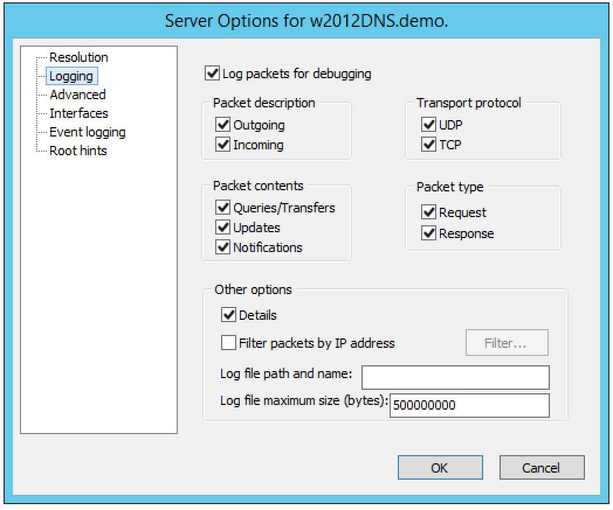
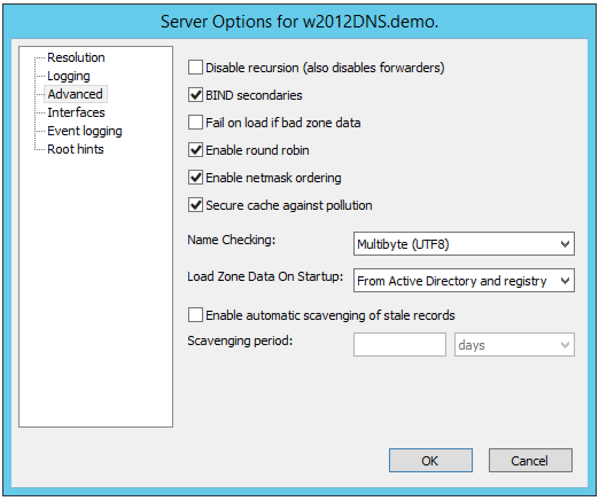
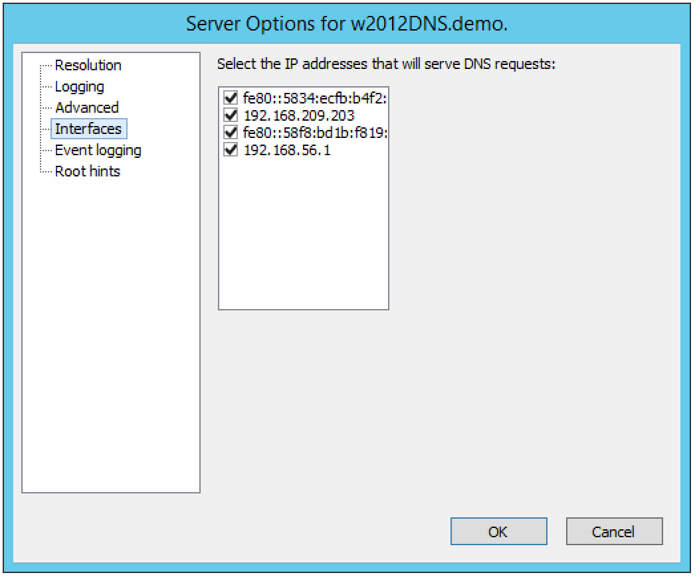
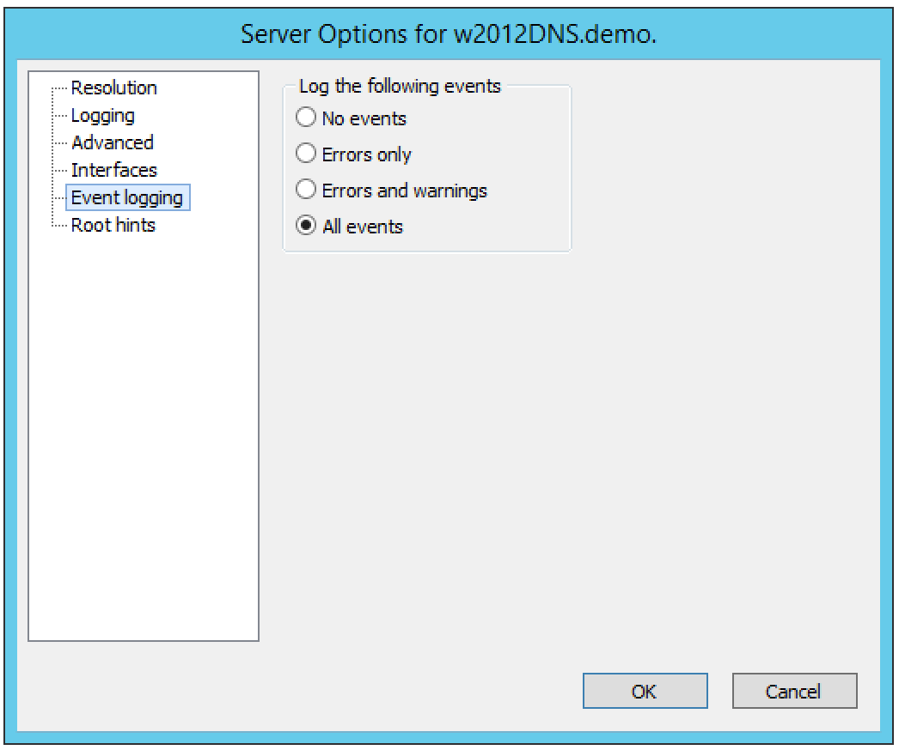
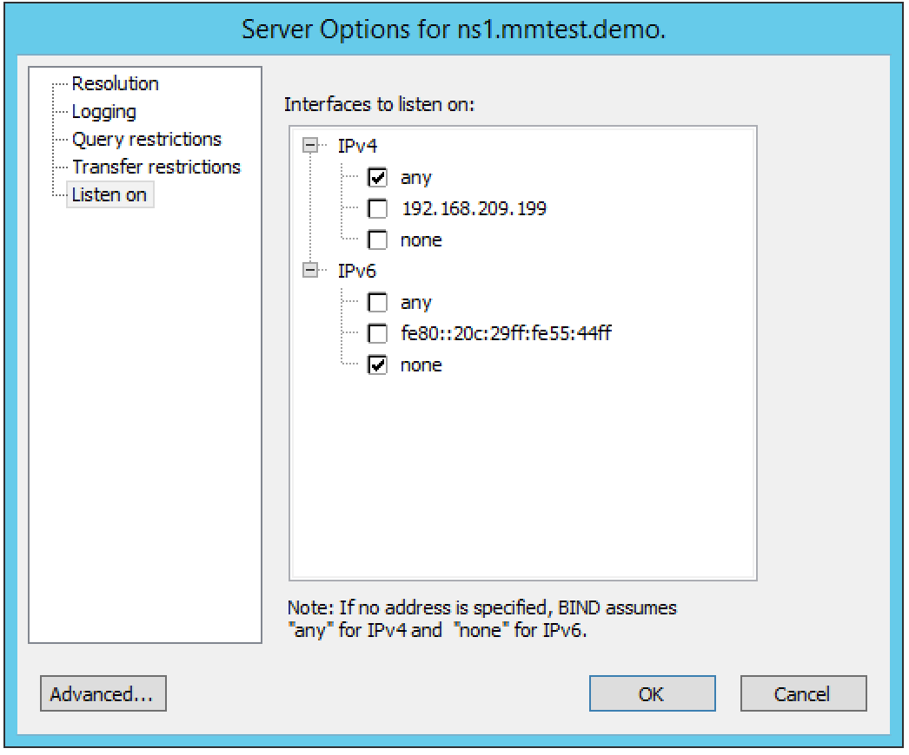
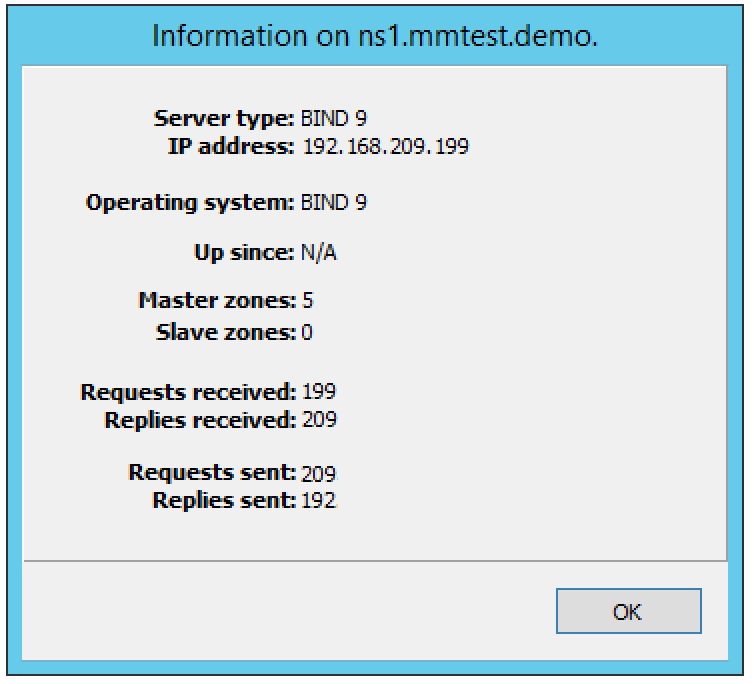
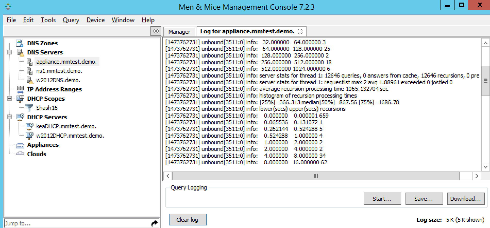
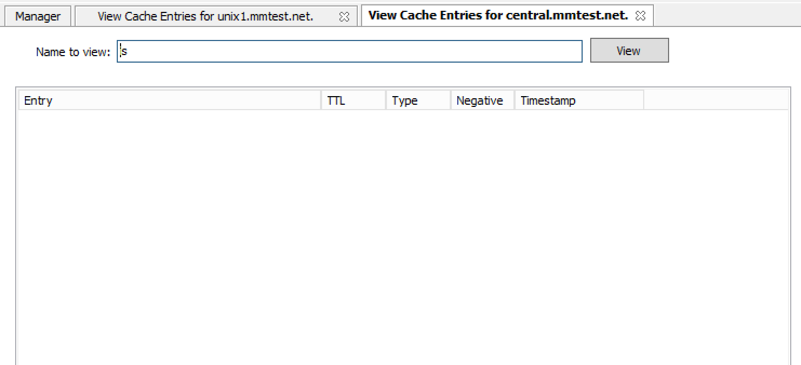
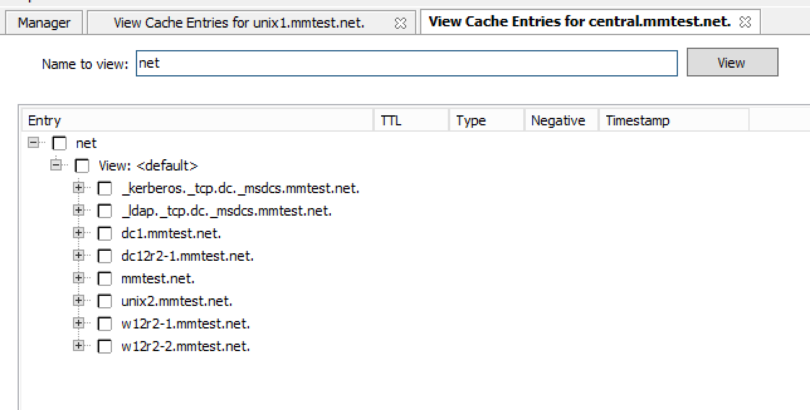

.. _dns-servers:

Authoritative DNS Servers
=========================

Overview
--------

This section shows you how to perform specific actions in the Men&Mice Management Console associated with maintaining your DNS servers, such as adding, and creating and editing zones and records.
The commands associated with server management are located in the Server menu and several are accessible from the toolbar. The Server menu is only available when the DNS Servers object is selected in the Object Section of the Management Console.

.. note::
  The functions for this menu option are listed alphabetically after the New DNS Server section.

.. _new-dns-server:

New DNS Server
--------------

You must be logged in as a user with privileges to administer DNS in order to add a DNS server.

.. note::
  For information on adding a DNS server on a Men&Mice Appliance, refer to Appliance Management.

.. image:: ../../images/console-dns-add-server.png
  :width: 50%
  :align: center

To add a new DNS server, do the following:

1. From the menu bar, select File, New, DNS Server. The Add DNS Server dialog box displays.

  Server Name.
    Type the name (fully qualified host name) of the DNS server as the name is used for the MNAME field in the SOA record of new DNS zones. For Azure DNS the name does not really matter. If the name can't be resolved you want to specify the optional IP address (see following point 3).

  Server address (optional).
    If desired, type the IPv4 or IPv6 address for the server. This is not required, but doing so allows the Management Console to connect to the server by IP Address instead of by name. The Server name will still be used when displaying server information and creating NS records.

  Server Type.
    Click the drop-down list, and select the desired server type.

  Microsoft with Agent Installed
    connects to a Microsoft DNS server that has a DNS Server Controller installed.

  Microsoft Agent-Free
    connects to a Microsoft DNS server that does not have a DNS Server Controller installed. For further information regarding this connection method, refer to DNS Servers—Server Access on Remote Computers.

  BIND
    connects to BIND DNS server.

  Generic
    connects to a DNS Server Controller that is configured to support a generic DNS server.

  Azure DNS
    connects to a DNS Server Controller that is configured as Microsoft Azure DNS controller.

  Use proxy server.
    If you are adding a Microsoft DNS server you can specify the location of the DNS Server Controller by clicking the Use proxy server checkbox and entering the DNS name or IP Address of the machine running the DNS Server controller. This option allows the system to connect to DNS servers in different forests where a cross-forest trust does not exist. It also allows a non-Windows version of Men&Mice Central to manage Microsoft DNS servers.

2. Click OK. You are connected to the server. Once connected, the name of the newly added server displays under DNS Servers in the Object Section. (You may need to click the plus (+) sign next to DNS Servers to see it.)

Server Access on Remote Computers
^^^^^^^^^^^^^^^^^^^^^^^^^^^^^^^^^

To manage DNS servers you must have the DNS Server Controller installed. For the BIND DNS server, a DNS Server Controller must be installed on each DNS server you want to manage.

If you plan to use Men&Mice Suite to manage any Microsoft DNS servers, install the DNS Server Controller on a Windows machine that is a member of the same domain or workgroup as the DNS servers. You may install multiple copies of the DNS Server Controller, for example if you want to manage Microsoft DNS Servers that reside in different forests. A single DNS Server Controller for Microsoft DNS Servers can manage multiple DNS servers. The DNS Server Controller must adhere to whatever restrictions and security standards are set forth in Microsoft Windows.

To configure the DNS Server Controller to access DNS servers on remote computers, do the following:

1. Before you can administer DNS servers, verify that the DNS Controller is running as a Windows User and has the necessary privileges.

2. To enable DNS Management in the Men&Mice Suite, start the Windows Services program and open the properties dialog box for Men&Mice DNS Server Controller.

3. Click the Log On tab. The Local System account radio button is most likely selected.

4. Click the This account radio button and enter the name and password of a Windows User that is a member of the Administrators group.

5. Close the dialog box and restart the Men&Mice DNS Server Controller service.

.. information::
  Some actions for static zones are not available if you are managing MS DNS servers on remote computers using the DNS Server Controller. The following actions are not available:

    * Disable resource record
    * Enable resource record
    * View and edit resource record comments
    * Disable zone

  If you need to be able to perform these actions, you must install the DNS Server Controller on the server and use the Microsoft with Agent Installed connection method when connecting to the server.

.. _edit-dns-server-name:

Edit DNS Server Name
--------------------

This feature allows you to change the name or IP Address used to connect to a DNS server. This is useful if you need to refer to the server by another name or if you are connecting to the server by an IP Address and the IP Address has changed. You can also use this feature to change the connection method for MS DNS servers.

To access this feature, do the following:

1. Locate the applicable server.

2. Right-click and, from the shortcut menu, select Edit Server Name. The Edit Server name dialog box displays.

..

3. Change the Server name, Server address (optional), and/or Server Type. If applicable, you can select Use proxy server and enter the relevant information.

4. Click OK.

Access
------

See :ref:`global-access`.

.. _define-work-set:

Define Work Set
---------------

It is possible to define a Work Set for servers. A Work Set contains a subset of all of the servers in the system and when a Work Set is active, only the servers in the Work Set are visible and the zones on the servers in the Work Set are the only zones visible. This feature is useful when many servers are defined, but you only work with a small number of them on a day-to-day basis.

To define a Work Set, do the following:

1. Select the server(s) you want to include in the Work Set

2. Right-click the selected server(s) and choose Define Work Set.

To clear a Work Set, do the following:

1. Click the Clear Work Set button in the Manager window. The Work Set is cleared.

.. _disable-dns-server:

Disable
-------

A server can be disabled. When a server is disabled, it is not synchronized with the Men&Mice Suite and excluded from various checks. When a DNS server is disabled, it is greyed out in the DNS server listing.

.. _enable-dns-server:

Enable
------

A server that is already disabled can be enabled again.

.. _delete-dns-server:

Delete
------

This command is only available with the Administrator account. Use this command to remove a server from the Management Console.

.. note::
  For information on removing a DNS server on a Men&Mice Appliance, refer Appliance Management.

1. In the Object browser of the Management Console, click on DNS Servers.

2. In the Object List, select the Name Server(s) from you want to disconnect. To select multiple servers, hold down the Ctrl key while making your selections.

3. On the toolbar, click the Remove button. A dialog box prompts you to confirm your decision.

4. To disconnect from the Name Server, click Yes. Otherwise, click No to keep the server.

Options
-------

The Server Options dialog box lets you configure settings for each name server individually, including forwarding servers, logging preferences, transfer and query restrictions, and root servers.

.. information::
  The server options vary depending on the server environment. In the section that follows, the server options are documented twice: once for those using a Windows DNS server, and again for those using BIND.

Accessing Server Options
^^^^^^^^^^^^^^^^^^^^^^^^

1. In the Object Section, select DNS Servers so the servers appear in the Object List.

2. Right-click on the server you want to make changes to and select Options from the context menu. The Server Options dialog box displays.

3. Choose the desired option (Resolution, Logging, Advanced, Interfaces, Event logging, Root hints) from the menu on the left. The corresponding options display in the right panel of the dialog box.

4. Refer to the appropriate section and server environment below for each option.

Windows DNS servers
^^^^^^^^^^^^^^^^^^^

This section describes the Server Options as they display in a Windows Server environment.

Resolution (Windows)
""""""""""""""""""""

The Resolution panel lets you change the method by which this server resolves queries.

.. image:: ../../images/console-dns-windows-dns-options-resolution.png
  :width: 70%
  :align: center

Three basic modes can be established:

The server can be set to resolve queries entirely by itself.
  If you do not want to use any forwarders with this server, leave the Use forwarder(s) checkbox unchecked.

The server can share the task of resolving queries.
  If you want to share the task of resolving requests with one or more forwarding servers, select the Use forwarder(s) checkbox and enter the IP Address of the forwarding servers in the Forwarders list. When you enter the IP Addresses to multiple forwarders, all the forwarders are queried simultaneously, and the first response is accepted. Under this shared mode, if a server using a forwarder does not receive a response after a few seconds, it will attempt to resolve the query itself.

The server can forward all requests to other servers.
  If you want to forward all requests to other servers (and never use this server), select the Use forwarder(s) checkbox, enter the IP Address of the forwarding server(s) in the Forwarders list, and check the Only user forwarder(s) checkbox.

After making the desired changes, you can choose another category from the left column, or click OK to close the dialog box.

Logging (Windows)
"""""""""""""""""

The Logging options consist of a list of checkbox options. Once you enable Log packets for debugging, the other options in the dialog box become accessible and you can choose which types of information you want the program to record in the server's log.

After checking the desired options, you can either choose another category from the left column or click OK to close the dialog box.

Advanced (Windows)
""""""""""""""""""

Use this panel to set various advanced options for the DNS server. Complete the dialog box based upon the guidelines below. When all selections/entries are made, click OK.

Disable recursion.
  Determines whether or not the DNS server uses recursion.

BIND secondaries.
  Disables fast (compressed) zone transfers for compatibility with old BIND servers (older than 4.9.4).

Fail on load if bad zone data.
  Prevents the server from loading a zone when bad data is found.

Enable round robin.
  Rotates the order of resource record data returned in query answers when multiple resource records of the same type exist for the queried DNS domain name.

Enable netmask ordering.
  Determines whether the DNS server reorders A resource records within the same resource record set in its response to a query based on the IP Address of the source of the query.

Secure cache against pollution.
  Determines whether the server attempts to clean up responses to avoid cache pollution.

Name Checking.
  Determines the type of name checking used for zones on the server. Click the drop-down list and select from the options provided.

Load Zone Data on startup.
  Determines from where to load the zone data when the server starts up. Click the drop-down list and select from the options provided.

Enable automatic scavenging of stale records.
  Specifies whether scavenging can occur for the selected server. If automatic scavenging is enabled, the scavenging period can be specified. Type the duration in the first field. In the second field, click the drop-down list and select the duration range – e.g., days.

Interfaces (Windows)
""""""""""""""""""""

Use this panel to specify the IP Addresses this server will use to serve DNS requests. When your selection is made, click OK.

Event Logging (Windows)
"""""""""""""""""""""""

Specifies what event information should be logged and displayed in the Server log.

Click next to each of the desired items using the guidelines below:

  No events.
    Specifies that no events will be logged in the DNS Server log.

  Errors only.
    Specifies that only errors will be logged in the DNS Server log.

  Errors and warnings.
    Specifies that only errors and warnings will be logged in the DNS Server log.

  All events.
    Specifies that all events will be logged in the DNS Server log.

When all selections are made, click OK.

Root hints
""""""""""

Allows configuration of suggested root servers for the server to use and refer to in resolving names.

.. image:: ../../images/console-dns-windows-dns-options-event-root-hints.png
  :width: 70%
  :align: center

To Add a Root name server, complete the fields as follows:

1. Click the Add button.

  Server fully qualified domain name.
    Type the name of the server.

  IP Address.
    Type the IP Address of this server.

2. Click OK.

To Edit the Root hint name server data, do the following:

1. Select the server definition you want to edit.

2. Click the Edit button.

3. In the Root hint name server dialog box, type the updated information.

4. Click OK.

To Remove a Root hint name server, do the following:

1. Select the server definition you want to remove.

2. Click the Remove button

BIND Environment
^^^^^^^^^^^^^^^^

This section describes the Server Options as they display in a BIND environment.

Resolution (BIND)
"""""""""""""""""

The Resolution settings in a BIND environment are the same as in a Windows environment.

.. image:: ../../images/console-dns-bind-options-resolution.png
  :width: 70%
  :align: center

Logging (BIND)
""""""""""""""

The Logging Settings control the type of information that is recorded in a server's log.

.. image:: ../../images/console-dns-bind-options-resolution.png
  :width: 70%
  :align: center

Channel.
  Specifies where your logged data will go. Use the drop-down list to select which log file you want to receive which categories of data.

Category.
  Lists the different types of information that can be logged. The System log typically tracks system-level messages, while the Men&Mice log is much more comprehensive and includes information about server interactions and activity. Check the categories you want to include in the log.

Log Level.
  The Log Level allows you to filter messages by severity. Select the level of messages that you want to log by choosing the corresponding radio button. There are eight radio buttons. The top five are the standard severity levels used by syslog. The remaining two settings areDebug and Dynamic.

Debug.
  Provides name server debugging. When you choose this option, a text box displays next to the radio button allowing you to specify a debug level. If you do not specify a debug level, it is assumed to be 1. If you do specify a level, you will see messages of that level when name server debugging is turned on.

Dynamic.
  Causes the name server to log messages that match the debug level. For example, if you send two trace commands to the name server, it will log messages from level 1 and level 2.

Print Category.
  When selected, the category of the message displays with the log entry.

Print severity.
  When selected, the severity of the message displays with the log entry.

Print time.
  When selected, the message includes a time stamp.

Max file size (only shown for log file channels).
  Determines how many versions of the log file are maintained. The log file will grow to the size specified in the Max file size field, after which a new log file is created and the old file is renamed. As this process continues, each file is systematically renamed until it is finally deleted. For example, if the Version field contained the value 2, there would be the 'active' log file, and two older versions. When the active log file becomes too big, a new log file would be created and the previously active log file would be renamed as the version 1 file. The old version 1 file would be renamed as the version 2 file, and the old version 2 file would be deleted.

Versions (only shown for log file channels).
  Enter the maximum size of the log file and the appropriate units. For example, 100K = 100 kilobytes, 2M = 2 megabytes, and 3G = 3 gigabytes. If no value is specified, the default unit bytes are used.

Facility (only shown for syslog channels).
  Allows the user to specify a syslog facility to be used.

.. note::
  For remote logging on the DDI appliance, only the local7 facility is configured to be sent to the remote loghost. See Appliance Management for more information on enabling remote logging on the DDI appliance.

Query Restrictions (BIND)
"""""""""""""""""""""""""

The Query restrictions panel allows you to restrict recursive DNS queries to only certain IP Addresses or address ranges.

.. image:: ../../images/console-dns-bind-options-query-restriction.png
  :width: 70%
  :align: center

To configure a query restriction, do the following:

1. Click the Add button.

2. Enter an IP Address in the field provided. You can choose a predefined range from the drop down list, which gives you the option to select any, none, localhost, or localnets.

3. Choose whether you want to allow or deny this server access control for recursive queries by selecting the appropriate radio button.

4. Click OK to add the new restriction to the list.

Transfer Restrictions (BIND)
""""""""""""""""""""""""""""

The Transfer restrictions panel allows you to restrict zone transfers to only certain IP Addresses or address ranges. Restricting access to zone transfers is a marginally effective security measure designed to prevent outsiders from seeing the names and IP Addresses of your hosts. All of this information is available from a reverse zone lookup. However, security through obscurity will keep out amateurs and the merely curious.

.. WRONG SCREENSHOT!!!

To configure a transfer restriction, do the following:

1. Click the Add button.

2. Enter an IP Address in the field provided. You can choose a predefined range from the drop down list, which gives you the option to select any, none, localhost, or localnets.

3. Choose whether you want to allow or deny zone transfers to this IP Address by selecting the appropriate radio button.

4. Click OK to add the new restriction to the list.

Listen on (BIND)
""""""""""""""""

The Listen on panel allows specify the IP Addresses this server will use to serve DNS requests.

To specify the listening interfaces, select the checkboxes for the interfaces you want to listen on, both for IPv4 and IPv6.

* If you select the any option, the server will listen on all configured IP Addresses.

* If you select the None option, the server will not listen on any IP Address.

.. _bind-advanced-options:

Advanced Server Options
"""""""""""""""""""""""

DNS Administrators can access the BIND configuration files directly to edit DNS server and zone options that are not available in the GUI.

To access the advanced options, do the following:

1. Log in to Men&Mice as the DNS administrator.

2. For a DNS zone or DNS server, right-click and select Options from the shortcut menu.

3. When the Options displays, click the Advanced button.

.. image:: ../../images/console-dns-bind-options-advanced.png
  :width: 70%
  :align: center

4. When the Advanced Options dialog box displays, you can edit the options for the zone or server in a text document. The dialog for editing server options contains four tabs where each tab contains a section of the server options (logging, user_before, options, user_after). If the DNS server contains one or more views, each view displays in a separate tab where various settings can be changed for each view.

.. information::
  #include statements are not shown and you cannot add #include statements.

  .. figure:: ../../images/console-dns-bind-options-advanced-options.png
    :width: 70%
    :align: center

    Refer to :ref:`bind-file-structure` for more information on each section.

5. Click OK. The contents of the files are verified for correctness. If an error is found during verification, an error message displays and the changes are not saved.

Properties
----------

Applies only when custom properties have been defined for DNS servers. Selecting this menu item will display a dialog box where the custom property values can be modified.

1. In the Object browser, select the server for which you want to manage properties.

2. From the menu bar, select Server, Properties.

3. Location. Type a location.

4. Click Apply or OK.

Server Info
-----------

This command opens a dialog box that shows information about the history and status of the currently selected server in the Management Console. This includes such things as the server's IP Address, operating system, number of requests & replies received, total uptime, and the number of master and slave zones it has. This command is only available when a server is selected in the Management Console.

In the Object List, right-click on the desired server name and, from the shortcut menu, select Server Info.

  An Information window opens for the selected server.

Server Log
----------

To view the activity log for a particular server:

In the Object List, right-click on the desired server and, from the shortcut menu, select Server Log. A Log tab opens for the selected server that contains a list of activity and maintenance that has occurred on that server since the last time the log was cleared.

You can clear the server log by clicking the Clear log button in the server log tab.

.. note::
  For Windows DNS servers, it is not possible to view the server log if connected through an agent-free connection.

.. note::
  If the server log window is opened for a caching DNS server, the window will contain additional buttons related to query logging.

Reload/Reload Zone List
-----------------------

There are two reload commands in the Server context and the commands are quite different:

Reload.
  This command reloads the DNS server. On Windows this command has the same effect as the Clear Cache command, but on BIND servers, the command 'rndc reload' is sent to the DNS server.

Reload Zone List.
  This command reloads the list of zones from the DNS server. It is useful if a zone has been created outside of the Men&Mice Suite.

To reload the zone list to include zones that have been added/deleted outside of the Men&Mice suite, do the following:

1. Select the desired server.

2. From the menu bar, select Server, Reload Zone List. The window grays as the zones are reloaded then displays with the updated zones.

To reload a DNS server, do the following:

1. Select the desired server.

2. From the menu bar, select Server, Reload Zone List.

Edit DNS Policies
-----------------

.. information::
  This functionality is only available for Windows Server 2016

For details on how to configure and use DNS Policies, see :ref:`windows-dns-policies`.

Clear Cache
-----------

It is possible to clear the DNS server cache using the Clear Cache command. The control you have over which cache entries you can clear depends on the DNS server type:

* On BIND, you can choose to clear individual cache entries or the entire cache

* On a Windows DNS server you can only clear the entire cache

* On the DNS Caching Appliance you can clear individual cache entries, an entire domain or clear the entire cache

To clear the cache of a BIND DNS server, do the following:

1. Select the desired server.

2. From the menu bar, select Server, Clear Cache. The Clear Cache dialog box displays.

.. image:: ../../images/console-dns-clear-cache.png
  :width: 50%
  :align: center

3. To clear the entire server cache, select Clear entire cache. Note that this is the only available option if you are clearing the cache on a Windows DNS server.

4. To clear a specific name, select the Name to clear radio button and enter the name you want to clear from the cache. The name is cleared from all views unless you specify the view name after the entry name. Note that this option is not available for Windows DNS servers.

To clear the cache of a Windows DNS server, do the following:

1. Select the desired server.

2. From the menu bar, select Server, Clear Cache. A confirmation dialog box displays.

3. Click OK to clear the cache of the server.

To clear the cache of a DNS Caching Appliance, do the following:

1. Select the desired server.

2. From the menu bar, select Server, Clear Cache. The Clear Cache dialog box displays.

3. To clear the entire server cache, select Clear entire cache. Note that this is the only available option if you are clearing the cache on a Windows DNS server.

4. To clear a specific name, select the Name to clear radio button and enter the name you want to clear from the cache. If you want to clear an entire domain (the name entered and all names below it), select the Recursively flush the entire domain checkbox.

View Cache Entries
------------------

You can view and clear individual DNS cache entries using the View Cache Entries command.

To view the cache of a DNS server, do the following:

1. Select the desired server.

2. From the menu bar, select Server, View Cache Entries. The View Cache Entries tab displays.

3. Enter a name to view and click the View button. The entries found are displayed in a tree view.

4. To clear one or more entries from the DNS server cache, select the checkbox for the entries you want to clear.

5. Click the Clear Selected button.

Backup and Restore (BIND Only)
------------------------------

The Men&Mice Suite will automatically backup configuration for all BIND DNS servers it manages. The backup can then be used to restore the DNS server to the backed-up copy of the configuration. The backup is fully automatic and there is no configuration needed.

Automatic backup can be disabled by setting the property BackupDNSServers value in Men&Mice central preferences to zero:

.. code-block::
  :linenos:

  <BackupDNSServers value="0" />

If a DNS server machine crashes and has to be replaced with another machine with the same IP Address, the Men&Mice Suite will detect the new server and consider it to be in an uninitialized state. To be able to work with the server the administrator needs to initialize the server. To initialize the server right-click on the server and select Initialize. This will display a dialog box where the user can choose how the server should be initialized:

.. image:: ../../images/console-dns-bind-backup-restore.png
  :width: 60%
  :align: center

* If "Use data from the Men&Mice Suite" is selected, all configurations and DNS zone information on the DNS server will be overwritten with the backed-up data.
* If "Use data from the new server" is selected, all data kept in Men&Mice Central will be ignored and overwritten with current data on the DNS Server.

Basically, the restore scenario is as follows:

1. The DNS server machine crashes and becomes unusable.

2. Configure a new machine to replace the broken machine, using the same IP Address as the old machine.

3. Install the DNS Server Controller on the new machine.

4. When the new machine is up and running, in the Management Console, right-click the server and choose Reconnect.

When a connection has been established, the Men&Mice Suite detects that this is a new, uninitialized server. See above for a description on what happens next.
