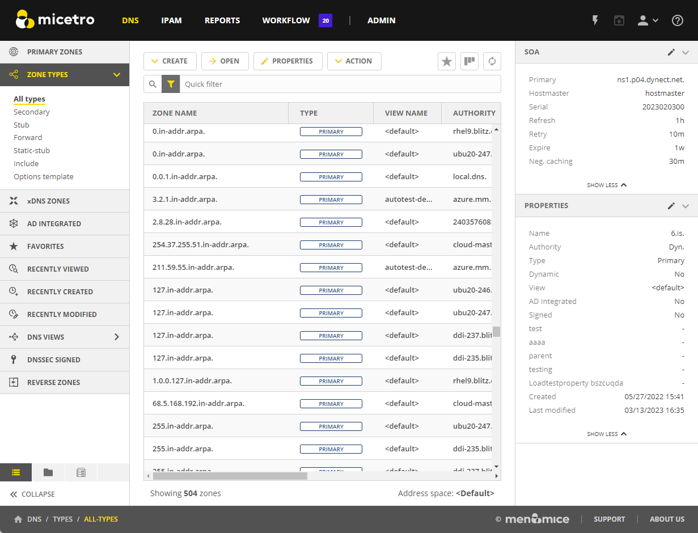
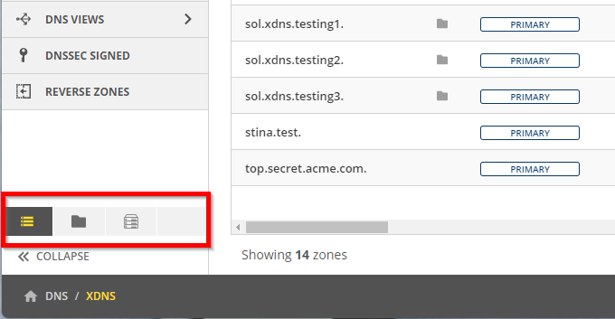
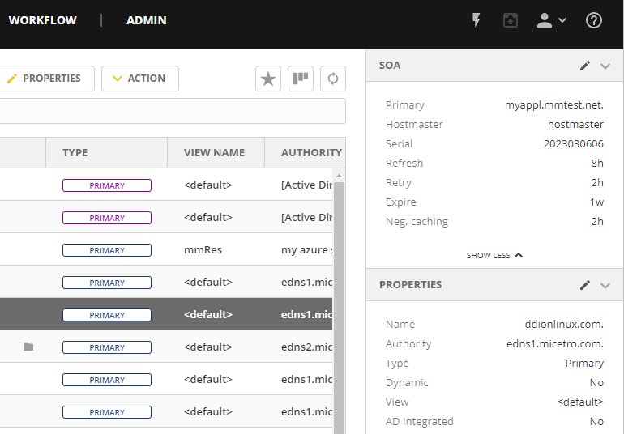

.. meta::
   :description: Overview, analysis, viewing and deleting of DNS zones in Micetro by Men&Mice
   :keywords: DNS zones, DNS servers

.. _dns-zones:

DNS Zones
=========

.. |controls| image:: ../../images/console-dns-zones-zone-controls-icon.png

.. note::
   This information applies to the web interface. For information about DNS zone management in the M&M Management Console, see :ref:`console-dns-zones`.

Overview
--------

By default, the DNS page displays all primary zones in the system regardless of authority. 

|
The left sidebar offers several options for filtering and organizing the zones. The sidebar has three tabs: **Menu**, **Folders**, and **DNS services**. 

* The **Menu** tab offers the most commonly used filtering options for zones, such as zone types, favorites, and reverse zones.

* The **Folders** tab allows you to organize zones and filter queries into folders. For more information about folder management, see :ref:`folder-management`.

* On the **DNS services** tab you can view zones by server/service. This can be useful if you have multiple DNS services and want to view the zones associated with each one separately.

Micetro will remember your current tab selection when you navigate away from the DNS page and return to it later.

.. _dns-zone-types:

Zone Types
-----------

.. csv-table::
  :header: "Type", "Description"
  :widths: 15, 85

  "Primary (blue)", "A static primary zone, which is always the original copy of the zone, and always present on that zone's primary server."
  "Primary (yellow)", "A dynamic master zone, which is always the original copy of the zone, and always present on that zone's master server."
  "Primary (purple)", "An Active Directory Integrated primary zone."
  "Secondary", "A read-only copy of a primary zone or another secondary zone."
  "Hint", "Root zone used for bootstrapping of recursive DNS servers."
  "*Configuration types*", "*The below zone types are essentially a configuration that tells the (recursive) DNS server how to resolve zones it cannot resolve the normal way*."
  "Stub", "A stub zone is a copy of a DNS zone that contains only resource records that identify the authoritative DNS servers for that zone. Stub zone is dynamically updated from the list of primary DNS servers."
  "Static-stub", "A BIND specific zone type to configure conditional forwarding, similar to Stub but is static, that is, it has a set of preconfigured NS entries."
  "Forward", "A forward zone contains a list of name server addresses, called forwarders, that are authoritative for the domain name in question. With forward zones queries are forced to go to the specified addresses."
  "*Template*", "*AuthServe specific*."
  "Options template", "This configuration template is specific to the AuthServe DNS server and can be used to add templated options configuration to multiple zones. Editing the options template will affect all zones using the template."
 
Opening a DNS Zone
------------------
There are several ways to open a zone:

* select the zone in the list, and then click :guilabel:`Open` on the taskbar.

-OR-

* double click the zone.

-OR-

* select the zone in the list, and then select :guilabel:`Open zone` on the Row menu (...).

Zone Contents
-------------

The Inspector pane on the right provides a detailed look at the data inside of a zone. The header record (Start of Authority or SOA record) displays as a collection of fields above the resource records.

Open the zone to view its contents. 

   

SOA
^^^

Since the SOA record is seldom modified after it is created, you can hide the data from the Inspector pane. Simply click the section header (or :guilabel:`<` and :guilabel:`v`) to collapse or expand the information.

SOA Fields
""""""""""

.. csv-table::
  :header: "Field", "Description"
  :widths: 15, 75

  "Primary", "The name of the server that acts as primary server for the zone."
  "Hostmaster", "This field is properly formatted by giving the email address of the person responsible for zone with the @ symbol replaced with a period (.). For example, instead of hostmaster@example.com enter hostmaster.example.com. The username part of the email address cannot contain a (verbatim) dot (.). See RFC 1912 'Common DNS Operational and Configuration Errors', Section 2.2 for additional information."
  "Serial", "The serial number is a ten-digit number consisting of the year, the month, the day, and a two-digit daily revision number. (Actually, it is any integer between 0 and ~ 4 billion, but the preceding is the standard convention.)"
  "Refresh", "This is the period (in seconds) that determines how often secondary servers will check with the primary server to determine if their zone files are up to date. This is done by checking the serial number. The default value for this field is 28800, which equates to once every 8 hours."
  "Retry", "This determines the period that a secondary server will wait before trying to re-contact the primary zone (in the event that an earlier contact attempt is unsuccessful). The default value is 7200 seconds, or once every 2 hours."
  "Expire", "This value determines how long a secondary server will keep serving a zone after its last successful contact to the primmary name server. Once the zone has expired, the secondary server stops giving information about the zone because it is deemed unreliable. The default expiration period is 604800 seconds, or 1 week."
  "Neg. caching", "This field is only available when connected to a BIND server. This value specifies how long a server will retain (cache) the knowledge that something does not exist. The default value is 86400 seconds, 24 hours."

Managing Zones
--------------

Creating Zones
^^^^^^^^^^^^^^^
To create a new DNS zone:

1. Click :guilabel:`Create` in the taskbar at the top of the DNS page.

2. Select the zone type, see :ref:`dns-zone-types`.
   
3. A wizard will lead you through the creation process. Number of steps varies between zone types and also depending on how Micetro is configured.

Primary Zone
"""""""""""""
When creating a primary zone it’s easy to find the right primary server by using the server filter. If xDNS profiles (link to xDNS Redundancy — Micetro by Men&amp;Mice latest documentation ) have been created on the instance, the zone can be added directly to an xDNS profile in the first step of the wizard.

Secondary Zone
"""""""""""""""

Stub Zone
"""""""""""
When creating a stub zone, the zone name and one or more primary servers for the zone being copied is needed. When entering addresses for the primary servers, address resolution can be turned on or off by switching the toggle control above the text area.

Static-stub Zone
""""""""""""""""

Options Template Zone
"""""""""""""""""""""""

Deleting Zones
^^^^^^^^^^^^^^^

To delete a zone from one or more servers:

1. Select the zone(s) you want to delete.

2. Do one of the following:
   
  * On the :guilabel:`Action` menu, select :guilabel:`Delete zone`. 
   
   -OR-
   
  * On the Row menu (**...**), select :guilabel:`Delete zone`.
   
3. The Delete Zone dialog box opens, showing each zone you selected and a list of servers that currently serve that zone. The zone(s) you selected will be deleted from every server that is selected on this list. To keep the zone on a particular server, clear the checkbox for that server.

4. Click :guilabel:`Delete`. The zone is removed from the servers.

Migrating Zones
-----------------

You can migrate one or more zones from one server to another, including all data in the zone.

To migrate a zone:

1. Select the zone you want to migrate.

2. Do one of the following:
   
  * On the :guilabel:`Action` menu, select :guilabel:`Migrate zone`. 
   
   -OR-
   
  * On the Row menu (**...**), select :guilabel:`Migrate zone`.

3. The Migrate Zone(s) Wizard dialog box opens.

4. Select the DNS service to migrate the zone to. 

5. If you want remove the zone from the current service, select the :guilabel:`Remove original zone` checkbox.

.. tip::
  You can duplicate DNS zones by leaving the **Remove original zone** checkbox unselected.

.. _ad-preferred-servers:

Edit Preferred Servers
----------------------

.. note::
  This option is only available when working with AD integrated zones. (See :ref:`active-directory`.)

DNS administrators can specify the server to use when opening an AD integrated zone, as well as the order of servers to use if the first preferred server becomes unavailable.

1. In the filtering sidebar, select the :guilabel:`AD Integrated`.

2. Select the zone(s) you'd like to set preferred servers for.

3. Do one of the following:
   
  * On the :guilabel:`Action` menu, select :guilabel:`Edit preferred servers`. 
   
   -OR-
   
  * On the Row menu (**...**), select :guilabel:`Edit preferred servers`.

4. Arrange the order of your servers into the preferred order. The server on the top of the list is tried first, then, if that server is unavailable, the second, and so on.

5. Click :guilabel:`Save`.

.. warning::
  If you selected multiple zones, they might have different settings for preferred servers. Saving the configuration will overwrite the previous settings on all selected zones.

Editing Zone Properties
-------------------------

You can click :guilabel:`Edit Properties` on the taskbar to edit custom properties that have been configured for the selected zones.

Promoting Secondary Zones
---------------------------

The Promote Zone feature makes it possible to change a secondary zone to a primary zone. This might be necessary in emergency situations, for example, if the primary zone becomes unavailable for an extended period of time. This feature is only available for DNS Administrators.

When a secondary zone is promoted, the following actions are performed:

* Micetro checks whether the most recent copy of the zone is found in its internal database or on the server hosting the secondary zone, and uses the copy that is more recent.

* The server hosting the secondary zone is configured so that the zone is saved as a primary zone on the server.

* The zone history and access privileges from the old primary zone are applied to the new primary zone.

* The configurations of other instances of the secondary zone are modified so that they will get the updates from the new primary zone.

To promote a secondary zone to a primary zone:

1. Select the secondary zone.

2. Do one of the following:
   
  * On the :guilabel:`Action` menu, select :guilabel:`Promote to primary`. 
   
   -OR-
   
  * On the Row menu (**...**), select :guilabel:`Promote to primary`.

3. Click :guilabel:`Save` to continue, or :guilabel:`Cancel` to discontinue the process.

View History
------------

The :guilabel:`View history` option on the :guilabel:Àction` menu opens the History window that shows a log of all changes that have been made to the zone, including the date and time of the change, the name of the user who made it, the actions performed, and any comments entered by the user. See :ref:`webapp-object-change-history`.
