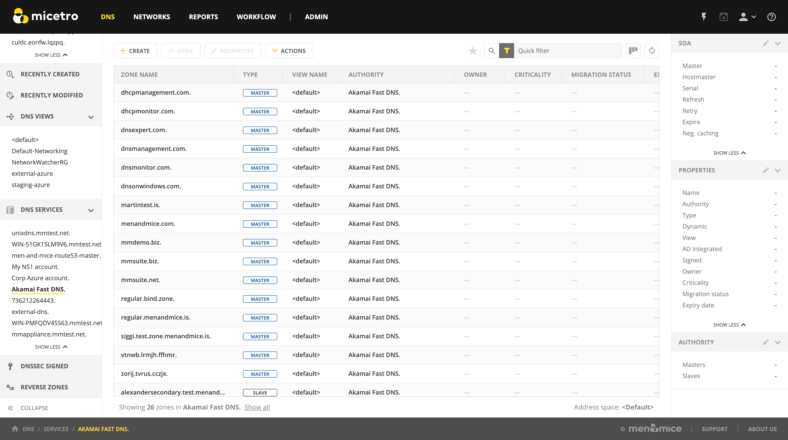
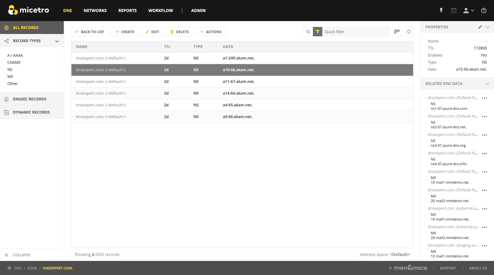
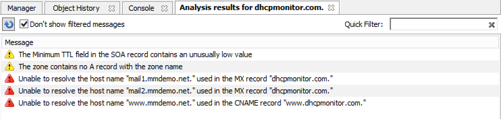
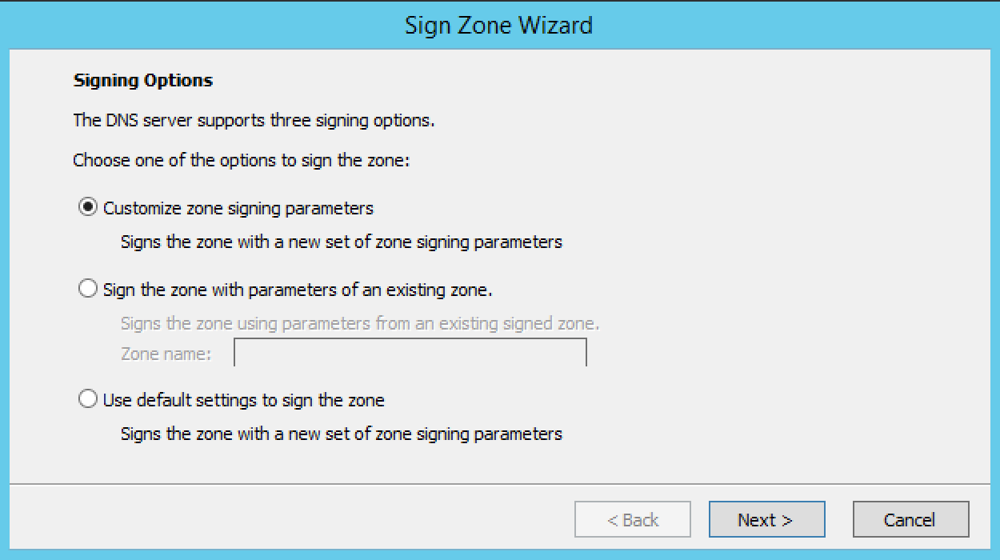
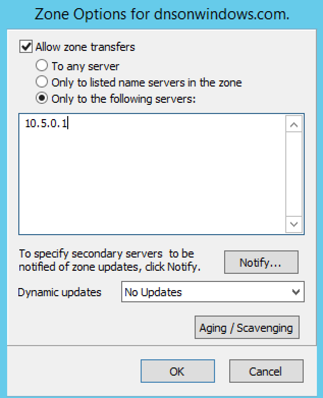
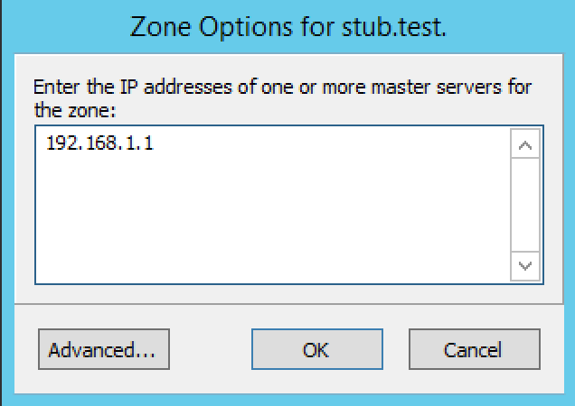
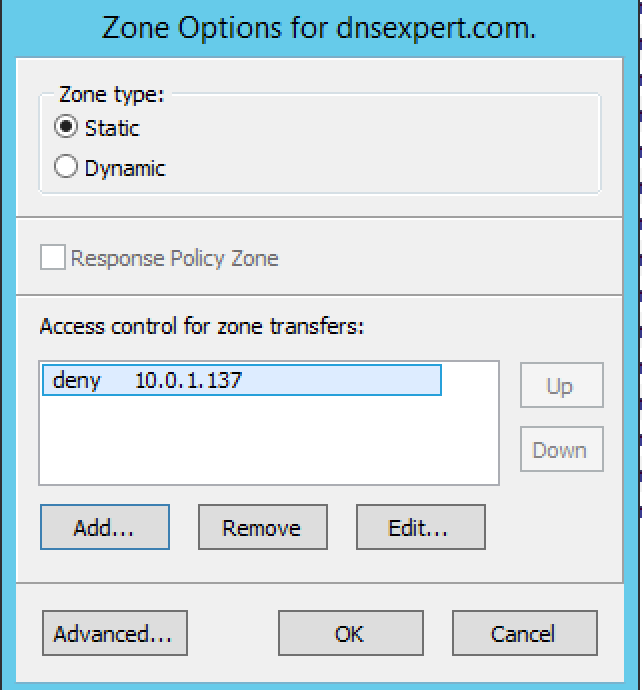
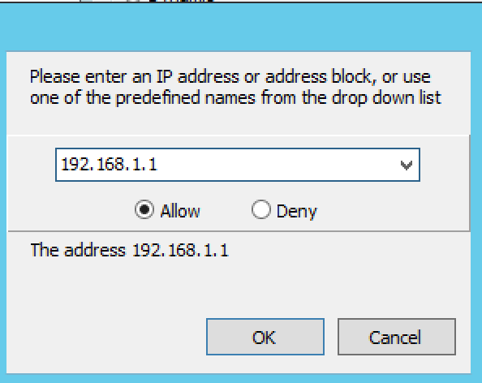
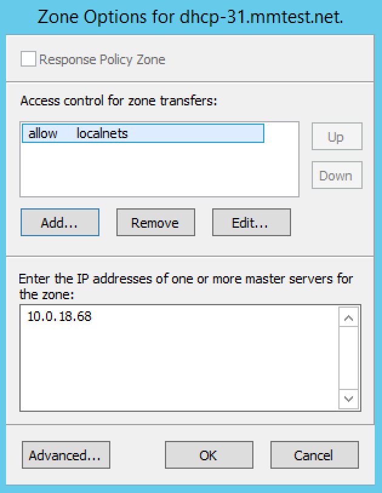
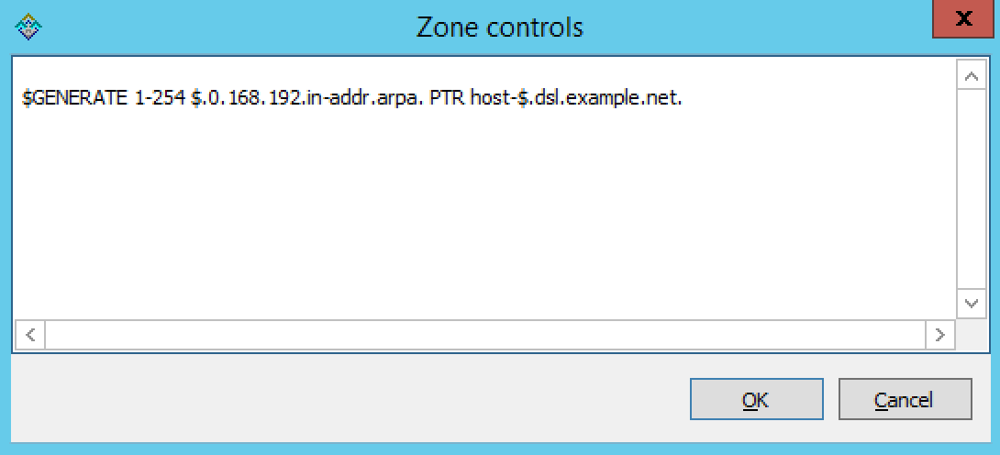

.. _dns-zones:

DNS zones
=========

Overview
--------

The commands associated with zone management (located in the *DNS* context of the Web Application or the ::menuselection:`Zone menu` in the Management Console) are only available when a specific DNS server or DNS zone is selected. In other words, actions for the DNS zone are only available when DNS zones are listed. The default for the *DNS* context is displaying all zones. (In the Management Console, when DNS Zones is selected in the Object Browser, all DNS zones are listed on all servers.) However, when a particular name server is selected, only the zones being managed on that server are listed.

The Web Application's *DNS* context displays zone types in the second column.

.. csv-table::
  :header: "Indicator", "Description"
  :widths: 15, 85

  "Master (blue)", "A static master zone, which is always the original copy of the zone, and always present on that zone's master server."
  "Master (yellow)", "A dynamic master zone, which is always the original copy of the zone, and always present on that zone's master server."
  "Master (AD-integrated)", "(AD-integrated is displayed in a tooltip) An Active Directory Integrated zone."
  "Stub", "A stub zone. The corresponding master zone(s) is displayed in the Inspector window on the left."
  "Slave", "A slave zone. The corresponding master zone is displayed in the Inspector window on the left."
  "Forward", "A forward zone. The corresponding master zone is displayed in the Inspector window on the left."

.. note::
  For DNS zone indicators in the Management Console, see :ref:`console-dns-zone-icons`.

Zone Viewing
------------

All Zones on All Servers
^^^^^^^^^^^^^^^^^^^^^^^^

You can use the Web Application to view all of the existing DNS zones at once, regardless of the server to which they belong.

In the Web Application, click the :guilabel:`DNS` on the top. This causes all existing zones (to which you have access) to appear in the grid.

Single Name Server Zones
^^^^^^^^^^^^^^^^^^^^^^^^

In the filtering sidebar or through :menuselection:`Admin --> Server Management` of the Web Application, locate the DNS server that owns the zones you want to view and click on it. This will list all zones on the server. (In *Server Management* when a server is selected, select :guilabel:`Show zones` from the ellipsis menu to display all zones residing on the server.)

.. tip::
  The navigation indicator in the bottom left displays the name of the DNS server.

Zone Contents
^^^^^^^^^^^^^

The Inspector window on the right provides a detailed look at the data inside of a zone. The header record (a.k.a. Start of Authority or SOA record) displays as a collection of fields above the resource records.

To view the contents of a particular zone, double-click on it. This opens the Zone tab.

SOA
^^^

Since the SOA record is seldom modified after it is created, the Inspector windows has a built-in control to allow you to hide the SOA data from view. On the right edge of the Inspector, next to the 'edit' button, you'll notice the open/close button (:guilabel;`>` and :guilabel:`v`, respectively) to show/hide the SOA information.

SOA Fields
""""""""""

.. csv-table::
  :header: "Field", "Description"
  :widths: 15, 75

  "Master", "This field gives the name of the server that acts as master server for the zone."
  "Hostmaster", "This field is properly formatted by giving the e-mail address of the person responsible for zone with the @ symbol replaced with a period (.). For example, instead of hostmaster@example.com type hostmaster.example.com. The username part of the e-mail address cannot contain a (verbatim) dot (.). See RFC 1912 'Common DNS Operational and Configuration Errors', Section 2.2 for additional information."
  "Serial", "The serial number is a ten-digit number consisting of the year, the month, the day, and a two-digit daily revision number. (Actually, it is any integer between 0 and ~ 4 billion, but the preceding is the standard convention.) To create a unique serial number, the Management Console adds 1 to the daily revision number every time the zone is saved."
  "Refresh", "This is the period (in seconds) that determines how often slave servers will check with the master server to determine if their zone files are up to date. This is done by checking the serial number. The default value for this field is 28800, which equates to once every 8 hours."
  "Retry", "This determines the period that a slave server will wait before trying to re-contact the master zone (in the event that an earlier contact attempt is unsuccessful). The default value is 7200 seconds, or once every 2 hours."
  "Expire", "This value determines how long a slave server will keep serving a zone after its last successful contact to the master name server. Once the zone has expired, the slave stops giving information about the zone because it is deemed unreliable. The default expiration period is 604800 seconds, or 1 week."
  "Neg. caching", "This field is only available when connected to a BIND server. This value specifies how long a server will retain (cache) the knowledge that something does not exist. The default value is 86400 seconds, 24 hours."

Zone Analysis (Management Console)
----------------------------------

.. note::
  Importing DNS data into the Web Application (see :ref:`webapp-import-dns-records`) will automatically validate the data.

The DNS Expert Zone Analysis engine allows zones to be analyzed for correctness in the Management Console.

To analyze a zone, do any of the following:

* Right-click on the zone you want to analyze, and from the shortcut menu select :guilabel:`Analyze`.

* Choose :guilabel:`Zone --> Analyze`

* Open the zone and click the Analyze button on the toolbar. |analyze|

The results of the zone analysis are shown in a new window:

Reanalyze
  To perform the analysis again, press F5 or click the :guilabel:`Analyze` button.

Filtering
  It is possible to filter out messages of a certain type. When the checkbox :guilabel:`Don't show filtered messages` is selected, the filtering is active and these messages are not shown in the message list. Deselecting the checkbox disables the filtering and all messages are shown in the message list.

Quick Filter
  The Quick filter works the same as it does in other windows.

Messages
  The message list shows the results of the zone analysis. Messages are either warnings or errors (as indicated by the icon next to the message). Selecting a message will display detailed information about the message at the bottom of the window.

Fix
  When the application can fix an error, the :guilabel:`Fix` menu item becomes available. Selecting this menu item will display more information about the fix for the error.

Filter out messages of this type
  Selecting this item, will suppress the display of the selected error type unless the :guilabel:`Don't show filtered messages` checkbox is unselected. NOTE: This setting is global and it is applied to all subsequent analysis in all zones. If you right-click a filtered message, this item will read as Don't filter out messages of this type.

  .. image:: ../../images/console-dns-zones-zone-analysis-filter.png
    :width: 60%
    :align: center

If the zone you are analyzing is open, an icon with an exclamation mark is shown in the bottom left corner of the window. Clicking this icon will display the errors found during the analysis in a list at the bottom of the Zone tab. Closing the analysis window will clear the error message list in the Zone tab.

Access/Access for Non-Master for Zone(s)
----------------------------------------

Refer to :ref:`global-access`.

Delete zone
-----------

Use this command to delete a zone from one or more servers. Before using this command, select the zone you want to delete from the Management Console; the Delete Zone dialog box displays and shows a list of servers on which that zone resides. By default, the zone will be removed from all servers (i.e., all servers are checked). If you want to keep it on one or more servers, clear the checkbox next to that server. Click the Delete button to remove the zone from the selected servers.

1. Select the zone(s) to delete.

2. From the ellipsis menu select :guilabel:`Delete zone` or use :menuselection:`Actions --> Delete zone`. A confirmation dialog appears.

3. To delete the zone(s) from the selected servers, click the :guilabel:`Yes` button. The zone is removed from the servers.

.. warning::
  The *Delete Zone* dialog, showing each zone you selected and a list of servers that currently serve that zone, is only available in the Management Console. There you are able to keep the zone on particular server(s) by clearing the checkbox next to that server(s).

.. note::
  See :ref:`console-delete-dns-zone` for the zone deletion operation in the Management Console.

Disable/Enable (Management Console)
-----------------------------------

.. note::
  This function is only available in the Management Console.

Disabling a Zone(s)
^^^^^^^^^^^^^^^^^^^

This function is only available for static master zones that have no slave zones. (For other types of zones (dynamic or AD integrated) the command is not visible. The Disable command deactivates the entire zone without deleting it. When disabled, the server ignores the contents of the zone. The zone can still be edited while disabled, but changes will not take effect until the zone is re-enabled.

1. In the Object Section, select :guilabel:`DNS Zones` to view all zones, or under the DNS Servers object, select the server containing the zone you want to disable. This displays the zones in the Object List.

2. Select the zone(s) that you want to disable. To select more than one zone, hold down the Ctrl key while making your selections.

3. From the menu bar, select :guilabel:`Zone --> Disable Zone`. A dialog box prompts you to confirm your decision.

4. To disable the selected zone(s), click the :guilabel:`Yes` button. The zone becomes disabled.

Zones that are disabled appear faded in the Object List. They are still fully accessible and editable, but they will not be active until you re-enable them.

Enabling a Zone(s)
^^^^^^^^^^^^^^^^^^

Use the following procedure to re-activate a zone that has been disabled.

1. In the Object List, locate the zone(s) that you want to re-enable. To select more than one disabled zone, hold down the Ctrl key while making your selections.

2. From the menu bar, select :guilabel:`Zone --> Enable Zone`. A dialog box prompts you to confirm your decision.

3. To enable the zone(s), click the :guilabel:`Yes` button. The Object List refreshes itself and shows that the zone(s) has been restored to active status.

Duplicate (Management Console)
^^^^^^^^^^^^^^^^^^^^^^^^^^^^^^

.. tip::
  In the Web Application, you can duplicate DNS zones by selecting :guilabel:`Migrate zone` from the ellipsis menu, or using ::menuselection:`Actions --> Migrate zone` and leaving the *Remove original zone* checkbox **unchecked**.

In the Management Console, use the following procedure to create a new zone that is an exact duplicate of an existing one, including master and slave servers, zone data and zone options.

1. In the Object Section, select either :guilabel:`DNS Zones`, or select a specific server under the DNS Servers object. This lists the zones in the Object List.

2. In the Object List, right-click on the zone you want to duplicate and select :guilabel:`Duplicate` from the popup menu. The *Create Zone* dialog box displays.

3. Enter a name for the new zone in the **Zone Name** field.

4. Click the :guilabel:`Create` button. A new zone is created with the same records, Master server, and Slave servers as the original.

Zone Migration Wizard
---------------------

The *Zone Migration Wizard* allows users to migrate one or more zones from one server to another, including all data in the zone.

To migrate a zone, do the following:

1. Select one or more zones.

2. Select the ellipsis menu's :guilabel:`Migrate Zone` or use ::menuselection:`Action --> Migrate zone`. The *Migrate Zone(s) Wizard* dialog box displays.

3. For each of the resulting screens, make a selection/entry and move through the wizard.

.. note::
  For DNS zone migration in the Management Console, see :ref:`console-dns-migration-wizard`.

View Related Servers (Management Console)
-----------------------------------------

This option is used to see on which servers a copy of a particular zone resides.

1. In the Manager window, select one or more zones.

2. Right-click and, from the shortcut menu, select :guilabel:`Related Servers`. A dialog box with information on where a copy of the zone resides displays.

3. Click :guilabel:`OK` to close the dialog box.

.. _ad-preferred-servers:

Edit Preferred Servers (Management Console)
-------------------------------------------

This option is only available when working with AD integrated zones. (See :ref:`active-directory`.) It is used to specify the server to use when opening an AD integrated zone.

It is also possible to specify which server to use if the preferred server becomes unavailable—e.g., the server on the top of the list is tried first and, if that server is unavailable, the second server is tried, and so on.

1. From the menu bar, select :guilabel:`Zone --> Preferred Server`. The *Edit preferred server list* dialog box displays.

2. Change the order of your servers into the preferred order.

3. Click :guilabel:`OK`.

Export (Management Console)
---------------------------

Use this command to export DNS zone files to standard format.

1. Select the zone you want to export and open the :guilabel:`Zone` tab.

2. From the menu, select :guilabel:`File --> Export`. The *Export zone to text file* dialog box displays.

3. Provide a name and destination for the file and click the :guilabel:`Save` button. All exported files are saved in standard, readable format.

Folders
-------

Refer to :ref:`object-folders` for details on this function.

.. _dns-forward-zone:

Forward Zone
------------

For creating a forward zone in the Web Application, see :ref:`webapp-create-dns-zone`.

For creating a forward zone in the Management Console, see :ref:`console-forward-zone`.

Import (Management Console)
---------------------------

.. note::
  This is a function that allows importing DNS *zones*. To import DNS *records* see :ref:`webapp-import-dns-records`.)

Through this function, you can import multiple DNS zones at one time.

1. Use :menuselection:`File --> Import Zone`. The *Import* dialog box displays.

2. Locate the zones to be imported. The zones must within the same folder. To select multiple zones, press/hold the Ctrl key. Then click on each zone.

3. Click :guilabel:`Open`. The files are uploaded and the *Import zones* dialog box displays.

.. image:: ../../images/console-dns-zones-import-zones.png
  :width: 50%
  :align: center

4. Click :guilabel:`Import`.

If you happen to select an invalid zone, the following error message dialog box displays:

.. image:: ../../images/console-dns-zones-import-invalid.png
  :width: 50%
  :align: center

5. Click :guilabel:`OK` and when you return to the *Import zones* dialog box, clear the field containing the zone.

Master Zone
-----------

For creating master zones in the Web Application, see :ref:`webapp-create-dns-zone`.

For creating master zones in the Management Console, see :ref:`console-create-master-dns-zone`.

DNS Response Policy Zones (BIND only) (Management Console)
----------------------------------------------------------

The ISC BIND name server (9.8 or later) supports DNS Response Policy Zones (RPZ). You can find more information on RPZ at dnsrpz.info

You can manage RPZ zones from within Micetro with the Management Console. When you open the *Options* dialog box for a master zone on a BIND server you will see the :guilabel:`Response Policy Zone` checkbox. To specify zone as an RPZ zone, just click the checkbox.

.. image:: ../../images/console-dns-zones-rpz.png
  :width: 50%
  :align: center

.. note::
  To use RPZ, a response-policy statement must exist in the DNS server options file. The :guilabel:`Response Policy Zone` checkbox is disabled if a response-policy statement is not present. For example

  .. code-block::
    :linenos:

    options {
      ...
      response-policy {zone "rpzzone.com" ;};
      ...
    };

DNSSEC Zones (Management Console)
---------------------------------

.. note::
  DNSSEC signed zones can be listed in the Web Application by selecting *DNSSEC signed* in the filtering sidebar on the left.

Zones containing DNSSEC records are labeled as "Signed" in the DNSSEC column in the zone list.

When DNSSEC zones are opened, the system ignores most DNSSEC records unless the system setting to include DNSSEC records has been set.

.. image:: ../../images/console-dns-zones-dnssec.png
  :width: 70%
  :align: center

.. note::
  All DNSSEC record types, with the exception of the DS and NSEC3PARAM record types, are read-only.

DNSSEC Management on Windows Server 2012
^^^^^^^^^^^^^^^^^^^^^^^^^^^^^^^^^^^^^^^^

You can use Micetro to manage DNSSEC on Windows Server 2012. You can sign and unsign zones. You can customize the zone signing parameters and add, edit and remove Key Signing Keys (KSK) and Zone Signing Keys (ZSK).

The details of DNSSEC are beyond the scope of this documentation. For more information on Windows Server 2012 and DNSSEC, see the Microsoft web site http://www.microsoft.com.

Signing Zones using DNSSEC
""""""""""""""""""""""""""

To sign a zone on a Windows Server 2012, do the following:

1. With the zones displayed in the Object List, select the zone you wish to sign.

2. Do one of the following to display the *Zone Signing* dialog box:

  * Right-click on the zone record and select :guilabel:`Sign Zone`.

  * From the menu bar, select :guilabel:`Zone --> Sign Zone`.

3. Select an option for signing the zone:

Customize zone signing parameters.
  Signs the zone with a new set of zone signing parameters. When this option is selected you can choose or create new Key Signing Keys (KSK) and Zone Signing Keys (ZSK).

Sign the zone with parameters of an existing zone.
  Signs the zone using parameters from an existing signed zone. To use this option, you must enter the name of the zone containing the parameters to use.

Use default settings to sign the zone.
  Signs the zone with the default zone signing parameters.

4. Click :guilabel:`Next`. If you chose the *Customize zone signing parameters* option, the zone signing wizard allows you to choose KSK and ZSK for signing the zone. If you chose either of the other options, an overview panel displays in which you can see the zone signing parameters that will be used to sign the zone.

5. Click :guilabel:`Finish` to complete the zone signing process.

Unsigning Zones using DNSSEC
""""""""""""""""""""""""""""

To unsign a zone on a Windows Server 2012, do the following:

1. With the zones displayed in the Object List, select the zone you wish to unsign.

2. Do one of the following to unsign the zone:

  * Right-click on the zone record and select :guilabel:`Unsign Zone`.

  * From the menu bar, select :guilabel:`Zone --> Unsign Zone`.

3. The zone is unsigned and all DNSSEC records are removed from the zone.

Options (Management Console)
----------------------------

.. note::
  Using the Web Application's :guilabel:`Properties` you can edit custom properties that's been configured for DNS zones.

The Zone Options dialog box is where you can configure individual settings for a specific zone on each server.

Zone Options (Windows and BIND)
^^^^^^^^^^^^^^^^^^^^^^^^^^^^^^^

To access the zone options for a specific zone only, do the following:

1. With the zones displayed in the Object List, select the zone you wish to configure.

2. Do one of the following to display the Zone Options dialog box:

  * Right-click on the zone record and select :guilabel:`Options`.

  * From the menu bar, select :guilabel:`Zone --> Options`.

  * On the toolbar, click the :guilabel:`Options` button.

3. Depending on the type of zone you select, the Option dialog box varies.

Master zones
""""""""""""

Allow Zone Transfers.
  When enabled, zone transfers will occur according to the method indicated by the radio buttons below. You must select at least one of these methods.

  To any server.
    When selected, the zone transfer will be performed to any requester.

  Only to listed name servers in the zone.
    When selected, the zone will be transferred from the server to any other name server listed in the zone.

  Only to the following servers.
    When selected, the zone will only be transferred to the servers you specify in the list below. To enter a server, click in the first available row and enter its IP Address.

  Dynamic updates.
    Specifies whether dynamic updates are allowed for the zone

  AD Replication.
    Displays a dialog box where you can set the AD Replication options for the zone.

  Aging/Scavenging.
    Displays a dialog box where aging and scavenging options can be set for the zone.

    .. image:: ../../images/console-dns-zones-aging-scavenging.png
      :width: 40%
      :align: center

Slave Zones
"""""""""""

Allow Zone Transfers.
  When enabled, zone transfers will occur according to the method indicated by the radio buttons below. You must select at least one of these methods.

  To any server.
    When selected, the zone transfer will be performed to any requester.

  Only to listed name servers in the zone.
    When selected, the zone will be transferred from the server to any other name server listed in the zone.

  Only to the following servers.
    When selected, the zone will only be transferred to the servers you specify in the list below. To enter a server, click in the first available row and enter its IP Address.

IP Addresses of master.
  Type the IP Address of the master servers for the zone.

Stub/Forward Zones
""""""""""""""""""

Type the IP Address of the master servers for the zone.

BIND Servers
^^^^^^^^^^^^

The Zone Options dialog box lets you specify an IP Address (or an address block) from which zone transfers can be allowed, or disallowed.

The top section of the Options dialog box lets you designate the zone as either Static or Dynamic. Newly created zones are static by default, but can be changed to a dynamic zone (and vice versa) using this option. Refer to :ref:`dynamic-zones` for more information on dynamic zones versus static zones.

Addresses that have already been setup to handle (i.e., allow or disallow) zone transfers are listed in the lower area of the Zone Options dialog box. If you want to change the settings associated with an address that is already listed here, select it and click on the Edit button. To remove the access control completely, select it from the list and click the Remove button.

To specify a new address (or block) on which you want to implement access controls, do the following:

1. Click the :guilabel:`Add` button. A small dialog box displays, prompting you to enter the server's IP Address, an address block, or to use one of the predefined names from the drop-down list (any, none, localhosts, localnets).

2. After entering the address, select either **Allow** or **Deny** to specify whether to permit or disallow access to/from this address.

3, Click :guilabel:`OK` to save the selection. The new address is now listed in the Zone Options dialog box.

.. note::
  BIND uses journal files to keep track of changes to dynamic zones. The data in the journal files is merged with the zone data file at a designated interval. It is not possible to manually merge the data from the journal files to the zone data file. This means that if there is data in the zone's journal file when the zone type is changed to a static zone, the entries in the journal file will not be visible in the Management Console.

Slave Zones on BIND Servers
"""""""""""""""""""""""""""

When a slave zone is hosted on a BIND server, the Options dialog box will look like the one below.

Besides being able to setup the access control (as described in the previous section), you can also specify the IP Address of one or more master servers for the zone.

The master servers are specified in the lower half of the Zone Options dialog box. To add a new server to the list, simply click in the white space and enter the IP Address of the master server you are assigning.

To change the address of an existing server, click on it and make the desired edits.

**Advanced Options**

DNS Administrators can now access the BIND configuration files directly to edit DNS server and zone options that are not available in the GUI. Refer to :ref:`bind-advanced-options` for details.

Options for a zone (Management Console)
------------------

.. image:: ../../images/console-dns-zones-zone-options-dynamic.png
  :width: 40%
  :align: center

If a zone exists on more than one server (e.g., in a master/slave configuration), it is possible to select the zone instance for which you want to set options.

1. Select the applicable zone.

2. From the menu bar, select :guilabel:`Zone --> Options for`.

3. From the submenu, select the desired zone/zone instance (e.g., Master Zones only, Slave Zone only, etc.). The Zone Options dialog box displays.

  Allow zone transfers
    When selected, enables the zone transfer options.

  To any server
    When selected, the zone transfer will be performed to any requester.

  Only to listed name servers in the zone
    When selected, the zone will be transferred from the server to any other name server listed in the zone.

  Only to the following servers
    When selected, the zone will only be transferred to the servers you specify in the list below. To enter a server, click in the first available row and enter its IP Address.

  Dynamic Updates
    Specifies whether dynamic updates are allowed for the zone

  Aging/Scavenging
    Displays a dialog box where aging and scavenging options can be set for the zone.

4. When all selections/entries are made, click :guilabel:`OK`.

Promote Slave to Master
-----------------------

The Promote Zone feature makes it possible to change a slave zone to a master zone. This might be necessary in emergency situations, for example if the master zone becomes unavailable for an extended period of time. This feature is only available for DNS Administrators.

When a slave zone is promoted, the following actions are performed:

* Micetro checks whether the most recent copy of the zone is found in its internal database or on the server hosting the slave zone and uses the copy that is more recent.

* The server hosting the slave zone is configured so that the zone is saved as a master zone on the server.

* The zone history and access privileges from the old master zone are applied to the new master zone.

* The configurations of other instances of the slave zone are modified so that they will get the updates from the new master zone.

To promote a slave zone to a master zone, do the following:

1. Select the slave zone.

2. Using the ellipsis menu's :guilabel:`Promote to master` or using ::menuselection:`Actions --> Promote to master`. An information message displays:

.. image:: ../../images/DNS-promote-to-master-Micetro.png
  :width: 50%
  :align: center

3. Click :guilabel:`Save` to continue, or :guilabel:`Cancel` to discontinue the process.

.. note::
  To promote slave zones in the Management Console, see :ref:`console-dns-promote-secondary-to-primary`.

Zone Controls (BIND only) (Management Console)
----------------------------------------------

The Zone Controls feature allows you to create and edit $GENERATE statements in static zones on BIND DNS servers.

1. Open the zone you want to work with.

2. On the Toolbar click the Zone Controls button |controls|. The Zone Controls dialog box opens, showing any $GENERATE statements that exist in the zone. The $GENERATE statements are shown in a multiline edit field.

3. Make the necessary adjustments to the statements and click OK.

.. note::
  The fields for each $GENERATE statement must be separated by a tab.

Reload (Management Console)
---------------------------

Sends a command to the DNS server instructing it to reload the zone data.

Set Folder
----------

Allows you to add or remove zones from folder.

.. warning::
  If you remove a zone from a folder, there is no way to undo this action.

1. Highlight the zone you want to remove from a folder.

2. From ellipsis menu select :guilabel:`Set folder` or use ::menuselection:`Actions --> Set folder`.

Search
------

For search in the Web Application, see :ref:`webapp-quick-command`.

For searching in the DNS zone tab in the Management Console, see :ref:`console-dns-search`.

Slave Zone
----------

For creating slave zones in the Web Application, see :ref:`webapp-create-dns-zone`.

For creating slave zones in the Management Console, see :ref:`console-create-slave-zone`.

.. _dns-stub-zone:

Stub Zone
---------

For creating stub zones in the Web Application, see :ref:`webapp-create-dns-zones`.

For creating stub zones in the Management Console, see :ref:`console-stub-zone`.

View History
------------

Opens the History window and displays a log of all changes that have been made to the zone, including the date and time of the change, the name of the user who made it, the actions performed, and any comments entered by the user. Refer to :ref:`webapp-object-change-history` for the Web Application and :ref:`console-object-change-history` for the Management Console.
