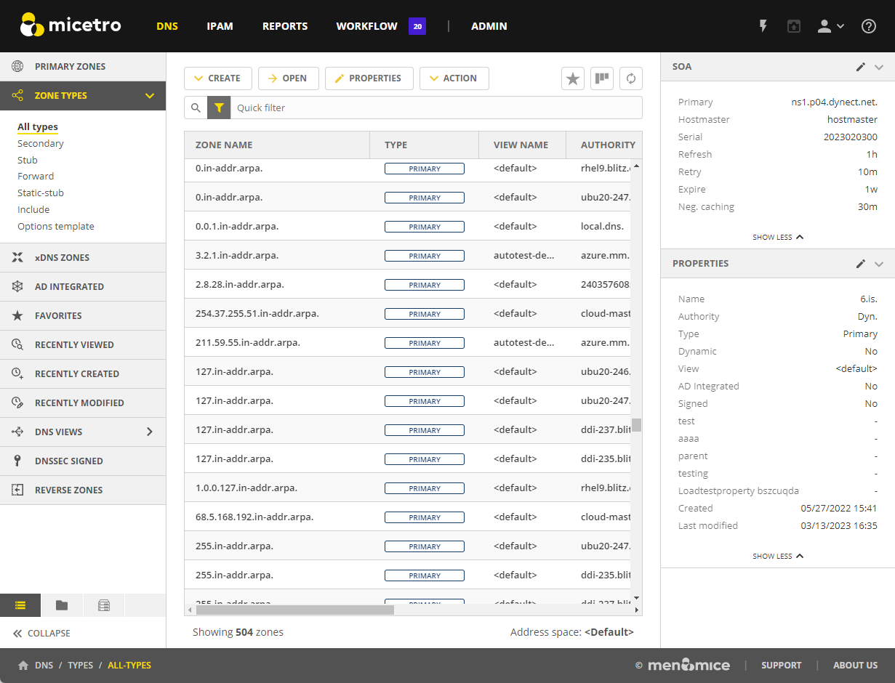
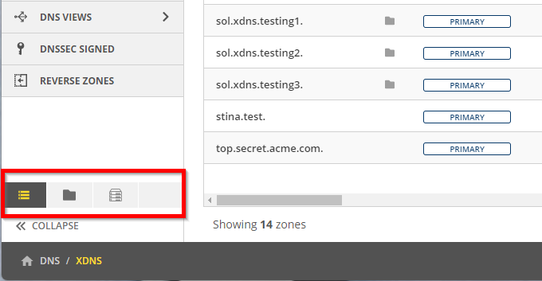
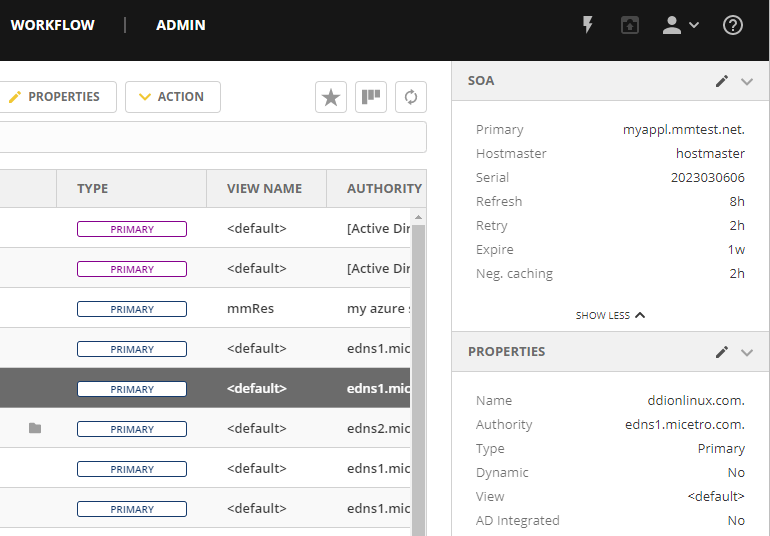
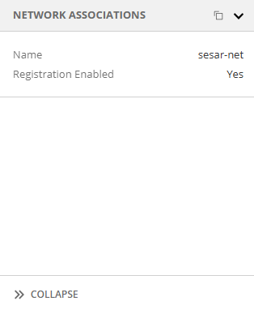
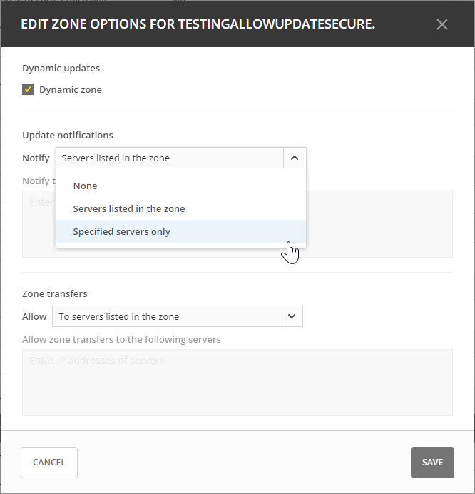
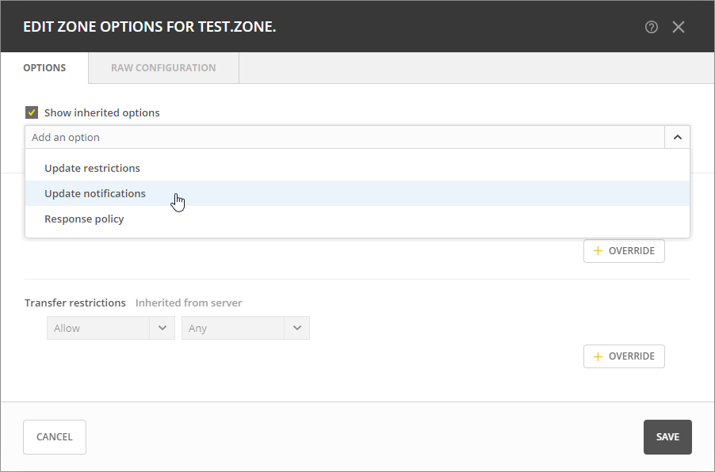

.. meta::
   :description: Overview, analysis, viewing, and deleting of DNS zones in Micetro
   :keywords: DNS zones, DNS servers

.. _dns-zones:

DNS Zones
=========

.. note::
   This information applies to the Micetro Web Application. For information about DNS zone management in the M&M Management Console, refer to :ref:`console-dns-zones`.

By default, the **DNS** page displays all primary zones in the system regardless of authority. 

|
The left sidebar offers several options for filtering and organizing zones. At the bottom of the sidebar, you can select a filter to display: **Menu**, **Folders**, and **DNS services**. 

* **Menu** provides the most commonly used filtering options for zones, such as zone types, favorites, and reverse zones.

* **Folders** allow you to organize zones and filter queries into folders. For more information about folder management, refer to :ref:`folder-management`.

* **DNS services** allows you to view zones by server/service. This can be useful if you have multiple DNS services and want to view the zones associated with each one separately.

Micetro will remember your current view selection when you navigate away from the **DNS** page and return to it later.

.. _dns-zone-types:

Zone Types
-----------
This table displays the zone types supported by Micetro.

.. csv-table::
  :header: "Type", "Description"
  :widths: 15, 85

  "Primary (blue)", "A primary zone, which is always the original copy of the zone and is always present on that zone's primary server."
  "Primary (yellow)", "A dynamic primary zone, which is always the original copy of the zone and is always present on that zone's primary server."
  "Primary (purple)", "An Active Directory-integrated primary zone."
  "Secondary", "A read-only copy of a primary zone or another secondary zone."
  "Hint", "Root zone used for bootstrapping of recursive DNS servers."
  "Private", "A private zone within a cloud environment, which is not exposed to the public internet. Specific to AWS and Azure."
  "Options template", "This configuration template is specific to the AuthServe DNS server and can be used to add templated options configuration to multiple zones. Editing the options template will affect all zones using the template."

**Configuration types**: The following zone types are configurations that tell the (recursive) DNS server how to resolve zones it cannot resolve as it typically does.

.. csv-table::
   :header: "Type", "Description"
   :widths: 15, 85

   "Stub", "A stub zone is a copy of a DNS zone that contains only resource records that identify the authoritative DNS servers for that zone. A stub zone is dynamically updated from the list of primary DNS servers."
   "Static-stub", "A BIND specific zone type to configure conditional forwarding, similar to Stub but is static, that is, it has a set of preconfigured NS entries."
   "Forward", "A forward zone contains a list of name server addresses, called forwarders, that can resolve queries for the zone. With forward zones queries are forced to go to the specified addresses."
 
Zone Contents
^^^^^^^^^^^^^
The Inspector on the right side of the screen provides a overview of the Start of Authority (SOA) record and properties of the selected zone. 

      
Click the header of the desired section to collapse or expand the section.

SOA 
""""
The SOA record contains the following data fields. To edit SOA information, click the pencil icon in the section header.

.. csv-table:: 
  :header: "Field", "Description"
  :widths: 15, 75

  "Primary", "The name of the server that serves as the primary server for the zone."
  "Hostmaster", "The email address of the individual responsible for the zone, formatted with a period (.) in place of the @ symbol. For example, hostmaster@example.com should be entered as hostmaster.example.com. The username must not contain a literal dot (.). See RFC 1912 'Common DNS Operational and Configuration Errors', Section 2.2 for additional information."
  "Serial", "A ten-digit number representing the year, month, day, and a two-digit daily revision number. It is actually any integer between 0 and approximately 4 billion, but the aforementioned format is the standard convention."
  "Refresh", "The interval in seconds at which secondary servers verify if their zone files are up to date by checking the serial number against the primary server. The standard setting for this field is 28800 seconds, or every 8 hours."
  "Retry", "The time a secondary server will wait to attempt reconnection with the primary zone after a failed attempt. The standard setting is 7200 seconds, or every 2 hours."
  "Expire", "The duration a secondary server will continue to serve a zone following the last successful contact with the primary name server. After expiration, the secondary server stops providing information about the zone, considering it unreliable. The standard expiration time is 604800 seconds, or 1 week."
  "Neg. caching", "This field is only available when connected to a BIND server. It specifies how long a server will cache the knowledge negative reponses. The standard setting is 86400 seconds, 24 hours."

Network Associations
""""""""""""""""""""
When you select a private zone in the data grid, the Inspector displays its cloud network associations. These network associations can be changed by editing the zone options. For instructions on editing zone options for private zones, refer to :ref:`private-zone-options`.

|
Managing DNS Zones
-------------------
Micetro enables you to manage your DNS zones, both in the Web Application and through the API. You can create new zones, edit or migrate existing zones to different servers, promote secondary zones to primary zones, and delete zones. Additionally, you can edit zone properties and options.

Viewing Zone Contents
^^^^^^^^^^^^^^^^^^^^^^
To view the DNS resource records for a particular zone, double-click the zone. You can also select the zone and then select :guilabel:`Open` on the task bar or the use the Row :guilabel:`...` to select :guilabel:`Open zone`. A list of the zone's resource records is displayed. For more information about DNS resource records, refer to :ref:`dns-records`.

Creating Zones
^^^^^^^^^^^^^^^

**To create a new DNS zone**:

1. Select :guilabel:`Create` on the **DNS** page task bar.

2. Select the zone type. For information about zone types, refer to :ref:`dns-zone-types` above.

      .. image:: ../../images/zone-create.png
         :width: 80%

3. Follow the steps of the wizard. The number of steps varies depending on the zone type and the configuration of Micetro. Refer to the zone-specific instructions below for each type.

.. tip::
   You can specify the network address in CIDR format, such as 192.168.1.0/24. Micetro will automatically convert this CIDR format into a reverse zone name (0.168.192.in-addr.arpa.). 

Primary Zone
"""""""""""""
1. Use the server filter to select the DNS server where the zone should be created. If xDNS profiles have been created on the instance, the zone can be added directly to an xDNS profile in the first step of the wizard.

   .. image:: ../../images/zone-primary-windows.png
      :width: 80%

   * When creating a DNS zone on a Windows Server, you'll encounter two checkboxes: 

      * **AD Integrated**: Selecting this option will create an Active Directory-integrated zone, which stores the zone data in Active Directory and benefits from AD's replication and security features.
      * **Dynamic Update**: Selecting this box enables dynamic updates, allowing DNS records to be automatically updated by authorized devices.

     If neither checkbox is selected, the DNS zone will be a standard static zone.

2. (Optional). You can select server(s) to host an identical copy of the zone. The zone files from the primary DNS are synced to the secondary DNS through a zone transfer.

      .. image:: ../../images/zone-flow-redundancy.png
         :width: 80%

3. If **custom properties** have been defined for zones, they can be edited in a separate step. Custom properties provide additional attributes that enhance the ability to understand, search, and sort zone data in Micetro. 

      .. image:: ../../images/zone-flow-custom-properties.png
         :width: 80%

   Custom properties appear as individual columns for each zone on the DNS data grid.

4. In the **Zone Options** step, you can specify which DNS servers will be notified of changes to the zone and to which servers it is allowed to perform zone transfers. 

      .. image:: ../../images/zone-flow-options.png
         :width: 80%

5. If DNS **Folders** have been configured in Micetro, you can add the new zone directly to a folder. DNS folders are a neat way to organize zones in Micetro to have a better overview and manageability. For more information about folders, refer to :ref:`folder-management`.

      .. image:: ../../images/zone-flow-folder.png
         :width: 80%   
      
6. The **Summary** step summarises the configuration for the new zone before it is created. To edit the configuration, go to the respective step in the wizard and make the desired changes.

Secondary Zone
"""""""""""""""
When creating a secondary zone, you need to specify the zone name and either the IP address or hostname of the primary servers that hold the zone you are creating a secondary copy for.

Private Zone
""""""""""""
When creating a private zone, the AWS and Azure services must have the required permissions to read and write private zones.

In the :guilabel:`Network Associations` step, select which cloud networks should have access to the private zone.

Stub Zone
"""""""""""
When creating a stub zone, you must provide the zone name and one or more primary servers for the zone being copied. You can use the toggle control above the text box to turn the address resolution on and off.

Static-stub Zone
""""""""""""""""
When creating a static-stub zone, you must provide the zone name and a target DNS server. To configure how to resolve the zone, specify either hostnames or IP addresses on the zone options page.
  
Forward Zone
""""""""""""
Forward zones are similar to stub zones. You must provide a zone name and a list of Forward servers as well as at least one target server for where to create the zone.

Options Template Zone
"""""""""""""""""""""""
The template zone option is available only if an AuthServe DNS server is connected to Micetro.

Deleting Zones
^^^^^^^^^^^^^^^

**To delete a zone from one or more servers**:

1. Select the zone(s) you want to delete.

2. Select :guilabel:`Delete zone` on either the :guilabel:`Action` or the Row :guilabel:`...` menu.    
      
3. The **Delete Zone** dialog opens, showing each zone you selected and a list of servers that currently serve that zone. The zone(s) you selected will be deleted from every server that is selected on this list. To keep the zone on a particular server, clear the checkbox for that server.

4. Click :guilabel:`Delete`. The zone is removed from the servers.

Migrating Zones
^^^^^^^^^^^^^^^

You can migrate one or more zones from one server to another, including all data in the zone.

**To migrate a zone**:

1. Select the zone you want to migrate.

2. Select :guilabel:`Migrate zone` on either the :guilabel:`Action` or the Row :guilabel:`...` menu.  
   
3. The **Migrate Zone(s)** dialog box opens.

4. Select the DNS service you want to migrate the zone to. 

5. If you want to remove the zone from the current service, select the :guilabel:`Remove original zone` checkbox. If the checkbox is left unselected, a copy of the zone is left on the current service.

.. _ad-preferred-servers:

Editing Preferred Servers
^^^^^^^^^^^^^^^^^^^^^^^^^^

.. note::
  This option is only available when working with Active Directory (AD) integrated zones. For more information about AD, see :ref:`active-directory`.

DNS administrators can specify the server to use when opening an AD-integrated zone, as well as the order of servers to use if the first preferred server becomes unavailable.

1. In the left sidebar, select the :guilabel:`AD Integrated`.

2. Select the zone(s) for which you'd like to set preferred servers.

3. Select :guilabel:`Edit preferred servers` on either the :guilabel:`Action` or the Row :guilabel:`...` menu.
   
4. Arrange the order of your servers into the preferred order. The server at the top of the list is tried first, and then if that server is unavailable, the second, and so on.

5. Select :guilabel:`Save`.

.. warning::
  If you select multiple zones, they might have different settings for preferred servers. Saving the configuration will overwrite the previous settings on all selected zones.

Editing Zone Properties
^^^^^^^^^^^^^^^^^^^^^^^^
:ref:`admin-custom-properties` are flexible metadata associated with zones and other object types, allowing you to include details such as contact information for zones, ranges, and records. These properties can be edited.

**To edit zone properties**:

1. In the **DNS** data grid, select the zone you want to edit.
2. Select :guilabel:`Edit Properties` on the task bar or the Row :guilabel:`...` menu.
2. Make the desired changes and select :guilabel:`Save` to apply them.

Editing Zone Options on Windows and BIND
^^^^^^^^^^^^^^^^^^^^^^^^^^^^^^^^^^^^^^^^
For Windows and BIND servers, you can configure individual settings for a specific zone on each server.

**To edit zone options for Windows and BIND zones**:

1. Select the zone(s) for which you want to edit the options.

2. Select :guilabel:`Edit zone options` on either the :guilabel:`Action` or the Row :guilabel:`...` menu.

3. In the configuration interface that appears, adjust the settings according to your requirements. 

Windows Zone Options
""""""""""""""""""""

* **Dynamic zone** (primary): Specifies whether the zone accepts dynamic updates. If selected, clients can use dynamic DNS updates to update their resource records.
* **Allow insecure updates** (Active Directory): Enable or disable insecure updates for the zone. When enabled, any client can update DNS records without authentication, potentially introducing security risks.
* **Update notifications** (primary, secondary, Active Directory): Specifies which servers should be notified when changes are made to the zone's DNS records.
* **Zone transfers** (primary, secondary, Active Directory): Controls which servers are allowed to receive zone transfers.
* **Forward servers** (forward): Specify the servers to which queries should be forwarded.
* **Primary servers** (stub): Specify the primary servers for the stub zone.

BIND Zone Options
"""""""""""""""""

By default, the **Show inherited options** checkbox is selected. When selected, any inherited options that are applied to the selected zone are displayed. Inherited options are settings that are propagated from higher-level configurations, either the server or view. You can edit the inherited options by selecting :guilabel:`Override` or by selecting the specific option you wish to modify from the dropdown.

To add another entry, click :guilabel:`Add` for the relevant option.

   * **Query restrictions** (primary, secondary, stub, static-stub): Specifies which hosts or IP addresses are allowed to query the DNS zone.
   * **Transfer restrictions** (primary, secondary): Transfer restrictions can specify which IP addresses or hosts are permitted to request zone transfers.
   * **Update restrictions** (primary):  Control who is allowed to dynamically update the DNS records within the zone. 
   * **Update notifications** (primary, secondary): Specify which servers should receive notifications when changes are made to the zone's DNS records. When dynamic updates occur, servers listed in the update notifications receive notifications to ensure they can synchronize their records accordingly.
   * **Response policy** (primary, secondary): Specify whether the zone is a response policy zone.
   * **Query forwarding** (forward): Determines how BIND behaves when forwarding queries for the forward zone. The **First - resolve if forwarding fails** option provides a fallback to local resolution if forwarding fails, while the **Only - fail if forwarding fails** option strictly relies on forwarding and does not attempt local resolution if forwarding fails.

Raw Configuration of Zone Options (BIND)
""""""""""""""""""""""""""""""""""""""""
The :guilabel:`Raw Configuration` option is intended for experienced users who have a good understanding of DNS configurations. There you can access and modify raw configuration files directly, granting you control over zone options not available in the Web Application.

.. _private-zone-options:

Editing Private Zone Options
^^^^^^^^^^^^^^^^^^^^^^^^^^^^
In Micetro, private zones are represented the same way as primary zones, except that they have cloud network associations. These cloud network associations can be accessed and added either in the Web Application or through API.

**Editing cloud network associations with API**

You can use the following API endpoints to access and edit your private zone's cloud network associations:

* ``GetDNSZoneOptions``
* ``SetDNSZoneOptions``

**Editing cloud network associations on the Web Application**

To edit your private zone's cloud network associations in the Web Application:

1. In the **DNS** data grid, select the private zone.
2. Use either the :guilabel:`Action` or Row :guilabel:`...` menu to select :guilabel:`Edit zone options`.
3. In the **Edit Zone Options** dialog box, select or deselect the networks where the private zone will be accessible. DNS queries for the zone will only resolve to the selected networks.

   .. note::
      You can associate the zone with multiple networks to enable DNS resolution across different network segments.

   .. image:: ../../images/edit-private-zone-options.png
      :width: 85%

4. Select :guilabel:`Save`.

Promoting Secondary Zones
^^^^^^^^^^^^^^^^^^^^^^^^^
The Promote Zone feature makes it possible to change a secondary zone to a primary zone. This might be necessary in emergencies, e.g., if the primary zone becomes unavailable for an extended period of time. This feature is only available for DNS Administrators.

When a secondary zone is promoted, the following actions are performed:

* Micetro checks whether the most recent copy of the zone is found in its internal database or on the server hosting the secondary zone, and uses the more recent copy.

* The server hosting the secondary zone is configured so that the zone is saved as a primary zone on the server.

* The zone history and access privileges from the old primary zone are applied to the new primary zone.

* The configurations of other instances of the secondary zone are modified so that they will get the updates from the new primary zone.

**To promote a secondary zone to a primary zone**:

1. Select the secondary zone.

2. Select :guilabel:`Promote to primary` on either the :guilabel:`Action` or the Row :guilabel:`...` menu.  
   
3. Click :guilabel:`Save` to continue, or :guilabel:`Cancel` to discontinue the process.

View History
^^^^^^^^^^^^^
The :guilabel:`View history` option on the :guilabel:`Action` menu opens the **History** window that shows a log of all changes that have been made to the zone, including the date and time of the change, the name of the user who made it, the actions performed, and any comments entered by the user when saving changes to objects. For more information, refer to :ref:`view-change-history`.
