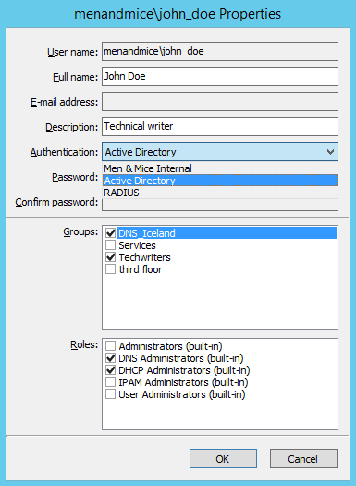

.. _external-auth:

External Authentication
=======================

Overview
--------

This section discusses the available user authentication methods available with the Men&Mice Suite.

In addition to Local User Authentication, the Men&Mice Suite currently supports two methods of AD user authentication using the Windows Active Directory user database and authentication through a RADIUS server.

Active Directory User Authentication
------------------------------------

The Active Directory (AD) User Authentication mechanism allows you to have users authenticate themselves in the AD login system before allowing them to login to the Men&Mice Suite. In large installations, this system has obvious benefits as the users do not have to maintain their passwords in multiple locations. The password rules (password expiry, minimum password length, etc.) that have been applied within the organization automatically apply to the Men&Mice Suite.

Active Directory User Authentication vs. Local User Authentication
^^^^^^^^^^^^^^^^^^^^^^^^^^^^^^^^^^^^^^^^^^^^^^^^^^^^^^^^^^^^^^^^^^

Even when you are using AD User Authentication, you must create users in the Management Console and assign privileges to them using the Men&Mice access system. The only difference between AD vs. local user authentication is that when AD user authentication is used, users are authenticated using the AD User Authentication system before they can access the Management Console. When AD User Authentication is used, the user password is not stored in the Men&Mice software.

.. note::
  Only one authentication method can be used per user, but different users can have different authentication methods. That means you can have some users log in using AD user authentication, while other users log in using local user authentication.

Enabling AD User Authentication Using Active Directory
^^^^^^^^^^^^^^^^^^^^^^^^^^^^^^^^^^^^^^^^^^^^^^^^^^^^^^

AD user authentication using Active Directory is only possible when you run Men&Mice Central on a Windows machine. The machine running Men&Mice Central must be a member in an Active Directory domain or forest.
No specific configuration is needed for Men&Mice Central for AD user authentication using Active Directory.

Configuring Users for AD Authentication
"""""""""""""""""""""""""""""""""""""""

To configure a user to use AD user authentication, do the following:

1. From the menu, select :guilabel:`Tools --> User management`.

2. Select the applicable user from the list. If the desired user is not shown, the user must be added to the application. Refer to :ref:`users`.

3. When the *Properties* dialog box display, move to the **Authentication** field, click the drop-down list, and select the applicable authentication method. (If Men&Mice Central is not running on a Windows machine, only the Men&Mice Suite authentication method displays.)

4. Click :guilabel:`OK`.

  .. note::
    When the AD authentication method is selected, the **Password** field is disabled, since the password is not stored in the Men&Mice Suite.

Active Directory Single Sign-on
-------------------------------

You can enable the Single Sign-on so that Active Directory users do not have to authenticate when logging in through the Management Console or the Command Line Interface.

To enable Active Directory Single Sign-on, do the following:

1. From the menu bar, select :guilabel:`Tools --> System Settings`.

2. In the *System Settings* dialog box, click the :guilabel:`General Settings` tab.

3. Select the :guilabel:`Allow Single Sign-on` option.

4. Click :guilabel:`OK`.

Web Interface
^^^^^^^^^^^^^

When single sign-on is enabled, it is possible to enable sign-on in the web interface if the web application is running on an IIS Server.

To enable single sign-on in the web interface, do the following:

1. Make sure that Single Sign-on and Single Sign-on for web is enabled in the Men&Mice Suite.

2. Using the IIS Administrator application, select an authentication method other than Anonymous and Basic for the MenandMice web folder.

3. Edit the file Index.htm in the MenandMice web folder, and change the redirection so SSO=1 argument is specified.

4. Make Index.htm the default document for the site.

.. _disable-kernel-mode-auth:

Disabling Kernel Mode Authentication
""""""""""""""""""""""""""""""""""""

The Windows Authentication in IIS has by default the Kernel Mode Authentication enabled, which blocks the SSO.

In the IIS Management Console, go to :guilabel:`Windows Authentication --> advanced settings` and set the "Kernel Mode Authentication" to *disabled*.

Application Log In
------------------

Logging into the Men&Mice Suite will not change when AD user authentication is used and Single Sign-on is disabled. The only thing to keep in mind is that the user name that is entered must match the user name stored in the Men&Mice Suite. If a distinguished user name is used, it must be entered in the same way when logging in.

Group Level Active Directory User Authentication
------------------------------------------------

The Group Level Active Directory (AD) User Authentication mechanism allows you to set user access privileges by group membership in the AD. In large installations, this system has obvious benefits as the users do not have to maintain their passwords in multiple locations. The password rules (i.e., password expiry, minimum password length, etc.) that have been applied within the organization automatically apply to the Men&Mice Suite.

The login sequence is as follows for users with Group Level AD authentication:

1. The user enters his/her user name and password in the Men&Mice Suite

2. The Men&Mice Suite uses the AD authentication mechanism to validate the user name and password. If the user name and password is correct, the Men&Mice Suite retrieves the group membership of the user from the AD.

3. The AD group list of the user is compared (by group name) to the local group list in the Men&Mice Suite. If a match is found, the user is logged in with the privileges specified in the local group list. If no match is found, the login fails.

To allow a user to log in to the Men&Mice Suite, you must create a group in the AD that has the same name as a group in the Men&Mice Suite and place the AD user in that group. You may create multiple groups in the AD that match group names in the Men&Mice Suite.

Configuring Groups for AD Group Level Authentication
^^^^^^^^^^^^^^^^^^^^^^^^^^^^^^^^^^^^^^^^^^^^^^^^^^^^

When using AD Group level authentication, you must specify which groups in the Men&Mice Suite should be used to verify group membership.

1. From the menu, select :guilabel:`Tools --> User Management`. The *Users and groups management* dialog box displays.

2. Click the :guilabel:`Groups` tab.

3. Select the group to which you want to configure AD and click the Edit button. If the desired group is not shown, you will need to add the group. See :ref:`groups`.

.. image:: ../../images/console_ad_groups_auth.png
  :width: 60%
  :align: center

Group Name
  Ensure that the group name is prefixed with the name of the owning domain name. Example: The Active Directory domain "MYDOMAIN" contains the group "MM-ReadOnly". The group name must then be "MYDOMAIN\MM-ReadOnly".

5. Click the checkbox for :guilabel:`Active Directory Integrated`.

6. Click :guilabel:`OK`.

.. note::
  Group Level Active Directory user authentication is only possible when you run Men&Mice Central on a Windows machine. The machine running Men&Mice Central must be a member in an Active Directory domain or forest.

Configuring Users and Access Privileges
^^^^^^^^^^^^^^^^^^^^^^^^^^^^^^^^^^^^^^^

You do not have to create users in the Men&Mice Suite when the Group Level AD authentication is used. Instead, user access is controlled by the group membership of the user in the AD.

RADIUS User Authentication
^^^^^^^^^^^^^^^^^^^^^^^^^^

The Men&Mice Suite can authenticate using an external RADIUS server. In large installations, this system has obvious benefits as the users do not have to maintain their passwords in multiple locations. The password rules (i.e., password expiry, minimum password length, etc.) that have been applied within the organization automatically apply to the Men&Mice Suite.

RADIUS User Authentication vs. Local User Authentication
^^^^^^^^^^^^^^^^^^^^^^^^^^^^^^^^^^^^^^^^^^^^^^^^^^^^^^^^

Even when you are using RADIUS User Authentication, you must create users in the Management Console and assign privileges to them using the Men&Mice access system. The only difference between RADIUS vs. local user authentication is that when RADIUS user authentication is used, users are authenticated using the RADIUS User Authentication system before they can access the Management Console. When RADIUS User Authentication is used, the user password is not stored in the Men&Mice software.

.. note::
  Only one authentication method can be used per user, but different users can have different authentication methods. That means you can have some users log in using RADIUS user authentication, while other users log in using local user authentication.

Enabling RADIUS User Authentication
^^^^^^^^^^^^^^^^^^^^^^^^^^^^^^^^^^^

To enable RADIUS authentication, you must add several properties to the Men&Mice Central configuration file preferences.cfg. This file is located in the data folder inside the Men&Mice Central data directory:

* Windows: C:\Program Files\Men&Mice\Central\data

* Mac OS X: ``/var/mmsuite/mmcentral``

* All others: set during installation. Usually ``/var/mmsuite/mmcentral`` or ``/chroot/var/mmsuite/mmcentral``, where ``/chroot`` is the location used as a chroot jail for named.

The properties to be added are:

.. csv-table::
  :widths: 25, 75

  "RADIUSServer", "Defines the address of the RADIUS server that will do RADIUS authentication."
  "RADIUSPort", "Defines the port that the RADIUS server is listening on. The default value is 1812, which is the port normally used by RADIUS."
  "RADIUSSharedSecret", "The shared secret between the RADIUS server and the Men&Mice Suite."
  "RADIUSAuthentication", "The type of authentication used. 0 = PAP, 1 = CHAP."

Example:

.. code-block::
  :linenos:

  <RADIUSServer value="192.168.1.3"/><RADIUSPort value="1515"/><RADIUSSharedSecret value="MyBigSecret"/><RADIUSAuthentication value="1"/>

After editing the file, restart Men&Mice Central.

* Windows: use :guilabel:`Administration Tools --> Services` to restart Men&Mice Central.

* Mac OS X: Execute the following shell command in a Terminal window (/Applications/Utilities/Terminal):

  .. code-block:: bash

    sudo /Library/StartupItems/mmSuite/mmcentral restart

* All others: Execute the ``mmcentral`` init script with the 'restart' argument.

Configuring Users
^^^^^^^^^^^^^^^^^

To allow a user to log in to the Men&Mice system, the user must exist in the Men&Mice user database. If the user does not exist in the Men&Mice user database, they are not allowed to log in, even if they provide a valid user name and password in the RADIUS login system.

To configure a user to use AD user authentication, do the following:

1. From the menu bar, select :guilabel:`Tools --> User Management`. The *User and group management* dialog box displays.

2. To add a new user, click the :guilabel:`Add` button. Refer to :ref:`users`. Follow the instructions with one exception: in the **Authentication** field, click the drop-down list and select RADIUS.

3. To modify an existing user, double-click on the user's name to display the user *Properties* dialog box, and in the **Authentication** field, click the drop-down list and select RADIUS.

.. note::
  When the RADIUS authentication method is selected, the **Password** field is disabled, since the password is not stored in the Men&Mice Suite.

.. image:: ../../images/console_ad_sso_radius.png
  :width: 60%
  :align: center

Logging into the Men&Mice Suite
^^^^^^^^^^^^^^^^^^^^^^^^^^^^^^^^^

Logging in to the Men&Mice Suite will not change when RADIUS user authentication is used. The only thing to keep in mind is that the user name that is entered must match the user name stored in the Men&Mice Suite.
