.. _ipam:

.. toctree::
  :maxdepth: 2

.. |user-range| image:: ../../images/console-ipam-user-created-range-icon.png
.. |dhcp-scope| image:: ../../images/console-ipam-dhcp-scope-icon.png

IP address management
=====================

Overview
--------

Managing IP Addresses entails being able to create assignable ranges within the available address space and determining which users and groups have usage rights to that space. The IP ranges can be created with specific properties that also determine the properties of the IP Addresses contained within them.

.. note::
  In order to use the IP Address Management features in the Men&Mice Management Console, you must have entered the license key for the IPAM module.

Address (A) Records in DNS Zone Windows
---------------------------------------

When the IP Address management component is enabled, you may notice some differences when working with Address (A) records in DNS zone windows, such as:

Restriction on allowed IP Addresses.
  When IPAM is enabled, the system administrator may restrict which IP Addresses you are allowed to use. The system administrator can determine an IP Address range that you are allowed to work with. In addition, he/she can choose whether you can use an IP Address that has already been assigned in DNS.

Automatic assignment of IP Addresses.
  The system administrator can configure the Men&Mice Suite so that you can create address (A) records without entering IP Addresses. When the zone is saved, the IP Addresses are automatically assigned using free IP Addresses in your IP Address range. If you want to enter an IP Address manually, you can type it in the IP Address field, but if you leave the field unchanged, the IP Address will be automatically assigned when you save the zone. If you have access to more than one IP Address range, a dialog box will be displayed at save time where you can choose the IP Address range for your new address records.

Range Access

You can manage access to ranges just as you can for other object types in the Men&Mice Suite, but there is one important distinction – You can set Inherited Access for ranges.

When you open the Access dialog box for a range, the dialog box has an extra section for inherited access.

* Checking the Inherit Access checkbox will have the selected range inherit all access bits from its parent range. This means that whenever the access privileges for the parent range are changed, they will be applied to the selected range as well.

* Clicking the Apply access inheritance in child ranges button will enable access inheritance for all descendants of the selected range. This means that whenever the access privileges in the selected range are changed, the changes will be applied of all descendants of the range.

Regarding other access settings, refer to :ref:`global-access`.

.. _ipam-containers:

Containers
----------

A Container is a section of the address space that has been reserved but not yet allocated. Containers can contain address ranges and scopes and you can set address privileges for containers that can be applied to the enclosed ranges and scopes through access inheritance. You cannot allocate IP addresses from within a container unless you have enabled that functionality in System Settings.

Creating a Container
^^^^^^^^^^^^^^^^^^^^

To create a Container, do the following:

1. Select File, New, Container. The Container dialog box displays.

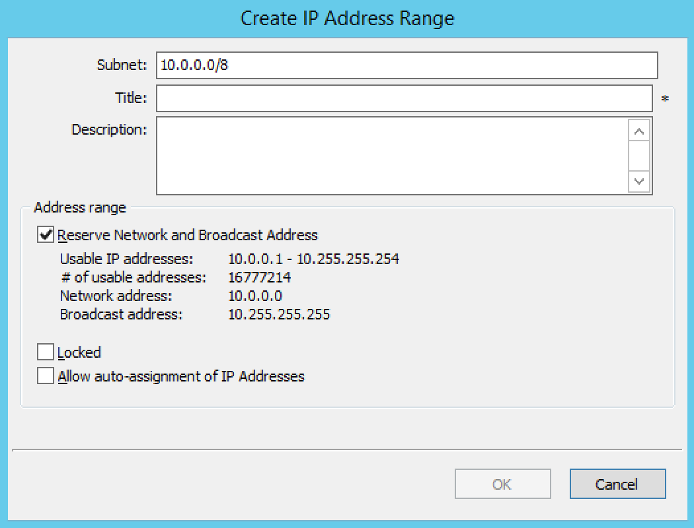

2. Subnet. For IPv4 ranges you can enter the address range in a network/subnet notation, for example 192.168.1/24. For IPv6 ranges you must enter the range in a network/subnet.

3. Title. Type the name you want to use for this Container. This name is for your convenience, so feel free to use whatever name you feel is appropriate.

4. Description. Enter a comment for this Container.

Converting Ranges and Containers
^^^^^^^^^^^^^^^^^^^^^^^^^^^^^^^^

A range that exists on network boundaries (a subnet) can be converted to a Container. Likewise, a Container can be converted to a range.

To convert a range to a Container:

1. Right-click the range that you want to convert.

2. From the shortcut menu, select Convert to Container.

3. Click OK in the confirmation dialog box that appears.

To convert a Container to a range:

1. Right-click the Container that you want to convert.

2. From the shortcut menu, select Convert to IP Address Range.

3. Click OK in the confirmation dialog box that appears.

You can manage access to Containers just as you can for other object types in the Men&Mice Suite, but there is one important distinction – You can set Inherited Access for Containers.

When you open the Access dialog box for a Container, the dialog box has an extra section for inherited access.

* Checking the Inherit Access checkbox will have the selected Container inherit all access bits from its parent. This means that whenever the access privileges for the parent are changed, they will be applied to the Container as well.

* Clicking the Apply access inheritance in child ranges button will enable access inheritance for all descendants of the Container. This means that whenever the access privileges in the Container are changed, the changes will be applied of all descendants of the Container.

Regarding other access settings, refer to :ref:`global-access`.

Container Utilization
^^^^^^^^^^^^^^^^^^^^^

When you open the properties dialog for a Container you can see how much of the Container has been allocated to subranges. This way, it is easy to see how much of the container is being utilized.

Viewing IP Address Ranges
-------------------------

The IP Address Range view shows the section of the IP Address space that is accessible to the current user of the system. The Men&Mice Suite allows administrators to manage the IP Address space by dividing it into any number of named sub ranges that can be assigned to specific groups for use by its members.

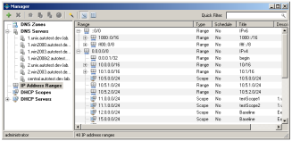

In the Object Section, click on IP Address Ranges. This shows the name of each IP range that has been created (and the address range it represents) and accessible to the current user.

As indicated by the icons there are two types of ranges listed:

* The |user-range| icon indicates a user-created range. Any range you create is considered a user-created range.

* The |dhcp-scope| icon represents a DHCP scope, created in the DHCP Scopes area of the Management Console.

You can choose between a flat and a hierarchical view for the Address Ranges scopes by selecting an appropriate button from the toolbar. You can also toggle between the views by selecting Toggle Hierarchical View from the Range menu.

If an Address range has no subranges, the utilization for the range is shown in the range list.

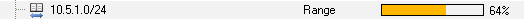

The IP Address Range view can display an indicator to show which gaps between IP Address ranges. This view is useful if you are looking for free segments in a fragmented IP Address space. When active, the view will display a thin blue line below a range if there is unallocated space between that range and the next range in the address space. To display the indicator, choose Show Trailing Gaps from the Range menu.

While viewing the IP Address ranges, the Quick Filter is available. When using the tree view while a filter is active, any parent ranges that don't fulfill the search criteria are displayed in gray to distinguish them from the found ranges. For example, in the image below, we searched for the string '0/26' and the only range found was '10.1.0.0./26'. However, to maintain the tree view, the parent ranges are shown even if they don't fulfill the search criteria.

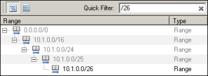

New Ranges
----------

To create a new IP Address range, do the following:

1. Make sure that IP Address Ranges is selected in the left hand side of the Manager window.

2. Click the Add button. The Properties dialog box displays.

3. Enter the appropriate values in the Properties dialog box and click OK.

Once a non-reserved IP Address range has been created, it is considered to be managed. A managed IP Address range is being managed by the IP Address component of the Men&Mice Suite. When the range is managed, the Men&Mice Suite will allow users with appropriate privileges to work with IP Addresses from the range.

It is possible to create subranges of existing ranges and DHCP scopes.

.. note::
  When you create a new IP Address range, the Men&Mice Suite checks to see if the new range can be logically grouped with other address ranges, and adds the new range in the appropriate address range group.

.. _ipam-range-config:

Range Configuration
-------------------

When configuring a new IP Address range, you must complete the Properties dialog box.

In the Object list, right-click and, from the shortcut menu, select New IP Address Range. The New Range Properties dialog box displays.

  Subnet.
    For IPv4 ranges you can enter the address range in a network/subnet notation, for example 192.168.1/24. You can also enter the address range using a from-to notation, for example 192.168.1.23-192.168.1.77. A range does not have to be defined on network boundaries. For IPv6 ranges you must enter the range in a network/subnet notation and the smallest network you can create is a /64. The actual range displays in the Usable IP Addresses field below. The network address and the broadcast address for the range are displayed below the Usable IP Addresses if the Range is a subnet checkbox is selected.  NOTE:  The boundaries of IP existing address ranges may not overlap.

  Title.
    Type the name you want to use for this IP Address range. This name is for your convenience, so feel free to use whatever name you feel is appropriate.
  Description. Enter a comment for this IP Address range.

  Reserve Network and Broadcast Address.
    This checkbox determines whether the user can use the first and last IP Address of the range when creating address records. If the address range is defined on actual network boundaries, you should leave this checkbox checked. If the address range you are defining is used for Administration boundaries rather than network boundaries, you should clear this checkbox.  NOTE:  This checkbox is disabled for IPv6 ranges.

  Locked.
    Select this checkbox if you want to lock this IP Address range. When an IP Address range is locked, Men&Mice Suite will not allow using IP Addresses from that range. This is useful if you want to lock a certain section of your IP Address block.

  Allow auto-assignment of IP Addresses.
    Select this checkbox if you want to allow automatically assigned IP Addresses from this IP Address range. If the checkbox is selected, and a user that has access to this address range creates an address record without entering an IP Address, Men&Mice Suite automatically assigns a free IP Address to the address record.

  .. note::
    This checkbox is disabled for IPv6 ranges.

Range Modifications
^^^^^^^^^^^^^^^^^^^

Once you have created an IP Address Range, it is easy for you to make changes to that IP Address Range. You can do the following:

* Change the name of the IP Address range

* Change the boundaries (start and end IP Address) of the IP Address range
* Change the state of the IP Addresses in that IP Address range

To modify an IP Address range, do the following:

1. Right-click on the IP Address ranges.

2. From the shortcut menu, select Properties.

3. Make the desired changes.

4. Click OK.

Range Deletions
^^^^^^^^^^^^^^^

You can always delete an IP Address Range definition. If you delete an IP Address Range, the IP Addresses that belonged to that range will get the attributes of the parent IP Address Range. If the range you are deleting has subranges, the subranges will become children of the unassigned ranges' parent.

Use the following procedure to delete an IP Address Range definition:

1. Locate the IP Address Range you want to remove and right-click on it.

2. From the shortcut menu, select Delete. A dialog prompts you to confirm your decision to delete this range

3. Click OK to delete the range, or Cancel to leave it.

IP Address List
---------------

To view a list of host entries in a particular range, double-click on the IP Address Range. This opens the IP Address List tab where you can view and edit the properties of individual IP Address entries.

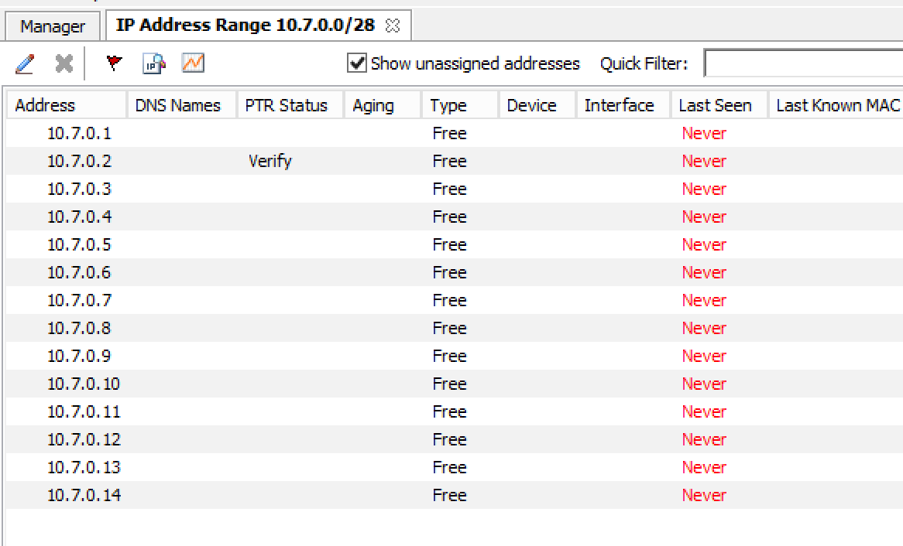

* The Show unassigned addresses checkbox lets you choose whether you want to see all IP Addresses in the range or whether you only want to show IP Addresses that are assigned.

* The PTR Status column shows the status of the Address (A) record and Pointer (PTR) record mappings. This column can have three values:

  Empty. The status is empty if there are no DNS records for the host. It is also empty if a PTR record exists where the domain in the data section of the PTR record is not managed by the system.

  OK. If there is a match between the A and the corresponding PTR record(s) the status is listed as OK.

  Verify. If there is not a match between the A and the PTR records for the host, the status is listed as Verify. The most common reasons are:

    * There is an A record but the PTR record is missing.
    * There is a PTR record but the A record is missing.
    * The data section in the PTR record does not correspond to the name of the A record.

When the PTR Status for a host entry shows Verify, you can open the IP Address dialog box for the host to see more detailed information on which DNS host entry is generating this status message.

.. note::
  When working with large IP Address ranges (ranges that contain more than 4096 IP Addresses) the Show unassigned addresses will no longer be available and the IP Address List window will only display assigned IP Addresses.

.. _ip-address-dialog:

IP Address Dialog Box
---------------------

When you add or modify an existing entry, the IP Address dialog box displays. The entries in this dialog box can vary, depending on the license keys in use, whether the dialog box is accessed from a DHCP scope or an IP Address range, and if any custom properties have been defined (e.g., "Owner" is a custom property in the example shown below).

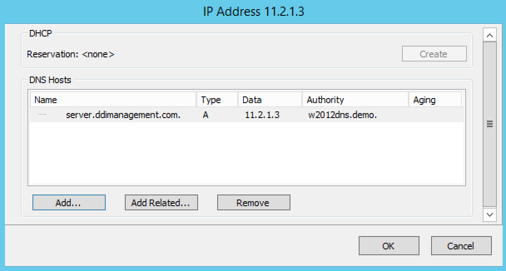

DNS Hosts. If a DNS license key is active, the IP Address dialog box will contain a DNS Hosts section where you can enter Address (A) records and related CNAME and TXT records. You can also add, edit, and remove hosts/related hosts from this screen. The PTR column in the list of DNS hosts shows the PTR status for each A or AAAA record. For more information on PTR status see the IP Address List section, above.

If a discovery schedule has been set for the subnet, the dialog box will show information on when the IP Address was last seen on the network:

  Last seen.
    Shows the last time this IP Address was seen. This information cannot be edited.

  Last discovery.
    Shows the last time a discovery was performed for this IP Address. This information cannot be edited.

  Last known MAC.
    Shows the last known MAC address for this IP Address. This information is read directly from the router tables and is only populated if Router Query is active.

  Discovery type.
    Shows the type of discovery performed for this IP Address (Ping or Router Query)

If the IP Address is linked to a device, the name of the device is shown and a Show button displays. Click the Show button to open the Device Properties window for the device the IP Address is linked to.

Adding a DNS Host
^^^^^^^^^^^^^^^^^

.. tip::
  As a shortcut, you can select a valid host name in any field, right-click and select Add Host.  The host is automatically added

1. While viewing the IP Address dialog box, move to the DNS Hosts section, and click the Add button.

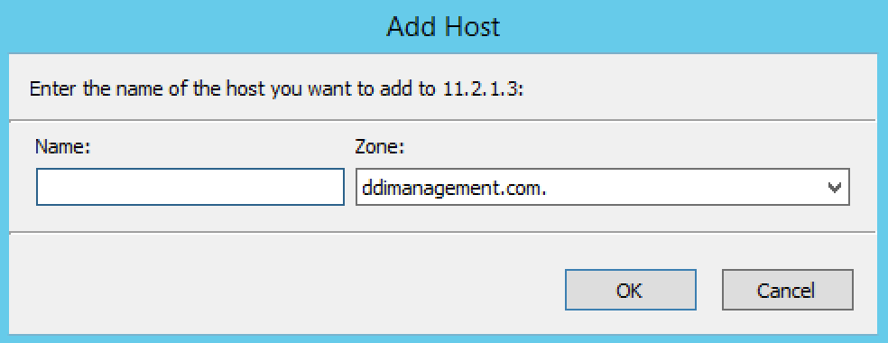

  .. note::
    If the number of available zones does not exceed 100, the Zone area of the window will be a drop-down list instead of the Browse button.

2. In the Zone menu, verify the zone selected is the zone to which you want to add a host. The Select zone menu displays, reflecting a list of available zones.

3. Click OK. The dialog box closes and the Address record displays in the IP Address dialog box.

Editing a DNS Host
^^^^^^^^^^^^^^^^^^

1. Select the host details you want to edit.

2. Double click the host entry you want to edit. A dialog box displays.

3. Make the desired changes and click OK. The dialog box closes and the details are updated.

Removing a DNS Host
^^^^^^^^^^^^^^^^^^^

1. Select the host you want to remove.

2. Click Remove. The host details are deleted and removed from the list in the IP Address dialog box.

Adding a Related Host
^^^^^^^^^^^^^^^^^^^^^

1. Click Add Related button. The Add Related Record dialog box displays.

.. image:: ../../images/console-ipam-add-related-record.png
  :width: 50%
  :align: center

2. For the Name and Zone fields, refer to the steps found for  Adding a DNS Host .

3. In the Type field, click the drop-down list and select the record type.

    * If the record type is CNAME, in the Zone field, choose the zone that should contain the record.
    * If the record type is TXT, in the Data field, type the text for the record.

4. Click OK. The dialog box closes and the related record displays in the IP Address dialog box.

Editing a Related Host
^^^^^^^^^^^^^^^^^^^^^^

1. Double click the related host you want to edit. The Modify Host dialog box displays.

  .. note::
    It is not possible to edit all record types.

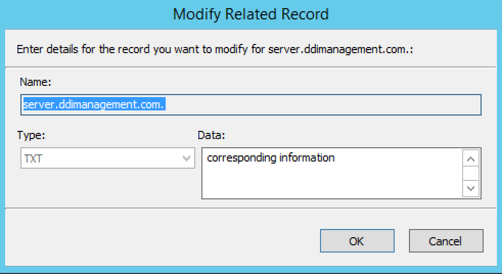

2. Make the desired changes and click OK. The dialog box closes and the record is updated.

Removing a Related Host
^^^^^^^^^^^^^^^^^^^^^^^

1. Select the related record you want to remove.

2. Click Remove. The related record is deleted from the zone and removed from the list in the IP Address dialog box.

Moving IP Address Information
-----------------------------

IP Address information can be moved to a new IP Address. When the IP Address information is moved, all information about the IP Address is retained, and the associated DNS records are updated.

To move a IP Address information, do the following:

1. Locate the IP Address Range containing the IP Address.

2. Double-click on it to display the list window.

3. Find the applicable IP Address.

4. Right-click and, from the shortcut menu, select Move.

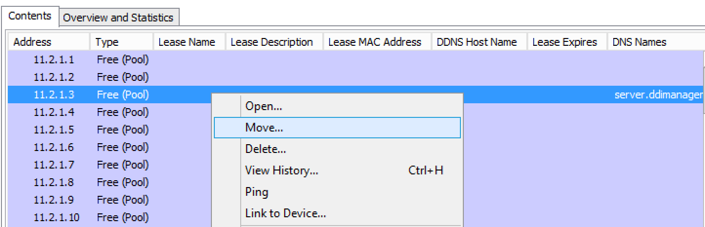

5. In the Move IP Address Information dialog box, type the new IP Address.

6. Click OK. The IP Address information is moved to the new IP Address.

Split Range Wizard
------------------

This wizard allows you to create multiple subranges of an existing range. The wizard can only be used on ranges that exist on subnet boundaries and have no subranges already in place.

1. From the object list, click on IP Address Ranges.

2. From the list of ranges displayed right-click and, from the shortcut menu, select Split into Subranges. The Split range wizard displays.

3. For each of the resulting screens, make a selection/entry and move through the wizard.

Update Reverse Records Wizard
-----------------------------

This wizard allows you to create reverse DNS zones for selected ranges. The wizard can only be used on ranges that exist on subnet boundaries and contain 254 or more IP Addresses (/24 or larger)

1. From the object list, click on IP Address Ranges.

2. From the list of ranges displayed, select the ranges, right-click and, from the shortcut menu, select Update Reverse Records. The Reverse zone generation wizard displays.

3. For each of the resulting screens, make a selection/entry and move through the wizard.

Allocate Ranges Wizard
----------------------

This wizard allows you to create allocate a user-defined number of subranges from an existing range. The wizard can only be used on ranges that exist on subnet.

1. From the object list, click on IP Address Ranges.

2. From the list of ranges displayed right-click and, from the shortcut menu, select Allocate Ranges. The Allocate ranges wizard displays.

3. Follow the instructions provided by the wizard to create the number of subranges that you need.

Join Ranges
-----------

This function allows you to select and join a number of ranges. The Join Ranges command is available if the selected ranges can be joined.

1. Display the list of address ranges that you want to join.

2. Select each of the desired ranges.

3. Right-click and, from the shortcut menu, select Join Ranges.

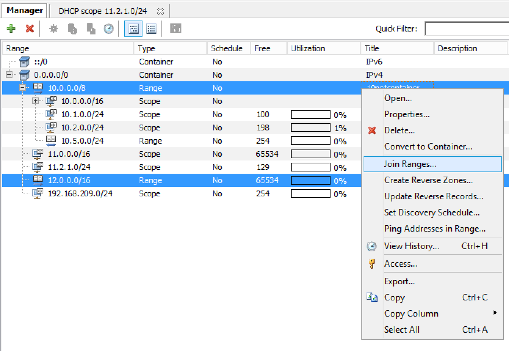

4. The Join Ranges dialog box displays.

  Use Access.
    Click the drop-down list and specify from which range you will gain access.

  Use Properties.
    Click the drop-down list and specify from which range you will use the properties.

  Title.
    Enter a title for this range.

  Description.
    Type a description.

5. Click Join.

Select Parent
-------------

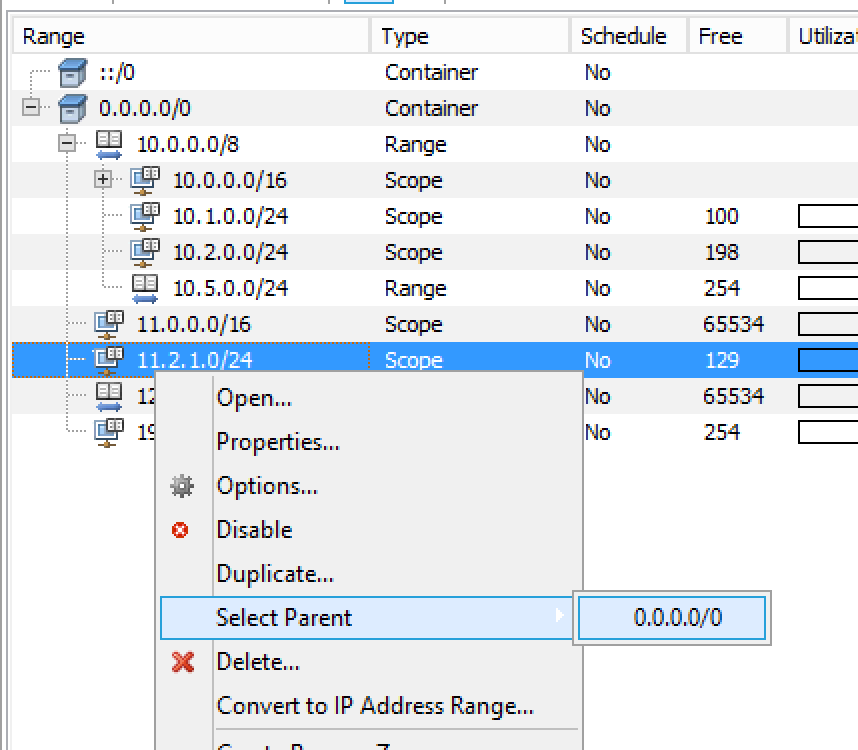

This function allows you to view the hierarchy for subnets when filtering is active.

1. Locate the subrange for which you want to view the hierarchy.

2. Right-click on the subrange and, from the shortcut menu, selects Parent. All available parent(s) are shown.

3. Click on the parent and the system automatically moves you to that parent range.

Host Discovery
--------------

With this feature, you can see when hosts were last seen on your network. There are two methods you can use for host discovery – using ping or querying routers for host information.

Configuring Host Discovery Using Ping
^^^^^^^^^^^^^^^^^^^^^^^^^^^^^^^^^^^^^

1. Select one or more IP Address Ranges.

2. Right-click and, from the shortcut menu, select Set Discovery Schedule. The Schedule dialog box displays.

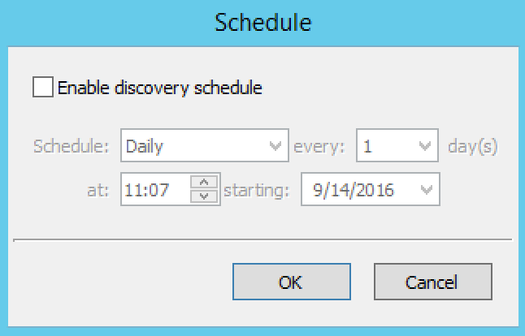

3. Select the Enable discovery schedule option.

4. Schedule ____ every ___ day(s)/week(s)/month(s). Click the drop-down list and select the frequency (e.g., Daily, Weekly, etc.) and the occurrences (e.g., 1 day, 2 weeks, etc.).

5. At ____. Enter the time at which discovery should take place.

6. Starting ____. Click the drop-down list and select the start date.

7. Click OK

Once the schedule options have been set and saved, a new column called, Last seen, identifies when a host last was last seen on the network.

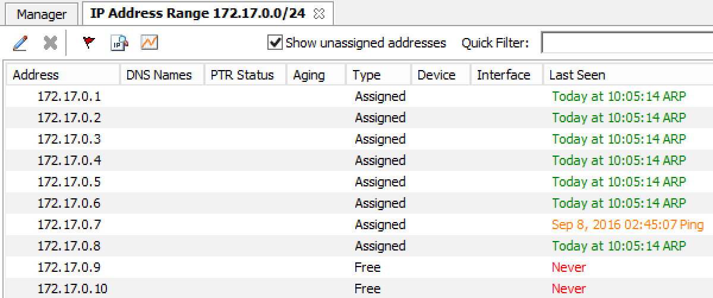

Green. Host responded to the last PING request. The date and time are shown.

Orange. Host has responded in the past, but did not respond to the last PING request. The date and time of last response is shown.

Red. Host has never responded to a PING request. The text Never is shown.

The list of ranges contains a column that shows if a discovery schedule has been set for a range. The name of this column is Schedule. To quickly see all ranges that have a schedule set, you can use the Quick Filter and filter by this column by entering Schedule:Yes in the Quick Filter search field.

At any time if you wish to  disable  host discovery, do the following:

1. Select the object(s) for which you want to disable discovery.

2. Right-click and, from the shortcut menu, select Set Discovery Schedule. The Schedule dialog box displays.

3. Uncheck the Enable discovery schedule option.

4. Click OK.

Configuring Host Discovery by Querying Routers
^^^^^^^^^^^^^^^^^^^^^^^^^^^^^^^^^^^^^^^^^^^^^^

It is possible to perform host discovery by performing SNMP queries on specified routers. SNMP v1, v2c and v3 is supported.

Before a router can be queried it must be placed in an SNMP profile. An SNMP profile contains the information necessary to access the SNMP information on the router. Note that multiple routers can share the same SNMP profile.

To create an SNMP profile:

1. Select Tools, SNMP Profiles. The following dialog window appears.  Here a new profile can be created, edited or removed. Additionally, a scan can be initiated. If the 'Scan' button is greyed out, a scan is already in progress.

2. To create a new profile, click Add. The SNMP Profile dialog box is displayed.

3. Enter a profile name and choose the SNMP version to use. You can also specify a non-standard port to use for SNMP

4. Enter the necessary information to access the router using SNMP. The information is different depending on the SNMP version selected.

  For SNMP v1 and v2c:

  .. csv-table::
    :widths: 15, 85

    "Community", "Enter the SNMP community string (password) to use to access the routers using the profile."

  For SNMP v3:

  .. csv-table::
    :widths: 15, 85

    "Username",	"Enter a user name for accessing the routers using the profile."
    "Authentication Protocol", "Choose the authentication protocol to use. The available protocols are MD5 and SHA."
    "Authentication Password", "Enter the authentication password for the routers using the profile."
    "Encryption Protocol", "Choose the encryption protocol to use. The available protocols are DES and AES."
    "Encryption Password", "Enter the authentication password for the routers using the profile."

5. Enter the IPv4 address of one or more routers that you want to query using this profile. Note that each router's IP address needs to be on a separate line in the text area.

6. Click OK to save the settings and close the dialog box.

You can edit an SNMP profile, for example if you want to add or remove routers from a profile.

To edit an SNMP profile:

1. Select Tools, SNMP Profiles, select the SNMP profile you want do edit and click Edit in the dialog box that appears. The SNMP Profile dialog box is displayed for the selected entry.

2. Make the required changes and click OK to save the changes and close the dialog box.

Subnet Discovery
----------------

The subnet discovery features enables the Men&Mice Suite to obtain information about the subnets on the network through SNMP on the routers. The process is the same as in  configuring host discovery, but to enable this feature, make sure the 'Synchronize subnets ...'  is checked.

Remove from Folder
------------------

Removes the currently selected IP Address Range from the current folder. Once you remove a range, there is no "undo" option available.

1. Highlight the range you want to remove.

2. Right-click and, from the shortcut menu, select Remove from Folder. The range is removed.

Subnet Monitoring and Utilization History
-----------------------------------------

The Subnet Monitoring is used to monitor the free addresses in subnets and DHCP address pools and perform an action if the number of free addresses goes below a user-definable threshold. In addition, the utilization history for the monitored subnets and scopes is collected and you can view and export the historical utilization data.

When Subnet Monitoring is enabled a global monitoring setting is applied to all subnets in the system. You can change the subnet monitoring settings for individual subnets and scopes, for example if you want to disable monitoring for a certain subnet or if you want to use a different threshold for the free addresses in a DHCP scope.  NOTE:  Only DHCP scopes that are enabled are monitored. Disabled scopes are ignored.

.. note::
  The Subnet Monitoring needs to be enabled in the System Settings before continuing. See :ref:`admin-monitoring`.

Set Subnet Monitoring
^^^^^^^^^^^^^^^^^^^^^

To change the monitoring settings for a subnet:

1. Select the subnet(s) for which you want to change the monitoring setting.

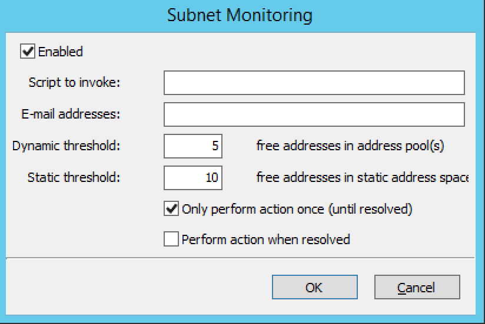

1. Right-click and, from the shortcut menu, select Set Subnet Monitoring. The Subnet Monitoring dialog box displays.

  Enabled.
    When checked, the subnet will be monitored.

  Script to invoke.
    Enter the path of the script to run when the number of free addresses goes below the set threshold. Refer to External Scripts , for information on the script interface and the format for calling the script.

  E-mail addresses.
    Enter one or more e-mail addresses (separated by comma, e.g. email@example.com,email@example.net). An e-mail will be sent to the specified addresses when the number of free addresses goes below the set threshold.

  Dynamic Threshold.
    Enter the threshold for the free addresses in a DHCP scope address pool.  NOTE:  For split scopes and scopes in a superscope (on MS DHCP servers) and address pools using the shared-network feature on ISC DHCP servers, the total number of free addresses in all of the scope instances is used when calculating the number of free addresses.

  Static Threshold.
    Enter the threshold for the free addresses in a subnet.

  Only perform action once (until fixed).
    When checked, the action is performed only once when the number of free addresses goes below the threshold.

  Perform action when fixed.
    When checked, the action is performed when the number of free addresses is no longer below the threshold.

2. Click OK to confirm your settings.

Removing Subnet Monitoring
^^^^^^^^^^^^^^^^^^^^^^^^^^

You can clear the monitor setting for individual subnets if you want to use the global subnet monitoring setting. To clear a monitoring setting for a subnet:

1. Select the subnet(s) for which you want to clear the monitoring setting.

2. Right-click and, from the shortcut menu, select Remove Subnet Monitoring. The custom subnet monitoring setting is removed and the global monitoring setting is used instead.

View Utilization History
------------------------

You can view the utilization history for a subnet or scope that is being monitored.

To view the utilization history:

1. Select the subnet for which you want to view the utilization history.

2. Right-click and, from the shortcut menu, select View Address Utilization. The Address Utilization window displays.

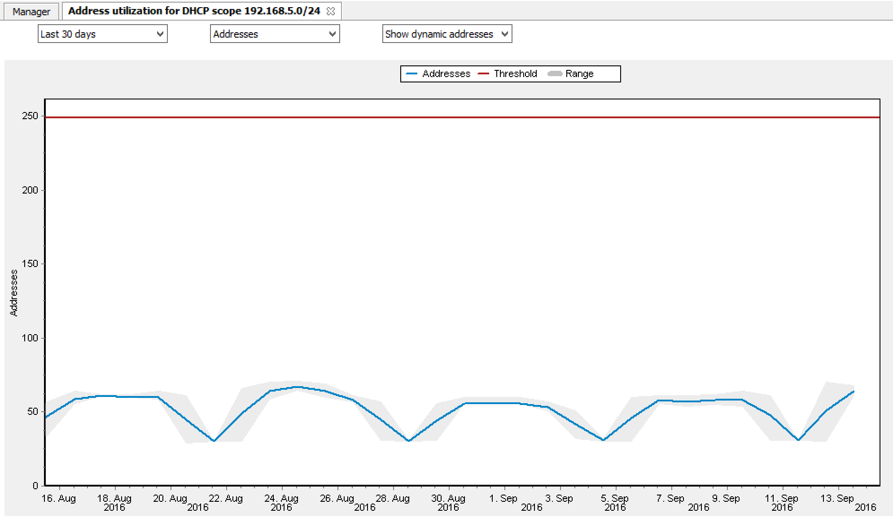

* The drop-down box in the top left section of the window allows you to choose the time period to view. You can choose between 30 days, 7 days or 24 hours.

* Use the drop-down box in the middle to choose whether you want to view the utilization by the actual address count or by percentage.

* If you are viewing the utilization of a scope, a dropdown box is displayed where you can choose whether you want to view the dynamic part of the scope (the address pool(s)) or the static part of the scope.

* The blue Addresses line shows the number of used addresses in the subnet.

* The red Threshold line shows the utilization threshold that is currently in effect for the subnet.

* If the 30 day or 24 hour view is active, a gray 'envelope' is shown around the Addresses line. This shows the maximum and minimum utilization of addresses during the time period.

* Moving the mouse cursor over the graph shows the actual data points, and if the 30 day or 24 hour view is active, the minimum, average and maximum values are shown for each data point.

* You can view the address utilization for a superscope. When viewing the address utilization for a superscope, the total number of addresses in all of the scopes in the superscope are used for the utilization calculation.

Export Utilization History
^^^^^^^^^^^^^^^^^^^^^^^^^^

You can export the utilization history for one or more subnets to the Clipboard or into a CSV file.

* To export the utilization history for a single subnet from the Address Utilization Window, right-click the graph and select the time period you want to export. The data is copied to the Clipboard.

* To export the utilization for multiple subnets, select the subnets, right-click and from the shortcut menu select Export Address Utilization. The data is saved in a CSV file.

Multiple Address Spaces
-----------------------

The Men&Mice Suite supports multiple address spaces. Each address space instance contains its own set of DNS servers, DNS zones, DHCP servers, DHCP scopes, IP Address ranges (including the IPv4 and IPv6 root ranges), IP Address entries and object folders. Changes to data in one address space do not affect data in any other address space.

Items shared between address spaces are the user and group lists and custom property definitions.

Address Space Management
^^^^^^^^^^^^^^^^^^^^^^^^

The Address Space Management dialog box allows you to create, modify or delete address spaces as well as set access privileges for existing address spaces. To access the Address Space Management dialog box, you must be logged in as the administrator user.

To open the Address Space Management dialog box, from the Tools menu, select Define Address Spaces.

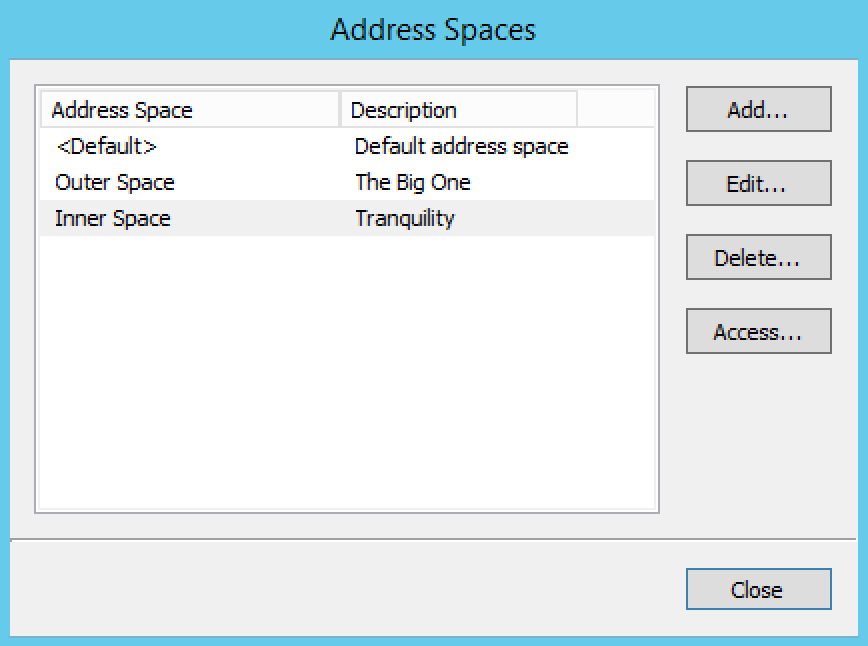

To create a new address space, click the Add button and enter the name and description for the address space.  NOTE:  When more than one address space is defined, the first address space will be named <default>. It is not possible to rename or delete the <default> address space. Also, the <default> address space is the only address space that shows AD sites if AD Site and Subnet integration is enabled.  NOTE:  When a new address space is created, you must set the access for the address space to allow users to access it. When creating your first address space, two address spaces will actually be created, the <default> address space and the address space you created. You must set access for the <default> address space as well as for the new address space.

To change the name or description for an address space, select the address space and click the Edit button.

To delete an address space, select the address space and click the Delete button.  NOTE:  When you delete an address space, all objects contained within the address space are removed (DNS servers, DHCP servers, IP Address ranges, IP Address entries and folders). This action is not undoable.  NOTE:  You cannot delete the <default> address space or the address space you are currently working in.

To set access privileges for an address space, select the address space and click the Access button.

Switching to a Different Address Space
^^^^^^^^^^^^^^^^^^^^^^^^^^^^^^^^^^^^^^

You can only work in one address space at a time. You can see the current address space in the Manager window, above the object list.

To switch to a different address space:

1. Select the IP Address Ranges object in the object list in the Manager window.

2. Select Ranges -> Switch Current Address Space. A dialog box listing all available address spaces displays.

3. Select the address space you want to switch to and click the OK button.

Moving Objects to a Different Address Space
^^^^^^^^^^^^^^^^^^^^^^^^^^^^^^^^^^^^^^^^^^^

DNS servers, DHCP servers, IP Address ranges and individual IP Address entries can be moved between address spaces. When an object is moved between address spaces, all properties for the object are retained, including its access settings and change history. You must have the relevant administrator privileges to move objects do a different address space.

.. note::
  You cannot move folders between address spaces. Individual DHCP scopes cannot be moved between address spaces, but when you move a DHCP server to a different address space, all of its DHCP scopes are moved as well. Likewise, you cannot move individual DNS zones to a different address space, but moving a DNS server to a different address space will move all of its zones as well.
