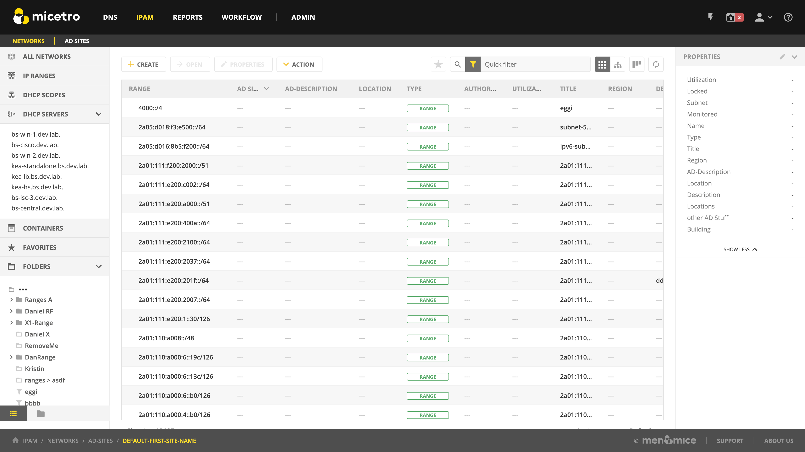

.. meta::
   :description: IP address management (IPAM) in Micetro by Men&Mice
   :keywords: IPAM, IP address management

.. _ipam:

IPAM
======

.. note::
  This information applies to the Web Interface. For information about how to manage IP addresses in the Management Console, see :ref:`console-ipam`.

Overview
--------

Managing IP Addresses entails being able to create assignable ranges within the available address space and determining which users and groups have usage rights to that space. The IP ranges can be created with specific properties that also determine the properties of the IP Addresses contained within them.

.. note::
  In order to use the IP Address Management features in Micetro, you must have entered the license key for the IPAM module.

Multiple Address Spaces
-----------------------

.. note::
  For managing address spaces, see :ref:`address-spaces`.
  For managing address spaces through the Management Console, see :ref:`console-address-spaces`.

Micetro supports multiple address spaces.

Each address space instance contains its own set of DNS servers, DNS zones, DHCP servers, DHCP scopes, IP Address ranges (including the IPv4 and IPv6 root ranges), IP address entries, and folders.

.. note::
  Changes to data in one address space do not affect data in any other address space.

Items **shared** between address spaces are:

* users, groups, and roles

* custom property definitions (see :ref:`admin-custom-properties`)

Switching to a Different Address Space
^^^^^^^^^^^^^^^^^^^^^^^^^^^^^^^^^^^^^^

You can only work in one address space at a time. You can see the current address space at the bottom of the :guilabel:`Networks` section on the :guilabel:`IPAM` page..

To switch to a different address space:

1. Click the **User** icon in the top right corner.

2. Point to :guilabel:`Address Space`, and then select the address space you want to use.

.. image:: ../../images/address-space-Micetro.png
  :width: 50%
  :align: center

|
Address (A) Records in DNS Zone Windows
---------------------------------------

When the IPAM component is enabled, you may notice some differences when working with Address (A) records in DNS zone windows, such as:

Restriction on allowed IP Addresses
  When IPAM is enabled, the system administrator may restrict which IP Addresses you are allowed to use. The system administrator can determine an IP Address range that you are allowed to work with. In addition, he/she can choose whether you can use an IP Address that has already been assigned in DNS.

Automatic assignment of IP Addresses
  The system administrator can configure Micetro so that you can create address (A) records without entering IP Addresses. When the zone is saved, the IP Addresses are automatically assigned using free IP Addresses in your IP Address range. If you want to enter an IP Address manually, you can type it in the IP Address field, but if you leave the field unchanged, the IP Address will be automatically assigned when you save the zone. If you have access to more than one IP Address range, a dialog box will be displayed at save time where you can choose the IP Address range for your new address records.

.. _ipam-containers:

Containers
----------

A Container is a section of the address space that has been reserved but not yet allocated. Containers can contain address ranges and scopes, and you can set address privileges for containers that can be applied to the enclosed ranges and scopes through access inheritance. You cannot allocate IP addresses from within a container unless you have enabled that functionality in System Settings.

.. _new-container:

New Container
^^^^^^^^^^^^^

A range that exists on network boundaries (a subnet) can be converted to a Container. Likewise, a Container can be converted to a range.

1. Select :guilabel:`IPAM` on the top navigation bar.

2. Select the range(s) you want to convert.

3. On the :guilabel:`Action` menu, select :guilabel:`Convert to container`. You can also select this option on the **Row menu (...)**.

4. Confirm that you want to convert the selected range(s), and add a save comment.

Viewing IP Address Ranges
-------------------------
The **IPAM** page shows the section of the IP address space that is accessible to the current user of the system. Micetro allows administrators to manage the IP Address space by dividing it into any number of named sub ranges that can be assigned to specific groups for use by its members.

In the filtering sidebar, select  :guilabel:`IP Ranges`.

.. image:: ../../images/Networks-Micetro-10.5.png
  :width: 90%
|
* Use the buttons on the top right of the grid to choose between a flat and a hierarchical view for the Address Ranges scopes.

* If an Address range has no subranges, the utilization for the range is shown in the range list.

To narrow down the results shown when viewing IP ranges, you can use the :ref:`webapp-quick-filter`. When using the tree view with an active filter, any parent ranges that do not match the search criteria will be faded out while the matches highlighted. For example, in the image below, we searched for the string ``3.1``.

.. image:: ../../images/ipam-tree-filter-Micetro.png
  :width: 90%
  
|
New Networks
------------

To create a new network, do the following:

1. Go to the **IPAM** page.

2. Click the :guilabel:`Create` button.

3. Select what type of network (new network, :ref:`new-dhcp-scope`, :ref:`new-container`) you'd like to create.

4. Enter the appropriate values, grouped on pages depending on the type.

.. note::
  The *Create* wizard is different depending on the type selected through the dropdown:

* For a *network*, you can reserve network and broadcast address, and lock the range if needed. You can also assign it to an AD site. (See :ref:`active-directory`)

* A *DHCP scope* can be created with the network and broadcast address automatically configured. See :ref:`new-dhcp-scope`.

* A *container* has no network or broadcast address. See :ref:`ipam-containers`.

5. Click :guilabel:`Finish`.

Once a non-reserved IP Address range has been created, it is considered to be managed. A managed IP Address range is being managed by the Networks component of Micetro. When the range is managed, Micetro will allow users with appropriate privileges to work with IP Addresses from the range.

It is possible to create subranges of existing ranges and DHCP scopes.

.. note::
  When you create a new IP Address range, Micetro checks to see if the new range can be logically grouped with other address ranges, and adds the new range in the appropriate address range group.

.. _ipam-range-config:

Network Configuration
^^^^^^^^^^^^^^^^^^^^^

When creating a new network, DHCP scope, or container, you must complete the Properties page in the final step.

These properties are defined in :ref:`admin-custom-properties`.

Network Modifications
^^^^^^^^^^^^^^^^^^^^^

Once you have created a network, it is easy to make changes.

1. Select the range in the list.

2. On the :guilabel:`Action` menu, select :guilabel:`Edit network properties`. You can also select this option on the **Row menu (..)**.

3. Make the desired changes.

4. Click :guilabel:`Save`.

Network Deletions
^^^^^^^^^^^^^^^^^

You can always delete a network definition. If you delete a network, the IP addresses that belonged to it will get the attributes of the parent network. If the network you are deleting has subranges, they will become children of the unassigned networks' parent.

To delete a network definition:

1. Select network(s) you want to remove.

2. On the :guilabel:`Action` menu, select :guilabel:`Delete network`. You can also select this option on the **Row menu (..)**. 

3. You are prompted to confirm your decision to delete the(se) network(s). Click :guilabel:`Yes` to delete the range, or :guilabel:`No` to leave it.

IP Address List
---------------

To view a list of host entries in a particular network, double-click the network. This opens a list where you can view and edit the properties of individual IP address entries.

.. image:: ../../images/view-Networks-Micetro-10.5.png
  :width: 80%
  
The :guilabel:`State` section in the filtering sidebar can be used to show only **Free**, **Assigned**, **Claimed**.

The :guilabel:`PTR Status` column shows the status of the Address (A) record and Pointer (PTR) record mappings. This column can have three values:

 * **Empty**: The status is empty if there are no DNS records for the host. It is also empty if a PTR record exists where the domain in the data section of the PTR record is not managed by the system.

 * **OK**: If there is a match between the A and the corresponding PTR record(s) the status is listed as OK.

 * **Verify**: If there is not a match between the A and the PTR records for the host, the status is listed as Verify. The most common reasons are:

      * There is an A record but the PTR record is missing.

      * There is a PTR record but the A record is missing.

      * The data section in the PTR record does not correspond to the name of the A record.

When the PTR Status for a host entry shows Verify, you can open the IP Address dialog box for the host to see more detailed information on which DNS host entry is generating this status message.

.. note::
  When working with large IP Address ranges (ranges that contain more than 4096 IP Addresses) the :guilabel:`Show unassigned addresses` will no longer be available and the IP Address List window will only display assigned IP Addresses.

.. _ip-address-dialog:

IP Address Inspector
--------------------

When you add or modify an existing IP address entry, the IP Address dialog box displays. The entries in Inspector can vary, depending on the custom properties defined in Micetro (e.g., "Owner" is a custom property in the example shown below), if DNS or DHCP related data exists, etc.

.. image:: ../../images/ip-inspector-Micetro.png
  :width: 30%
  :align: center
|
.. _ipam-add-dns-host:

Adding a DNS Host
^^^^^^^^^^^^^^^^^

While viewing the IP Address Inspector, click the :guilabel:`+` button in the :guilabel:`Related DNS data`.

.. image:: ../../images/ip-create-dns-Micetro.png
  :width: 50%
  :align: center

The **Address** field is automatically filled with the selected IP address. Fill in the other information and click :guilabel:`Create now` or :guilabel:`Add to request`. (See :ref:`webapp-workflows`.)

Editing a DNS Host
^^^^^^^^^^^^^^^^^^

1. In the Inspector, in the ellipsis menu in the :guilabel:`Related DNS data` section click :guilabel:`Edit`.

2. Make the desired changes and click :guilabel:`Save`. The dialog box closes and the details are updated.

Removing a DNS Host
^^^^^^^^^^^^^^^^^^^

1. In the Inspector, in the ellipsis menu in the :guilabel:`Related DNS data` section click :guilabel:`Delete`. The host details are deleted and removed from the Inspector.

.. _split-range-wizard:

Split/Allocate Range Wizard
---------------------------

This wizard allows you to create multiple subranges from an existing range. The wizard can only be used on ranges that exist on subnet boundaries and have no subranges already in place.

1. On the **IPAM** page, select the range you'd like to split.

2. On the :guilabel:`Action` menu, select :guilabel:`Allocate subranges`. You can also select this option on the **Row menu (...)**.

3. Configure the new subranges. If you choose fewer subnets that fit in the parent, you can also set the offset from where you want to start allocating. Click :guilabel:`Next` when finished configuring.

.. image:: ../../images/subranges-wizard.png
  :width: 65%
  :align: center

4. Define the title and custom properties for the new subranges. Click :guilabel:`Next` when done.

5. On the summary page verify the new subranges and click :guilabel:`Finish`.

.. note::
  In the web application, the Split Range and Allocate Range wizards are merged together. For information on these wizards in the Management Console, see :ref:`console-split-range` and :ref:`console-allocate-ranges`.

Join Ranges
-----------

1. On the **IPAM** page, select the ranges that you want to join.

2. On the :guilabel:`Action` menu, select :guilabel: `Join Ranges`. You can also select this option on the **Row menu (...)**.

   .. image:: ../../images/join-ranges.png
      :width: 90%
  
  
3. Set the properties for the joined range:

   * **Use Access from**: Click the drop-down list and specify from which range you will gain access.

   * **Use Properties from**: Click the drop-down list and specify from which range you will use the properties.

   * **Title**: Enter a title for the new range.

   * **Description**: Type a description.

4. Click :guilabel:`Join`.

Host Discovery
--------------

With this feature, you can see when hosts were last seen on your network. There are two methods you can use for host discovery – using ping or querying routers for host information.

Configuring Host Discovery Using Ping
^^^^^^^^^^^^^^^^^^^^^^^^^^^^^^^^^^^^^

1. Select one or more IP ranges.

2. On the :guilabel:`Action` menu, select :guilabel:`Set discovery schedule`. You can also select this option on the **Row menu (...)**.

3. Select the :guilabel:`Enable` option.

  * Frequency: 
    Click the drop-down list and select the frequency (e.g., 1, 2, etc.).

  * Every: 
    Enter the frequency unit for discovery (e.g. days, weeks, etc.).

  * Next run: 
    Select the start date and time.

4. Click :guilabel:`Save`.

Once the schedule options have been set and saved, two columns - Last Seen and Last Known MAC Address - are added to the range grid. The Last Seen column identifies when a host was last seen on the network.

* **Green**: Host responded to the last PING request. The date and time are shown.

* **Orange**: Host has responded in the past, but did not respond to the last PING request. The date and time of last response is shown.

* **Red**: Host has never responded to a PING request. The text Never is shown.

At any time if you wish to disable host discovery, do the following:

1. Select the object(s) for which you want to disable discovery.

2. On the **Row menu (...)**, select :guilabel:`Set discovery schedule`.

3. Uncheck the :guilabel:`Enable` option.

4. Click :guilabel:`Save`.

Configuring Host Discovery by Querying Routers
^^^^^^^^^^^^^^^^^^^^^^^^^^^^^^^^^^^^^^^^^^^^^^

See :ref:`snmp-profiles`.

Subnet Discovery
----------------

The subnet discovery features enables Micetro to obtain information about the subnets on the network through SNMP on the routers. The process is the same as in configuring host discovery, but to enable this feature, make sure the :guilabel:`Synchronize subnets ...` is checked in the SNMP profile. See :ref:`snmp-profiles`.

Add to/remove from Folder
-------------------------

Adds or removes the currently selected IP Address Range from folders.

.. danger::
  Once you remove a range from a folder, there is no "undo" option available.

1. Highlight the range you want to remove.

2. On the **Row menu (...)**, select :guilabel:`Set folder` and add or remove the range from folders.

Set Subnet Monitoring
^^^^^^^^^^^^^^^^^^^^^

To change the monitoring settings for a subnet:

1. Select the subnet(s) for which you want to change the monitoring setting.

2. On the :guilabel:`Action` menu, select :guilabel:`Set subnet monitoring`. The Subnet Monitoring dialog box opens.

  * **Enabled**: When selected, the subnet will be monitored.

   * **Script to invoke**: Enter the path of the script to run when the number of free addresses goes below the set threshold. Refer to External Scripts , for information on the script interface and the format for calling the script.

   * **Email addresses**: Enter one or more e-mail addresses (separated by comma, e.g. email@example.com,email@example.net). An e-mail will be sent to the specified addresses when the number of free addresses goes below the set threshold.

* **Dynamic Threshold**: Enter the threshold for the free addresses in a DHCP scope address pool.  NOTE:  For split scopes and scopes in a superscope (on MS DHCP servers) and address pools using the shared-network feature on ISC DHCP servers, the total number of free addresses in all of the scope instances is used when calculating the number of free addresses.

* **Static Threshold**: Enter the threshold for the free addresses in a subnet.

* **Only perform action once (until fixed)**: When selected, the action is performed only once when the number of free addresses goes below the threshold.

* **Perform action when fixed**: When selected, the action is performed when the number of free addresses is no longer below the threshold.

3. Click :guilabel:`OK` to confirm your settings.

.. _active-directory:

AD Sites and Subnets
--------------------

Overview
^^^^^^^^^
Micetro allows administrators to integrate Active Directory (AD) sites into the IPAM context, view subnets within these sites and add, remove, and move subnets between the sites.

.. note::
  AD sites and subnets integration is only available when Men&Mice Central is running on a Windows server, and it is enabled by default. See :ref:`admin-general`.

  AD sites are only assigned to and visible in the ``Default`` address space.

  To add/remove a subnet to/from a site, the user must be assigned to a role with the *Edit range properties* permission set and the role applied to the object. See :ref:`access-control` for more details.

AD sites and subnets are displayed in the :guilabel:`IPAM` context:

* subnets in the main :menuselection:`IPAM --> Networks` grid, along with all other subnets in Micetro (if any). The *AD Site* column displays the site the subnet belongs to.

* sites in a separate :menuselection:`IPAM --> AD sites` grid, grouped by Forests. The Inspector box on the right displays the subnets (if any) belonging to the selected AD site.

AD Forests
^^^^^^^^^^^^

To manage sites and subnets, Micetro needs to be configured with AD Forest(s).

.. note::
  You can manage sites and subnets from multiple forests.

Adding an AD Forest
"""""""""""""""""""

1. On the **IPAM** page, select :guilabel:`AD sites` in the upper-left corner.

2. Use the :guilabel:`Add Forest` action from the top bar. A dialog box displays.

   .. image:: ../../images/add-ad-forest.png
     :width: 60%
  
|
Use same Global Catalog as the Men&Mice Central server
  If checked, Micetro will use the same Global Catalog server as the Men&Mice Central server is using. If you unselect this checkbox, you must specify the Global Catalog server's FQDN or IP address in the **Global Catalog Server** field.

Global Catalog Server
  If you want to specify a Global Catalog server, enter the server's FQDN or IP address in this field. (To unlock this field, the :guilabel:`Use same Global Catalog as the Men&Mice Central server` checkbox needs to be unchecked.)

Use the same credentials as the Men&Mice Central server
  If checked, Micetro uses the same credentials as the Men&Mice Central server when accessing the site information.

User and Password
  If you don't want to use the default credentials for the machine running Men&Mice Central, enter the desired user name and password in these fields. (To unlock these fields, the :guilabel:`Use the same credentials as the Men&Mice Central server` checkbox needs to be unchecked.)

Set as read only
  If checked, users will be able to display data from Active Directory, but unable to make any modifications.

3. Click :guilabel:`OK` to save the changes. The forest is added and the sites belonging to the forest are displayed.

Edit AD Forest
"""""""""""""""

To edit an existing AD Forest (to, for example, change the read-only status):

1. On the **IPAM** page, select :guilabel:`AD sites` in the upper-left corner.

2. Select the :guilabel:`Edit AD Forest` action from the top toolbar or the **Row menu (...)**.

3. Update the settings in the dialog box.

4. Click :guilabel:`OK` to save your changes.

Removing an AD Forest
""""""""""""""""""""""""

To remove an AD Forest from Micetro:

1. On the **IPAM** page, select :guilabel:`AD sites` in the upper-left corner.

2. Select the AD Forest(s) you want to remove.

3. Select the :guilabel:`Remove AD Forest` action on the top toolbar or the **Row menu (...)**.

4. Click :guilabel:`OK` in the confirmation box to remove the Forest(s).

Reloading the Sites in an AD Forest
"""""""""""""""""""""""""""""""""""""

Data from AD Forests is synchronized by Men&Mice Central regularly. To manually synchronize forests and reload the data for sites and subnets:

1. On the **IPAM** page, select :guilabel:`AD sites` in the upper-left corner.

2. Select the AD Forest(s) you want to synchronize.

3. Use the :guilabel:`Synchronize` action from the top bar.

4. Click :guilabel:`OK` in the confirmation box to synchronize the Forests.

AD Subnets
----------

View subnets in a site
^^^^^^^^^^^^^^^^^^^^^^

To view subnets within a specific site:

1. On the **IPAM** page, select :guilabel:`AD sites` in the upper-left corner.

2. Select the AD Forest the site is in, or use the :ref:`webapp-quick-filter` to find it by name.

3. On the :guilabel:`Action` menu, select :guilabel:`View networks`. You can also select this option on the **Row menu (...)**.

This will open the :menuselection:`IPAM --> Networks` context with a filter applied to show all subnets that belong to the site.

.. note::
  You can also use the :guilabel:`-> View` button in the Inspector of the selected AD site to open the subnet view.

Moving subnets between AD sites
^^^^^^^^^^^^^^^^^^^^^^^^^^^^^^^

To add subnet(s) to a site, or move between sites:

1. On the **IPAM** page, select the subnet(s) in the list.

2. Select :guilabel:`Set AD Site` on the :guilabel:`Action` menu or the **Row menu (...)**.

3. Set the (new) AD Site in the dropdown and click :guilabel:`Save`.

.. note::
  Child subnets cannot be moved to a different site than the parent subnet unless the ``Enforce site inheritance`` checkbox is unchecked in the System Settings dialog box.

  Subnets whose AD site settings are inherited from a parent range will have a ``<AD Site Name> (inherited)`` notation added.

  See :ref:`admin-general`.

Remove subnet from AD site
^^^^^^^^^^^^^^^^^^^^^^^^^^

1. Select the subnet(s) in the :menuselection:`IPAM --> Networks` grid.

2. Select :guilabel:`Remove from AD Site` on the :guilabel:`Action` menu or the **Row menu (...)**.

3. Click :guilabel:`Yes` to confirm the removal.

Subnets outside of sites
^^^^^^^^^^^^^^^^^^^^^^^^

To view subnets that don't belong to any AD site:

1.  On the **IPAM** page, select :guilabel:`AD sites` in the upper-left corner.

2. Click the ``Flat view`` button (see :ref:`webapp-quick-filter`) next to the Quick Filter to change the view.

3. Sort the IP address ranges by the **AD Site** column in *ascending* order:

|
