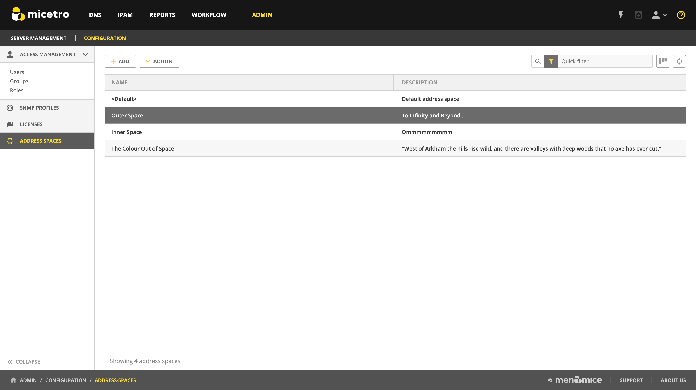

.. meta::
   :description: IP address management (IPAM) in the Micetro by Men&Mice Management Console
   :keywords: IPAM, IP address management

.. _ipam:

.. toctree::
  :maxdepth: 2

IP address management
=====================

.. note::
  To manage IP addresses in the Management Console, see :ref:`console-ipam`.

Overview
--------

Managing IP Addresses entails being able to create assignable ranges within the available address space and determining which users and groups have usage rights to that space. The IP ranges can be created with specific properties that also determine the properties of the IP Addresses contained within them.

.. note::
  In order to use the IP Address Management features in Micetro, you must have entered the license key for the IPAM module.

Multiple Address Spaces
-----------------------

.. note::
  For managing address spaces through the Management Console, see :ref:`console-address-spaces`.

Micetro supports multiple address spaces.

Each address space instance contains its own set of DNS servers, DNS zones, DHCP servers, DHCP scopes, IP Address ranges (including the IPv4 and IPv6 root ranges), IP address entries, and folders.

.. note::
  Changes to data in one address space do not affect data in any other address space.

Items **shared** between address spaces are:

* users, groups, and roles

* custom property definitions (see :ref:`admin-custom-properties`)

Address Space Management
^^^^^^^^^^^^^^^^^^^^^^^^

Users with sufficient permissions are allowed to create, modify or delete address spaces as well as set access privileges for existing address spaces.

Navigate to :menuselection:`Admin --> Configuration --> Address Spaces`

To **create** a new address space, click the :guilabel:`Add` button in the top bar and enter the name and description for the address space.

.. note::
  The first address space is always named ``<default>``. It is not possible to rename or delete the *<default>* address space.

  The *<default>* address space is the only address space that shows AD sites if *AD Site and Subnet* integration is enabled.

To **edit** the name or description for an address space, select the address space and click the :guilabel:`Action --> Edit address space` button in the top bar or ellipsis menu.

To **delete** an address space, select the address space and click the :guilabel:`Action --> Remove address space` button in the top bar or ellipsis menu.

.. danger::
  When you delete an address space, all objects contained within the address space are removed (DNS servers, DHCP servers, IP address ranges, IP address entries, and folders). This action cannot be undone.

.. note::
  You cannot delete the *<default>* address space or the address space you are currently working in.

To see and edit the **access controls** for an address space, select the address space and click the :guilabel:`Action --> Access` button in the top bar or ellipsis menu.

Switching to a Different Address Space
^^^^^^^^^^^^^^^^^^^^^^^^^^^^^^^^^^^^^^

You can only work in one address space at a time. You can see the current address space in the Manager window, above the object list.

To switch to a different address space:

1. Click the **User** icon in the top right corner of the Web Application.

2. Select :guilabel:`Address Space` and select the address space you want to use.

.. image:: ../../images/address-space-Micetro.png
  :width: 50%
  :align: center

Moving Objects to a Different Address Space (Management Console)
^^^^^^^^^^^^^^^^^^^^^^^^^^^^^^^^^^^^^^^^^^^^^^^^^^^^^^^^^^^^^^^^

See :ref:`console-address-spaces`.

----

Address (A) Records in DNS Zone Windows
---------------------------------------

When the IP Address management component is enabled, you may notice some differences when working with Address (A) records in DNS zone windows, such as:

Restriction on allowed IP Addresses
  When IPAM is enabled, the system administrator may restrict which IP Addresses you are allowed to use. The system administrator can determine an IP Address range that you are allowed to work with. In addition, he/she can choose whether you can use an IP Address that has already been assigned in DNS.

Automatic assignment of IP Addresses
  The system administrator can configure Micetro so that you can create address (A) records without entering IP Addresses. When the zone is saved, the IP Addresses are automatically assigned using free IP Addresses in your IP Address range. If you want to enter an IP Address manually, you can type it in the IP Address field, but if you leave the field unchanged, the IP Address will be automatically assigned when you save the zone. If you have access to more than one IP Address range, a dialog box will be displayed at save time where you can choose the IP Address range for your new address records.

Range Access (Management Console)
^^^^^^^^^^^^^^^^^^^^^^^^^^^^^^^^^

You can manage access to scopes just as you can for other object types in Micetro, but there is one important distinction: you can set *Inherited Access* for scopes. When you open the *Access* dialog box for a scope, the dialog box has an extra section for inherited access.

Checking the :guilabel:`Inherit Access` checkbox will have the selected scope inherit all access bits from its parent range. This means that whenever the access privileges for the parent range are changed, they will be applied to the scope as well.

Clicking the :guilabel:`Apply access inheritance in child ranges` button will enable access inheritance for all descendants of the scope. This means that whenever the access privileges in the scope are changed, the changes will be applied of all descendants of the scope.

Regarding other access settings, refer to :ref:`access-control`.

.. _ipam-containers:

Containers
----------

A Container is a section of the address space that has been reserved but not yet allocated. Containers can contain address ranges and scopes and you can set address privileges for containers that can be applied to the enclosed ranges and scopes through access inheritance. You cannot allocate IP addresses from within a container unless you have enabled that functionality in System Settings.

.. _new-container:

New container
^^^^^^^^^^^^^

A range that exists on network boundaries (a subnet) can be converted to a Container. Likewise, a Container can be converted to a range.

1. In the **Networks** context select the range(s).

2. From the ellipsis menu select :guilabel:`Convert to container` or use :menuselection:`Actions --> Convert to container`.

3. Confirm that you want to convert the selected range(s) and add a save comment.

.. note::
  In the Management Console, you can set Inherited Access for Containers.

  When you open the Access dialog box for a Container, the dialog box has an extra section for inherited access.

  * Checking the :guilabel:`Inherit Access` checkbox will have the selected Container inherit all access bits from its parent. This means that whenever the access privileges for the parent are changed, they will be applied to the Container as well.

  * Clicking the :guilabel:`Apply access inheritance in child ranges` button will enable access inheritance for all descendants of the Container. This means that whenever the access privileges in the Container are changed, the changes will be applied of all descendants of the Container.

  Regarding other access settings, refer to :ref:`access-control`.

Viewing IP Address Ranges
-------------------------

The **Networks** context shows the section of the IP address space that is accessible to the current user of the system. Micetro allows administrators to manage the IP Address space by dividing it into any number of named sub ranges that can be assigned to specific groups for use by its members.

.. image:: ../../images/Networks-Micetro.png
  :width: 90%
  :align: center

In the filtering sidebar, click on :guilabel:`IP Ranges`.

You can choose between a flat and a hierarchical view for the Address Ranges scopes by selecting an appropriate button on the top right of the grid.

If an Address range has no subranges, the utilization for the range is shown in the range list.

While viewing the IP ranges, the :ref:`webapp-quickfilter` is available. When using the tree view while a filter is active, any parent ranges that don't fulfill the search criteria are faded out and the matches highlighted. For example, in the image below, we searched for the string ``1.4``.

.. image:: ../../images/networks-tree-filter-Micetro.png
  :width: 90%
  :align: center

New Networks
------------

To create a new network, do the following:

1. Open the :menuselection:`Networks` context.

2. Click the :guilabel:`Create` button.

3. Select what type of network (new network, :ref:`new-dhcp-scope`, :ref:`new-container`) you'd like to create.

4. Enter the appropriate values, grouped on pages depending on the type.

.. note::
  The *Create* dialog is different depending on the type selected through the dropdown:

  * For a *network*, you can reserve network and broadcast address, and lock the range if needed. You can also assign it to an AD site. (See :ref:`active-directory`)

  * A *DHCP scope* can be created with the network and broadcast address automatically configured. See :ref:`new-dhcp-scope`.

  * A *container* has no network or broadcast address. See :ref:`ipam-containers`.

5. Click :guilabel:`Finish`.

Once a non-reserved IP Address range has been created, it is considered to be managed. A managed IP Address range is being managed by the Networks component of Micetro. When the range is managed, Micetro will allow users with appropriate privileges to work with IP Addresses from the range.

It is possible to create subranges of existing ranges and DHCP scopes.

.. note::
  When you create a new IP Address range, Micetro checks to see if the new range can be logically grouped with other address ranges, and adds the new range in the appropriate address range group.

.. _ipam-range-config:

Network Configuration
^^^^^^^^^^^^^^^^^^^^^

When creating a new network, DHCP scope, or container, you must complete the Properties dialog box in the final step.

These properties are defined in :ref:`admin-custom-properties`.

Network Modifications
^^^^^^^^^^^^^^^^^^^^^

Once you have created a network, it is easy to make changes.

1. Select the range in the grid.

2. From the ellipsis menu select :guilabel:`Edit network properties` or use :menuselection:`Actions --> Edit network properties`.

3. Make the desired changes.

4. Click :guilabel:`Save`.

Network Deletions
^^^^^^^^^^^^^^^^^

You can always delete a network definition. If you delete a network, the IP addresses that belonged to it will get the attributes of the parent network. If the network you are deleting has subranges, they will become children of the unassigned networks' parent.

Use the following procedure to delete a network definition:

1. Select network(s) you want to remove.

2. From the ellipsis menu select :guilabel:`Delete network` or use :menuselection:`Actions --> Delete network`. A dialog prompts you to confirm your decision to delete the(se) network(s).

3. Click :guilabel:`Yes` to delete the range, or :guilabel:`No` to leave it.

IP Address List
---------------

To view a list of host entries in a particular network, double-click on the network. This opens the grid where you can view and edit the properties of individual IP address entries.

.. image:: ../../images/view-Networks-Micetro.png
  :width: 80%
  :align: center

The filtering sidebar's :guilabel:`State` section can be used to show only **Free**, **Assigned**, **Claimed**.

The :guilabel:`PTR Status` column shows the status of the Address (A) record and Pointer (PTR) record mappings. This column can have three values:

  Empty
    The status is empty if there are no DNS records for the host. It is also empty if a PTR record exists where the domain in the data section of the PTR record is not managed by the system.

  OK
    If there is a match between the A and the corresponding PTR record(s) the status is listed as OK.

  Verify
    If there is not a match between the A and the PTR records for the host, the status is listed as Verify. The most common reasons are:

      * There is an A record but the PTR record is missing.

      * There is a PTR record but the A record is missing.

      * The data section in the PTR record does not correspond to the name of the A record.

When the PTR Status for a host entry shows Verify, you can open the IP Address dialog box for the host to see more detailed information on which DNS host entry is generating this status message.

.. note::
  When working with large IP Address ranges (ranges that contain more than 4096 IP Addresses) the :guilabel:`Show unassigned addresses` will no longer be available and the IP Address List window will only display assigned IP Addresses.

.. _ip-address-dialog:

IP Address Inspector
--------------------

When you add or modify an existing IP address entry, the IP Address dialog box displays. The entries in Inspector can vary, depending on the custom properties defined in Micetro (e.g., "Owner" is a custom property in the example shown below), if DNS or DHCP related data exists, etc.

.. image:: ../../images/ip-inspector-Micetro.png
  :width: 30%
  :align: center

.. _ipam-add-dns-host:

Adding a DNS Host
^^^^^^^^^^^^^^^^^

While viewing the IP Address Inspector, click the :guilabel:`+` button in the :guilabel:`Related DNS data`.

.. image:: ../../images/ip-create-dns-Micetro.png
  :width: 50%
  :align: center

The **Address** field is automatically filled with the selected IP address. Fill in the other information and click :guilabel:`Create now` or :guilabel:`Add to request`. (See :ref:`webapp-workflows`.)

Editing a DNS Host
^^^^^^^^^^^^^^^^^^

1. In the Inspector, in the ellipsis menu in the :guilabel:`Related DNS data` section click :guilabel:`Edit`.

2. Make the desired changes and click :guilabel:`Save`. The dialog box closes and the details are updated.

Removing a DNS Host
^^^^^^^^^^^^^^^^^^^

1. In the Inspector, in the ellipsis menu in the :guilabel:`Related DNS data` section click :guilabel:`Delete`. The host details are deleted and removed from the Inspector.

Moving IP Address Information (Management Console)
--------------------------------------------------

IP Address information can be moved to a new IP Address. When the IP Address information is moved, all information about the IP Address is retained and the associated DNS records are updated.

To move a IP Address information, do the following:

1. Locate the IP Address Range containing the IP Address.

2. Double-click on it to display the list window.

3. Find the applicable IP Address.

4. Right-click and, from the shortcut menu, select :guilabel:`Move`.

.. image:: ../../images/console-ipam-move.png
  :width: 60%
  :align: center

5. In the *Move IP Address Information* dialog box, type the new IP Address.

6. Click :guilabel:`OK`. The IP Address information is moved to the new IP Address.

.. _split-range-wizard:

Split/Allocate Range Wizard
---------------------------

This wizard allows you to create multiple subranges from an existing range. The wizard can only be used on ranges that exist on subnet boundaries and have no subranges already in place.

1. Open the :menuselection:`IPAM` context and select the range you'd like to split.

2. Use the :guilabel:`Action --> Allocate Subranges` action from the top bar or the ellipsis menu.

3. Configure the new subranges. If you choose fewer subnets that fit in the parent, you can also set the offset from where you want to start allocating. Click :guilabel:`Next` when finished configuring.

.. image:: ../../images/subranges-wizard.png
  :width: 65%
  :align: center

4. Define the title and custom properties for the new subranges. Click :guilabel:`Next` when done.

5. On the summary page verify the new subranges and click :guilabel:`Finish`.

.. note::
  In the web application, the Split Range and Allocate Range wizards are merged together. For information on these wizards in the Management Console, see :ref:`console-split-range` and :ref:`console-allocate-ranges`.

Update Reverse Records Wizard (Management Console)
--------------------------------------------------

This wizard allows you to create reverse DNS zones for selected ranges.

.. note::
  The wizard can only be used on ranges that exist on subnet boundaries and contain 254 or more IP Addresses (/24 or larger)

1. From the object list, click on :guilabel:`IP Address Ranges`.

2. From the list of ranges displayed, select the ranges, right-click and, from the shortcut menu, select :guilabel:`Update Reverse Records`. The *Reverse zone generation wizard* displays.

3. For each of the resulting screens, make a selection/entry and move through the wizard.

Join Ranges
-----------

1. In the :menuselection:`IPAM` context, select the ranges that you want to join.

2. Use the :guilabel:`Action --> Join Ranges` action from the top bar or ellipsis menu.

.. image:: ../../images/join-ranges.png
  :width: 90%
  :align: center

3. Set the properties for the joined range:

  Use Access from
    Click the drop-down list and specify from which range you will gain access.

  Use Properties from
    Click the drop-down list and specify from which range you will use the properties.

  Title
    Enter a title for the new range.

Description
  Type a description.

4. Click :guilabel:`Join`.

Select Parent (Management Console)
-------------

.. image:: ../../images/console-ipam-select-parent.png
  :width: 70%
  :align: center

This function allows you to view the hierarchy for subnets when filtering is active.

1. Locate the subrange for which you want to view the hierarchy.

2. Right-click on the subrange and, from the shortcut menu, selects :guilabel:`Parent`. All available parent(s) are shown.

3. Click on the parent and the system automatically moves you to that parent range.

Host Discovery
--------------

With this feature, you can see when hosts were last seen on your network. There are two methods you can use for host discovery – using ping or querying routers for host information.

Configuring Host Discovery Using Ping
^^^^^^^^^^^^^^^^^^^^^^^^^^^^^^^^^^^^^

1. Select one or more IP ranges.

2. From the ellipsis menu select :guilabel:`Set discovery schedule` or use :menuselection:`Actions --> Set discovery schedule`.

3. Check the :guilabel:`Enable` option.

  Frequency
    Click the drop-down list and select the frequency (e.g., 1, 2, etc.).

  Every
    Enter the frequency unit for discovery (e.g. days, weeks, etc.).

  Next run
    Select the start date and time.

4. Click :guilabel:`Save`.

Once the schedule options have been set and saved, two columns - Last Seen and Last Known MAC Address - are added to the range grid. The Last Seen column identifies when a host was last seen on the network.

Green
  Host responded to the last PING request. The date and time are shown.

Orange
  Host has responded in the past, but did not respond to the last PING request. The date and time of last response is shown.

Red
  Host has never responded to a PING request. The text Never is shown.

At any time if you wish to disable host discovery, do the following:

1. Select the object(s) for which you want to disable discovery.

2. From the ellipsis menu, select :guilabel:`Set discovery schedule`.

3. Uncheck the :guilabel:`Enable` option.

4. Click :guilabel:`Save`.

Configuring Host Discovery by Querying Routers
^^^^^^^^^^^^^^^^^^^^^^^^^^^^^^^^^^^^^^^^^^^^^^

See :ref:`snmp-profiles`.

Subnet Discovery
----------------

The subnet discovery features enables Micetro to obtain information about the subnets on the network through SNMP on the routers. The process is the same as in configuring host discovery, but to enable this feature, make sure the :guilabel:`Synchronize subnets ...` is checked in the SNMP profile. See :ref:`snmp-profiles`.

Add to/remove from Folder
-------------------------

Adds or removes the currently selected IP Address Range from folders.

.. danger::
  Once you remove a range from a folder, there is no "undo" option available.

1. Highlight the range you want to remove.

2. From the ellipsis menu, select :guilabel:`Set folder` and add or remove the range from folders.

Subnet Monitoring and Utilization History (Management Console)
--------------------------------------------------------------

The Subnet Monitoring is used to monitor the free addresses in subnets and DHCP address pools and perform an action if the number of free addresses goes below a user-definable threshold. In addition, the utilization history for the monitored subnets and scopes is collected and you can view and export the historical utilization data.

When Subnet Monitoring is enabled a global monitoring setting is applied to all subnets in the system. You can change the subnet monitoring settings for individual subnets and scopes, for example if you want to disable monitoring for a certain subnet or if you want to use a different threshold for the free addresses in a DHCP scope.  NOTE:  Only DHCP scopes that are enabled are monitored. Disabled scopes are ignored.

.. note::
  The Subnet Monitoring needs to be enabled in the System Settings before continuing. See :ref:`admin-monitoring`.

Set Subnet Monitoring
^^^^^^^^^^^^^^^^^^^^^

To change the monitoring settings for a subnet:

1. Select the subnet(s) for which you want to change the monitoring setting.

.. image:: ../../images/console-ipam-subnet-monitoring.png
  :width: 50%
  :align: center

2. Right-click and, from the shortcut menu, select :guilabel:`Set Subnet Monitoring`. The *Subnet Monitoring* dialog box displays.

Enabled
  When checked, the subnet will be monitored.

Script to invoke
    Enter the path of the script to run when the number of free addresses goes below the set threshold. Refer to External Scripts , for information on the script interface and the format for calling the script.

E-mail addresses
  Enter one or more e-mail addresses (separated by comma, e.g. email@example.com,email@example.net). An e-mail will be sent to the specified addresses when the number of free addresses goes below the set threshold.

Dynamic Threshold
  Enter the threshold for the free addresses in a DHCP scope address pool.  NOTE:  For split scopes and scopes in a superscope (on MS DHCP servers) and address pools using the shared-network feature on ISC DHCP servers, the total number of free addresses in all of the scope instances is used when calculating the number of free addresses.

Static Threshold
  Enter the threshold for the free addresses in a subnet.

Only perform action once (until fixed)
  When checked, the action is performed only once when the number of free addresses goes below the threshold.

Perform action when fixed
  When checked, the action is performed when the number of free addresses is no longer below the threshold.

3. Click :guilabel:`OK` to confirm your settings.

Removing Subnet Monitoring
^^^^^^^^^^^^^^^^^^^^^^^^^^

You can clear the monitor setting for individual subnets if you want to use the global subnet monitoring setting. To clear a monitoring setting for a subnet:

1. Select the subnet(s) for which you want to clear the monitoring setting.

2. Right-click and, from the shortcut menu, select :guilabel:`Remove Subnet Monitoring`. The custom subnet monitoring setting is removed and the global monitoring setting is used instead.

View Utilization History (Management Console)
---------------------------------------------

You can view the utilization history for a subnet or scope that is being monitored.

To view the utilization history:

1. Select the subnet for which you want to view the utilization history.

2. Right-click and, from the shortcut menu, select :guilabel:`View Address Utilization`. The *Address Utilization* window displays.

.. image:: ../../images/console-ipam-utilization-history.png
  :width: 80%
  :align: center

* The left drop-down box allows you to choose the time period to view. You can choose between 30 days, 7 days or 24 hours.

* Use the middle drop-down box to choose whether you want to view utilization by the actual address count or by percentage.

* If you are viewing the utilization of a scope, a dropdown box is displayed where you can choose whether you want to view the dynamic part of the scope (the address pool(s)) or the static part of the scope.

* The blue Addresses line shows the number of used addresses in the subnet.

* The red Threshold line shows the utilization threshold that is currently in effect for the subnet.

* If the 30 day or 24 hour view is active, a gray 'envelope' is shown around the Addresses line. This shows the maximum and minimum utilization of addresses during the time period.

* Moving the mouse cursor over the graph shows the actual data points, and if the 30 day or 24 hour view is active, the minimum, average and maximum values are shown for each data point.

* You can view the address utilization for a superscope. When viewing the address utilization for a superscope, the total number of addresses in all of the scopes in the superscope are used for the utilization calculation.

Export Utilization History
^^^^^^^^^^^^^^^^^^^^^^^^^^

You can export the utilization history for one or more subnets to the Clipboard or into a CSV file.

* To export the utilization history for a single subnet from the :guilabel:`Address Utilization Window`, right-click the graph and select the time period you want to export. The data is copied to the Clipboard.

* To export the utilization for multiple subnets, select the subnets, right-click and from the shortcut menu select :guilabel:`Export Address Utilization`. The data is saved in a CSV file.
