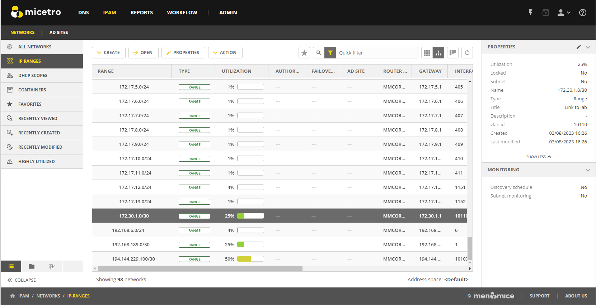
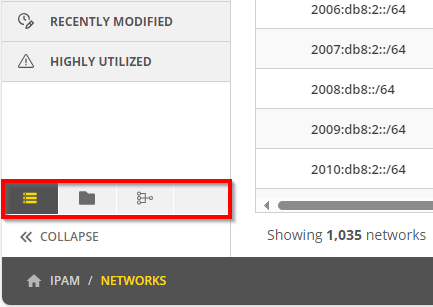
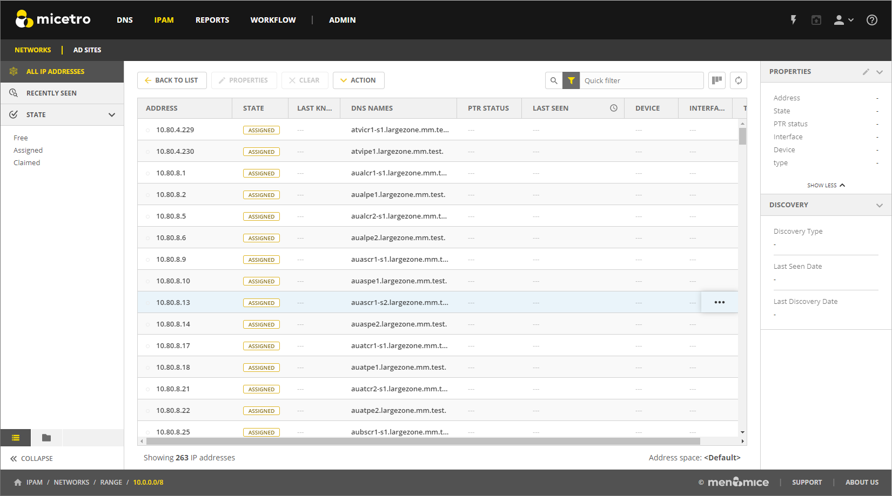

.. meta::
   :description: IP address management (IPAM) in Micetro - networks
   :keywords: IPAM, IP address management, networks, container, dhcp scope

.. _networks:

Networks
=========

Viewing Networks
----------------
The **Networks** tab on the **IPAM** page provides a comprehensive overview of the IP :ref:`address space <address-spaces>` accessible to you. By default, all networks are displayed, but you can use the filtering sidebar on the left to filter by **IP ranges**, **DHCP scopes**, and **containers**. The network list displays how the IP addresses are organized into named subnets and provides important details such as how much of the address space is used and backup plans for subnet failures. You can also view details for the selected network in the inspector on the right.

* Use the buttons in the upper-right corner of the table to switch between a flat and a tree view.

* The star button adds the selected network to a list of favorites. You can access the favorites list on the filtering sidebar.

* When a network has no subranges, its utilization is displayed in the network list.

The left sidebar offers several options for filtering and organizing the networks: Menu, Folders, and DHCP services.

To narrow down the results shown when viewing networks, use the :ref:`webapp-quick-filter`. When using the tree view with an active filter, parent networks that do not match the search criteria will appear dimmed, while the matching results are highlighted. For example, in the image below, we searched for the string ``3.1``.

.. image:: ../../images/ipam-tree-filter-Micetro.png
  :width: 90%

.. _ipam-create-network:

Creating Networks
------------------
When creating a network, Micetro automatically places it in the proper location within the network tree. You can create three types of networks: 

* **Network (IP Ranges)**: A network is a block of IP addresses defined for partitioning the address space. Networks can include reserved addresses for network and broadcast functions, and they can be assigned to Active Directory (AD) sites for integration with directory services.

* **DHCP Scope**: This type is a block of valid IP addresses available for lease or assignment to client computers on a subnet. DHCP scopes automatically configure network and broadcast addresses, managing the dynamic assignment of IP addresses within the specified range.

* **Container**: Unlike networks and DHCP scopes, containers do not have network or broadcast addresses. They are used to organize and group other networks and scopes, providing a hierarchical structure for easier management and visualization.

**To create a network**:

1. On the **IPAM** page, click the :guilabel:`Create` button.

2. Select the type of network you want to create (network, scope, container).

3. Fill in the necessary details. The **Create** wizard varies depending on the type you selected:

   * For a **network**, you can reserve network and broadcast address, and lock the range if needed. You can also assign it to an AD site, see :ref:`active-directory`.

   * A **DHCP scope** can be created with the network and broadcast addresses automatically configured. If the server is configured to use a failover relationship, you can add the scope to the failover. Also, if :ref:`dhcp-superscopes` have been created on the server, you can add the scope to a superscope.

    .. Note::
      
      When creating a DHCPv6 scope for a Microsoft or a Kea DHCP server, you must specify a preference value for the DHCP scope. If the scope is assigned to multiple servers, the DHCP client will select the server with the lowest preference value.

   * A **container** doesn't have a network or broadcast address. Within a container, you can define address ranges and scopes, and you can set privileges that apply to the enclosed ranges and scopes through access inheritance. You cannot allocate IP addresses from a container unless you have enabled this functionality in the **IPAM** section of the :ref:`admin-system-settings`. 
    
     You can also create a container by converting a network existing on a subnet into a container, or vice versa. Select the range(s) you wish to convert and select :guilabel:`Convert to container` on either the :guilabel:`Action` or the row :guilabel:`...` menu.

4. Complete the Properties page in the final step, using the properties defined in :ref:`admin-custom-properties`.

5. When you're done, click :guilabel:`Finish`.

Editing Network Properties
^^^^^^^^^^^^^^^^^^^^^^^^^^^
You can edit the properties of a network. 

.. note::
  If the network has :ref:`admin-event-hooks` configured, these hooks will be triggered when changes are made.

**To edit a network**:

1. Select the network(s) in the list.

2. Select :guilabel:`Properties` on the taskbar or :guilabel:`Edit network properties` on the row :guilabel:`...` menu. 

3. Make the desired changes to the network.

  .. image:: ../../images/ipam-network-properties.png
    :width: 65%

  * When multiple networks are selected, the fields will show combined values from all the networks: 
   
    * If all the selected networks have the same value for a property, that value will be displayed in the corresponding field. 
    * If the networks have different values for a property, the fields will display "<multiple values>". 
  
  * You can replace a "<multiple values>" placeholder with a specific value if you want to apply that value to all selected networks.
  
4. Click :guilabel:`Save`.

Duplicating Networks
^^^^^^^^^^^^^^^^^^^^
When you need to set up similar environments or scale existing configurations, you can duplicate networks along with their subranges, DHCP scopes and configurations under a new network address. This process helps standardize network layout by replicating the structure of the original network. Any modifications or overrides applied during duplication will be reflected across all duplicated ranges and their subranges.

**To duplicate a network**:

1. Select the network you wish to duplicate.

2. Select :guilabel:`Duplicate` on either the :guilabel:`Action` or the row :guilabel:`...` menu.

3. In the Duplicate Networks dialog box, enter a new network address and title for the network you are creating. 

4. Click :guilabel:`Duplicate`. The new network is added to the networks list.

Deleting Networks
^^^^^^^^^^^^^^^^^^
When a network is deleted, its IP addresses will not be deleted. Instead, they are assigned to the parent network and will be listed when that network is opened. If the network being deleted contains subranges, those subranges will become children of the parent network of the unassigned networks.

When a DHCP scope is deleted, the IP addresses within that scope will no longer be managed dynamically. 
Associated DHCP objects such as Leases, Address Pools, Exclusions, Reservations, and their options are automatically removed from the DHCP server. Devices that were assigned IP addresses from the deleted scope will keep their addresses until they are no longer needed, but no new IP addresses will be allocated from the deleted scope. Be sure to reconfigure any devices or services that relied on the deleted DHCP scope to ensure they continue to function properly.

.. warning:: 
  Deleting a DHCP scope is permanent and cannot be undone. Make sure to double-check your configuration and confirm that you want to proceed with the deletion.

**To delete a network**:

1. Select network(s) you wish to remove.

2. Select :guilabel:`Delete network` on either the :guilabel:`Action` or the row :guilabel:`...` menu. 

3. You are prompted to confirm your decision to delete the(se) network(s). Click :guilabel:`Yes` to delete the range, or :guilabel:`No` to cancel.

Viewing IP Addresses within Networks
-------------------------------------
To view a list of IP addresses within a specific network, double-click the network. This opens a list where you can view and edit the properties of individual IP addresses. You can filter the IP address list, so it displays only the IP addressees you need. 

  
* The :guilabel:`PTR Status` column shows the status of the Address (A) record and Pointer (PTR) record mappings. This column can have three values:

  * **Empty**: The status is empty if there are no DNS records for the host. It is also empty if a PTR record exists where the domain in the data section of the PTR record is not managed by the system.

  * **OK**: If there is a match between the A and the corresponding PTR record(s) the status is listed as OK.

  * **Verify**: There isn't a match between the A and the PTR records for the host. Common reasons for this include:

    * An A record exists, but the PTR record is missing.

    * A PTR record exists, but the A record is missing.

    * The data section in the PTR record does not correspond to the name of the A record.
  
  * On the :guilabel:`Action` menu you can use the :guilabel:`Find next free address` option to select the next available IP address within the range. Alternatively, selecting :guilabel:`Find random free address` will randomly select an available IP address.

  * **Viewing DHCPv6 scopes**: Unlike DHCPv4 scopes, which display all addresses within a scope, a DHCPv6 scope only shows addresses that are currently in use or have been recently used. At the bottom of the view, you can see the number of active IP addresses being displayed. An IP address with the status **free** indicates that it was recently used. To see more information about an address, select :guilabel:`View History` for that address.

IP Address State
^^^^^^^^^^^^^^^^^
The **State** column in the IP Address list displays the current state of each address, allowing you to quickly see whether an address is free, assigned, or in another state. You can use the :guilabel:`State` section in the left-hand filtering sidebar to filter the list.

The following states indicate the IP address usage:

   * **Free**: IP addresses that are unassigned and available for use.

   * **Assigned**: IP addresses with a DHCP reservation or lease. Additionally, addresses are also considered assigned if they have a corresponding DNS record, a set custom property, or are currently undergoing discovery and ping tests. These settings can be configured in the **General** section of the :ref:`admin-system-settings`. 
    
    It's important to note that the rules defined in system settings do not apply to DHCP pools. In these pools an IP address is considered free if it is neither leased and not reserved, meaning the DHCP server is authorized to allocate it to clients or reserve it as needed.

   * **Claimed**: IP addresses that have been explicitly claimed using Micetro. 

   * **Held**: a free IP address that has been temporarily reserved (for up to 10 minutes) for a user who requested it. During this period, the user can complete the necessary information, such as adding a DNS record. This reservation ensures that no other user can be assigned the same IP address within this timeframe, preventing duplicate allocations.

   * **Reserved**: IP addresses with a DHCP reservation configured on them.

   * **Leased**: IP addresses currently leased through DHCP but not specifically claimed.

   * **Pending**: This is specific to the Workflow module. It indicates that there is a pending Change Request for an A record associated with this IP address. Although the address is otherwise available, it is marked as **Pending**  to avoid it from being assigned to another user while the change request awaits approval.

Managing DHCP Pools
--------------------

A DHCP pool is a range of IP addresses that the DHCP server can assign to clients. Each pool is defined within a specific subnet. You can configure the IP address ranges that a DHCP server can assign to clients on a network.

Adding an Address Pool
^^^^^^^^^^^^^^^^^^^^^^^

1.	Select the relevant scope for which you want to create an address pool.
2.	On the :guilabel:`Action` or the row :guilabel:`...` menu, select :guilabel:`Manage DHCP pools`.
3.	Click :guilabel:`Add pool`.
 
  .. image:: ../../images/add-dhcp-pool.png
    :width: 50%

4.	In the **Add pool** dialog box, enter the range of addresses to be included in the pool in the :guilabel:`From`` and :guilabel:`To` fields. These fields default to the first available address in the range. If this scope is shared across multiple servers (a split scope) and there is an overlap in the address pool, a warning message will appear.
5.	Click :guilabel:`Add`.

Editing and Removing Address Pools
^^^^^^^^^^^^^^^^^^^^^^^^^^^^^^^^^^

**To edit or remove an existing address pool**:

1.	In the **Manage DHCP pools** dialog box, select the relevant pool.
2.	On the pool's row :guilabel:`...` menu, select :guilabel:`Edit` to modify the pool or :guilabel:`Remove` to delete it.

Adding Exclusions (MS DHCP only)
^^^^^^^^^^^^^^^^^^^^^^^^^^^^^^^^

You can exclude a single IP Address or an entire range of addresses from being used. Exclusions can only be made for addresses that are already part of an existing address pool.

**To create an exclusion**:

1.	Select the relevant scope.
2.	On the :guilabel:`Action` or the row :guilabel:`...` menu, select :guilabel:`Manage DHCP pools` .
3.	Click :guilabel:`Add exclusion`.

  .. image:: ../../images/add-exclusion.png
    :width: 50%

4.	In the **Add exclusion** dialog box, enter the range of addresses to be excluded in the :guilabel:`From` and :guilabel:`To` fields. All addresses within this range, including the start and end addresses, will be excluded.

Editing and Removing Exclusions
^^^^^^^^^^^^^^^^^^^^^^^^^^^^^^^

**To edit or remove an existing exclusion**:

1.	In the **Manage DHCP pools** dialog box, select the exclusion you want to edit or remove.
2.	On the exclusion's row :guilabel:`...` menu, select :guilabel:`Edit` to modify the exclusion or :guilabel:`Remove` to delete it.

Creating DHCP Reservations
--------------------------

DHCP reservations can be created in unassigned address spaces, address pools, and excluded addresses. You can also set specific options for reserved IP addresses. 

**To create a reservation**:

1.	On the **Networks** tab within the **IPAM** page, select the relevant scope. 
2.	Open the scope by clicking :guilabel:`Open` on the top toolbar or by double-clicking it. 
3.	Select the relevant IP address and click :guilabel:`Reserve` on the top toolbar.
4.	Fill in the necessary information.

  .. image:: ../../images/create-dhcp-reservation.png
    :width: 50%

  * **Name**: Assign a name to identify the reserved address.

  * **Reservation method**: Choose between :guilabel:`Hardware address` or :guilabl:`Client identifier`.

       * **Hardware address**: Enter the MAC Address (Media Access Control Address) of the network node for which this address is being reserved.

       * **Client identifier**: Use the Ascii and Hex switch on the right to change the input type.

  * **Reservation type**: Select whether this reservation should support **DHCP**, **BOOTP** (Bootstrap Protocol), or **both** (default).

  * **Description**: (Optional) Provide a description.

5.	Click :guilabel:`Create` to finalize the reservation. The IP address will receive the status **Reserved**.

Editing and Deleting Reservations
^^^^^^^^^^^^^^^^^^^^^^^^^^^^^^^^^^

**To edit or delete a reservation**:

1.	Select the reserved IP address.
2.	On the :guilabel:`Action` or the row :guilabel:`...` menu, select :guilabel:`Edit DHCP reservation` to modify the reversion or :guilabel:`Delete Reservation(s)` to delete it.

Editing Reservation Options
^^^^^^^^^^^^^^^^^^^^^^^^^^^^

**To edit reservation options**:

1.	Select the reserved IP address.
2.	On the :guilabel:`Action` or the row :guilabel:`...` menu, select :guilabel:`Edit reservation options`. For more information about DHCP options, see http://127.0.0.1:8000/guides/user-manual/dhcp_scopes.html#editing-dhcp-options.

Managing DHCPv6 Exclusions
--------------------------
You can create an exclusion range within a DHCPv6 scope to prevent the DHCP server from assigning IP addresses within that range. This allows you to manually assign those addresses without conflicts. 
When managing exclusions within a DHCPv6 pool, you have the option to specify a percentage of the DHCPv6 scope instead of manually entering the :guilabel:`From address` and :guilabel:`From address`. 

**To add an exclusion**:

1.	Select the desired DHCP scope.
2.	On the :guilabel:`Action` or the row :guilabel:`...` menu, select :guilabel:`Manage DHCP Exclusions`.
3.	Click :guilabel:`Add Exclusion`.
4.	In the **Add exclusion** dialog box, choose to create the exclusion range by either :guilabel:`Percentage` or :guilabel:`Manual entry`:

  * **Percentage**: Drag the percentage bar to the correct percentage of addresses you'd like to exclude and enter a :guilabel:`From address` only.
  * **Manual entry**: Enter the :guilabel:`From address` and :guilabel:`From address` for the range you'd like to exclude from the DHCP scope.
 
  .. image:: ../../images/add-exclusion-percentage.png
    :width: 50%

  .. note::

    If the exclusion range doesn't have the space to accommodate the specified percentage of IP addresses, it will not allow you to add this exclusion range. Adjust the :guilabel:`From address` or lower the percentage as needed.

5.	Click :guilabel:`Add`.

  * **Red bar**: Represents the exclusion range.
  * **Blue bar**: Represents the address pool of dynamic allocation addresses.
 
   .. image:: ../../images/dhcp-exclusions.png
     :width: 65%

Reconciling Scopes
------------------

.. note::
  Applies to Microsoft DHCP servers only.

Reconciling scopes is a crucial task to ensure the consistency and reliability of your DHCP configuration. This function is specifically applicable to Microsoft DHCP servers and is used to address inconsistencies between the information stored in the Windows registry and the DHCP database. Such inconsistencies can cause issues with IP address allocation and network stability.
Use this function to fix inconsistencies between information in the registry and the DHCP database.

**To reconcile DHCP scopes**:

1. On the **Networks** tab on the **IPAM** page, select one or multiple DHCP Scopes from Microsoft servers.
2. On the :guilabel:`Action` or the row :guilabel:`...` menu, select :guilabel:`Reconcile DHCP Scopes`.
3. If any inconsistencies are found, a list will be presented. Click :guilabel:`Fix` to resolve the inconsistencies.

  .. image:: ../../images/reconciling-scopes.png
    :width: 65%

For more detailed information, see the `Microsoft documentation <https://docs.microsoft.com/en-us/previous-versions/windows/it-pro/windows-server-2008-R2-and-2008/dd145311(v=ws.10)?redirectedfrom=MSDN>`_.

Deleting a Lease
----------------
You may need to delete a lease from a DHCP scope, such as when a device is no longer in use or needs to be reconfigured. When a lease is deleted, the IP address associated with that lease becomes available for reassignment by the DHCP server.

**To delete a lease in a DHCP scope**:

1. Open the scope containing the lease you want to delete.

2. Select the lease and select :guilabel:`Release DHCP lease` on either the :guilabel:`Action` or the row :guilabel:`...` menu.

Split Scopes
------------

.. note:: 
  Split scopes are only supported on MS DHCP and ISC Kea servers.

Split Scopes in Load Balancing Mode
^^^^^^^^^^^^^^^^^^^^^^^^^^^^^^^^^^^^
When creating scopes on Kea servers configured in load balancing mode for high availability, Micetro will evenly split the available pool between primary and secondary servers. This ensures efficient distribution of IP addresses and enhances network reliability by balancing the load and providing redundancy.

.. image:: ../../images/kea-ha-lb-split-scopes-Micetro.png
  :width: 65%

Managing Split Scopes for DHCPv6
^^^^^^^^^^^^^^^^^^^^^^^^^^^^^^^^^

A split scope divides the DHCP address range into two or more segments, with each segment being assigned to a different DHCP server. This ensures that if one server fails, another server can continue providing IP addresses to clients.

**To manage DHCPv6 split scopes**:

1.	On the **Networks** tab on the **IPAM** page, select the relevant DHCPv6 scope.
2.	On the :guilabel:`Action` or the row :guilabel:`...` menu, select :guilabel:`Manage scope instances`.
3.	Select a second server to manage the DHCP scope, and then click :guilabel:`Add`. Enable the servers on which the split scope should reside.
 
  .. image:: ../../images/split-scopes-instances.png
    :width: 65%

  .. note::
    You can change the server preferences by clicking and dragging the hamburger icon (the three lines to the left of the server) to change the server order. The preference for the second server will always be the **First Server Preference + 1**, and each additional server will increment by 1.

4.	Click :guilabel:`Save`.
5.	On the same scope, select :guilabel:`Manage DHCP Exclusions`` on either the :guilabel:`Action` or the row :guilabel:`...` menu.
6.	Click :guilabel:`Add Exclusion` for the first server. Select the percentage of the address range you want to exclude from the first server and click :guilabel:`Add`.`
7.	Click :guilabel:`Add Exclusion` for the second server. Select the address range you want to exclude from the second server and click :guilabel:`Add`.

  .. image:: ../../images/split-scope-exclusions.png
    :width: 65%

8.	Click :guilabel:`Save`.

.. _edit-dhcp-options:

Editing DHCP Options
--------------------

.. note::
  DHCPv4 and DHCPv6 scopes inherit DHCP and DDNS Options from the parent DHCP server. DHCPv4 and DHCPv6 reservation inherit DHCP and DDNS options from the DHCP scope. However, these options may be changed by editing the options for the specific scope or reservation.

**Viewing the configured DHCP options for a DHCP scope**:

1.	Select the DHCP scope in the networks list.
2.	On the :guilabel:`Action` or the row :guilabel:`...` menu, select :guilabel:`Edit scope options`.
3.	A dialog box is displayed. Note that in order to see the options that have inherited values, you need to select the :guilabel:`Show inherited options` checkbox.

  .. image:: ../../images/edit-dhcp-options.png
    :width: 65%

Adding a New DHCP Option
^^^^^^^^^^^^^^^^^^^^^^^^

**To add a new DHCP option**:

1.	Start typing into the :guilabel:`Add an option`` field. Either type in the name of the option or the option number.
2.	A list of available options will be displayed as you type.

  .. image:: ../../images/edit-scope-autocomplete.png
    :width: 65%
 
3.	Select the option you want to add.
4.	The option is now shown in the list and you can add values to the option.

Removing a DHCP Option
^^^^^^^^^^^^^^^^^^^^^^^

Hovering over an option in the **Edit Scope** dialog box will display a trash can icon to the right of the option.
Click the trash can to remove the option.

HEX and ASCII Representation
^^^^^^^^^^^^^^^^^^^^^^^^^^^^
Some DHCP options, such as DHCP option 43 (Vendor specific info) require the value to be in HEX format. In this case the UI offers the value to be viewed both as HEX and ASCII by selecting each option in tabs above the field, as seen in the figure below.
 
.. image:: ../../images/blackstar-edit-dhcp-ascii-hex.png
  :width: 65%

.. _split-range-wizard:

Allocating Subranges
----------------------

You can create multiple subnets from an existing network that resides on subnet boundaries and currently has no subnets configured.

**To allocate subranges**:

1. On the **IPAM** page, select the network you want to allocate from.

2. Select :guilabel:`Allocate subranges` on either the :guilabel:`Action` or the row :guilabel:`...` menu.

3. Configure the new subranges. If you select fewer subnets than fit within the network, you can set the offset from where to start the allocation. Click :guilabel:`Next` when you finish configuring.

   .. image:: ../../images/subranges-wizard.png
     :width: 65%

4. Define the title and custom properties for the new subranges. Click :guilabel:`Next` when you're done.

5. On the summary page, verify the new subranges and click :guilabel:`Finish`.

Joining Networks (Ranges)
-------------------------
With this feature, you can select and merge multiple networks. The :guilabel:`Join ranges` command becomes available if the selected networks can be joined.

**To join networks**:

1. On the **IPAM** page, select the ranges you want to join.

2. Select :guilabel:`Join ranges` on either the :guilabel:`Action` or the row :guilabel:`...` menu. 

   .. image:: ../../images/join-ranges.png
      :width: 90%
   
3. Configure the properties for the joined range:

   * **Use access from**: Select the range from which you want to inherit access permissions.

   * **Use properties from**: Select the range from which you want to inherit properties.

   * **Title**: Enter a title for the new range.

   * **Description**: Add a description if needed.

4. Click :guilabel:`Join`.

Enabling or Disabling Scopes
-----------------------------
If a scope is no longer needed but you want to keep it for potential future use, you can disable it instead of deleting it. When a scope is disabled, it will be ignored by the DHCP server until it is re-enabled.

**To enable or disable a scope**:

1.	Select the scope you want to enable or disable.
2.	Select :guilabel:`Disable scope` or :guilabel:`Enable scope` on either the :guilabel:`Action` or the Row :guilabel:`...` menu.
3.	Click :guilabel:`Yes` to confirm.

Host Discovery
---------------

With this feature, you can monitor the presence of hosts on your network and track when they were last detected. Host discovery can be accomplished through two methods: using ping or querying routers for host information.

Configuring Host Discovery Using Ping
^^^^^^^^^^^^^^^^^^^^^^^^^^^^^^^^^^^^^

1. On the **IPAM** page, select one or more networks.

2. Select :guilabel:`Set discovery schedule` on either the :guilabel:`Action` or the row :guilabel:`...` menu.

3. Select the :guilabel:`Enable` checkbox.

4. Enter the :guilabel:`Frequency` and select the frequency unit on the :guilabel:`Every` dropdown list.

5. Set the date and time for the :guilabel:`Next run`.  

6. Click :guilabel:`Save`.

Once the schedule options have been configured, two columns - **Last Seen** and **Last Known MAC Address** - are added to the IP address list. The **Last Seen** column identifies the timestamp of when a host was last detected on the network.

   * **Green**: Host responded to the last PING request, displaying the date and time.

   * **Orange**: Host has responded in the past but did not respond to the last PING request. The date and time of the last response is shown.

   * **Red**: Host has never responded to a PING request, and the text **Never** is displayed.

Disabling Host Discovery
""""""""""""""""""""""""
At any time if you wish to disable host discovery, do the following:

1. Select the network(s) for which you want to disable discovery.

2. On the row :guilabel:`...` menu, select :guilabel:`Set discovery schedule`.

3. Clear the :guilabel:`Enable` checkbox.

4. Click :guilabel:`Save`.

Configuring Host Discovery by Querying Routers
^^^^^^^^^^^^^^^^^^^^^^^^^^^^^^^^^^^^^^^^^^^^^^

See :ref:`snmp-profiles`.

Subnet Discovery
----------------

The subnet discovery feature enables Micetro to obtain information about the subnets on the network through routers using SNMP. To activate the subnet discovery feature, ensure that :guilabel:`Synchronize subnets ...` is selected in the SNMP profile. For more information about SNMP profiles, see :ref:`snmp-profiles`.

Setting Subnet Monitoring
-------------------------

**To adjust monitoring settings for a subnet**:

1. Select the subnet(s) for which you want to change the monitoring setting.

2. Select :guilabel:`Set subnet monitoring` on either the :guilabel:`Action` or the row :guilabel:`...` menu. 

3. Complete the required details in the Subnet Monitoring dialog box.

   * **Enabled**: When selected, the subnet will be monitored.

   * **Script to invoke**: Enter the path of the script to run when the number of free addresses falls below the defined threshold. For information on the script interface and formatting, see :ref:`admin-change-events`.

   * **Email addresses**: Enter one or more email addresses separated by commas (for example, email@example.com,email@example.net) to receive notifications when the number of free addresses drops below the set threshold.

   * **Dynamic Threshold**: Define the threshold for the number of free addresses in a DHCP scope address pool.  NOTE:  For split scopes and scopes in a superscope (on MS DHCP servers) and address pools using the shared-network feature on ISC DHCP servers, the total number of free addresses in all of the scope instances is used when calculating the number of free addresses.

   * **Static Threshold**: Enter the threshold for the number of free addresses in a subnet.

   * **Only perform action once (until fixed)**: Select this option to execute the action only once when the number of free addresses falls below the threshold.

   * **Perform action when fixed**: Choose this option to execute the action when the number of free addresses is no longer below the threshold.

4. Click :guilabel:`OK` to confirm your settings.
   
.. _ip-address-dialog:

Adding and Modifying Related DNS Data
--------------------------------------

The inspector located on the right side of the IP address list displays the properties associated with the selected IP address. The information included in the inspector may vary, depending on the custom properties defined in Micetro, as well as the presence of DNS or DHCP related data. 

In the **Related DNS Data** section, you can find all DNS records associated with the address. You can create new records or edit/delete the existing ones.

.. image:: ../../images/ip-inspector-Micetro.png
  :width: 30%
  :align: center
|

.. _ipam-add-dns-host:

Adding a DNS Record
^^^^^^^^^^^^^^^^^^^

1. Select the desired IP address in the IP address list.

2. In the :guilabel:`Related DNS data` section of the inspector, click the create :guilabel:`+` button.

3. Fill in the **Create DNS Record** dialog box. :guilabel:`Address` is automatically filled with the selected IP address.

   .. image:: ../../images/ip-create-dns-Micetro.png
     :width: 50%

4. Click :guilabel:`Create now` or :guilabel:`Add to request`. See :ref:`webapp-workflows` for further details.

Editing a DNS Record
^^^^^^^^^^^^^^^^^^^^

1. In the :guilabel:`Related DNS data` section of the inspector, select :guilabel:`Edit` on the row :guilabel:`...` menu for the relevant DNS record.

2. Make the desired changes and click :guilabel:`Save now` or :guilabel:`Add to request`. See :ref:`webapp-workflows` for further details.

Removing a DNS Record
^^^^^^^^^^^^^^^^^^^^^

1. In the :guilabel:`Related DNS data` section of the inspector, select :guilabel:`Delete` on the row :guilabel:`...` menu for the relevant DNS record.

2. Select :guilabel:`Delete now` or :guilabel:`Add to request`. See :ref:`webapp-workflows` for further details.

3. The host details are deleted and removed from the inspector.

Working with Address (A) Records in DNS Zone Windows
-----------------------------------------------------

When the IPAM module is enabled, you may notice some differences when working with Address (A) records in DNS zones. One key change is the restriction on allowed IP addresses. 

The system administrator can control which IP addresses users are permitted to use and set a range of IP addresses they are allowed to work with. Additionally, administrators can decide whether users are allowed to use IP addresses already assigned in DNS. This means that there could be a predefined range of IP addresses that you're permitted to work with, and the system may prevent you from using IP addresses outside of this range.

|
**Related Topics**:

* :ref:`ipam`
* :ref:`active-directory`
* :ref:`devices`
* :ref:`dhcp-superscopes`
* :ref:`admin-custom-properties`
* :ref:`admin-change-events`
* :ref:`snmp-profiles`
* :ref:`webapp-workflows`
* :ref:`admin-system-settings`
* :ref:`new-dhcp-scope`