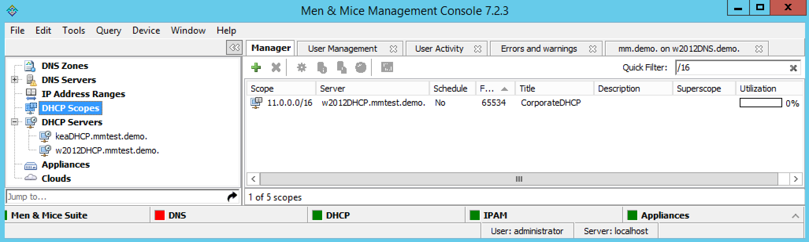
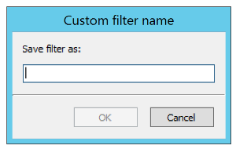

.. _quickfilter:

Quick Filter (Management Console)
=================================

.. note::
  The Quick Filter functionality is also available in the Web Application.

Quick Filters provide a simple way to filter out data records you do not want to see. They can be found in most windows that contain a number of objects. A Quick Filter works in real time and searches all items in a list by default. It is also possible to narrow the search by using keywords to specify in which field to search.

Using Keywords
^^^^^^^^^^^^^^

Column Headers
  It is possible to use column headers as keywords in the Quick Filter and to specify in which field to search. For example, if you enter the following filtering criterion when filtering zones - ``name:myzone`` - the filter only searches in the **Name** field and displays only those results that contain the text ``myzone``. When a column header's name contains a space, such as ``Lease MAC Address``, you can enclose the name in quotes –e.g. ``"Lease MAC Address":11``. See Colons, below.

Colons
  Colons are used to separate a column name from a filter. If the filter contains colons, you can either enclose the filter in quotes or escape the colons with a backslash ``\``. For example, both ``"Lease MAC Address":"11:22"`` and ``"Lease MAC Address":11\:22`` search for a MAC address containing ``11:22`` in a column with a name containing with the name ``Lease MAC Address``.

Simultaneous Keywords
  You can use several keywords simultaneously simply by leaving a space between each consecutive filtering criterion. An ``AND`` condition is used when finding records. For example: ``name:myzone type:slave``.

Custom Properties
  When custom properties are used, you can use the name of the custom property as a keyword.

Using Wildcards and Regular Expressions in Filters
^^^^^^^^^^^^^^^^^^^^^^^^^^^^^^^^^^^^^^^^^^^^^^^^^^

When using the Quick Filters, it is possible to use the wildcard characters ``^`` and ``$`` to narrow the search results.

  * The **caret symbol** ``^`` means **starts with**. For example, the search string ^server finds server1.zone.com and server-north.anotherzone.com, but not myserver.myzone.com.

  * The **dollar symbol** ``$`` means **ends with**. For example, the search string 'server$' finds the.best.server and good.nameserver, but not slow.servers.

  * The ``!`` operator means **NOT{\*}**.

For example, the search string ``!^a`` finds entries that don't start with 'a'. The exclamation mark can be used with the other wildcards to find non-empty fields. Entering ``Description: !^$`` finds all entries where the Description field is not empty.

.. warning::
  The ``&`` and ``|`` operators only work for the SOAP interface and Web Application, but *not* currently for the Management Console. It is a known issue that will be fixed in an upcoming version.

  * The ``&`` and ``|`` operators. The **ampersand** is interpreted as an **AND** operator while the **vertical bar** is used as an **OR** operator. Using these operators, you can combine searches for added control. You can use parenthesis in conjunction with these operators. Examples:

    * ``A | B`` Finds entries with the text A or the text B

    * ``A & B`` Find entries containing both A and B

    * ``A & (B | C)`` Finds entries containing A and either B or C

    * ``(A & B) | C`` Finds entries containing both A and B or entries containing C

For even more control, you can use regular expressions in filters.

.. note::
  The character ``.`` must be escaped if it is to be used as a wildcard character. Otherwise, it will be interpreted literally. The same applies to following characters: ``(``, ``)``, ``{``, ``}``.

Clearing an Entry
^^^^^^^^^^^^^^^^^

At any time, you can clear the text you have in the Quick Filter field by click the :guilabel:`X` shown at the end of the field.

Saving a Filter
^^^^^^^^^^^^^^^

It is possible to save filters for various object types. Saved filters appear in the list on the left hand side of the Manager Window and in the Create Zone dialog box. Filters can be local or global in scope. Filters created by the Administrator are global and visible to all users. Filters created by any other user are visible only to that user.

To save a filter, do the following:

1. Type the entry you want to filter by in the Quick Filter field.

2. Move to the menu bar, and select :menuselection:`Edit --> Save Filter`.

3. In the dialog box, type the desired name for the filter. Then click :guilabel:`OK`.

4. The saved filter shows at the bottom of the Object list for the corresponding object type.

.. note::
  You can also create filters that reside in object folders. To create a filter in a folder, start by selecting the folder before creating the filter. A filter that resides in a folders perform the search within the context of the folder.

Editing a Filter
^^^^^^^^^^^^^^^^

To edit a filter, do the following:

1. Locate the filter name in the Object list.

2. Right-click the filter and select :guilabel:`Edit Filter`.

3. Make the desired changes to the filter and click :guilabel:`OK` to save the changes.

.. image:: ../../images/console-edit-filter.png
  :width: 60%
  :align: center

Deleting a Filter
^^^^^^^^^^^^^^^^^

To delete a filter, do the following:

1. Locate the filter name in the Object list.

2. Right-click the filter and select :guilabel:`Delete Filter`.
