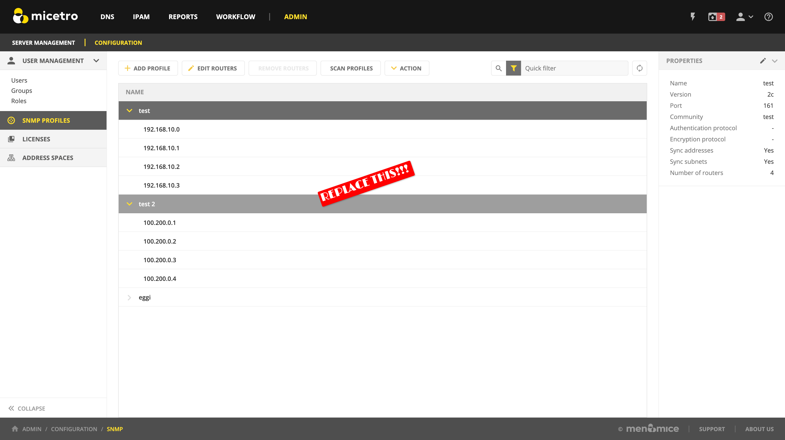
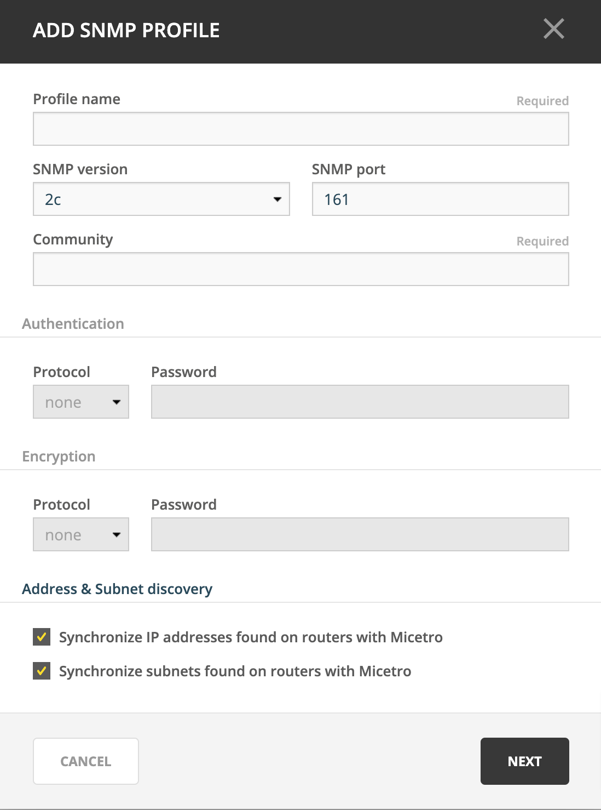

.. meta::
   :description: SNMP profiles in Micetro by Men&Mice  
   :keywords: SNMP profile, IPAM, routers

.. _snmp-profiles:

Configuring SNMP profiles for Host Discovery
--------------------------------------------

The SNMP protocol provides a common mechanism for devices on networks to relay management information. Micetro uses SNMP profiles to define how device data that is discovered on networks should be synced into Micetro.​

.. note::
  For configuring SNMP profiles using the Management Console, see :ref:`console-snmp-profiles`.

Create new SNMP profile 
^^^^^^^^^^^^^^^^^^^^^^^

Before a router can be queried it must be placed in an SNMP profile containing the parameters necessary to access the SNMP information on the router. 

.. note::
  Multiple routers can share the same SNMP profile.

To create an SNMP profile:

1. Navigate to :guilabel:`Admin --> Configuration --> SNMP Profiles`.

2. Use the :guilabel:`Add Profile` action from the top bar.

3. Enter a profile name and choose the SNMP version to use. (Supported versions are SNMP v1, v2c, and v3.) You can also specify a non-standard port to use for SNMP.

4. Enter the necessary information to access the router using SNMP. The information is different depending on the SNMP version selected:

  For SNMP v1 and v2c:

  .. csv-table::
    :widths: 15, 85

    "Community", "Enter the SNMP community string (password) to use to access the routers using the profile."

  For SNMP v3:

  .. csv-table::
    :widths: 15, 85

    "Username",	"Enter a user name for accessing the routers using the profile."
    "**Authentication**"
    "Protocol", "Choose the authentication protocol to use. The available protocols are **MD5** and **SHA**."
    "Password", "Enter the authentication password for the routers using the profile."
    "**Encryption**"
    "Protocol", "Choose the encryption protocol to use. The available protocols are **AES** and **DES**."
    "Password", "Enter the authentication password for the routers using the profile."

5. If needed, disable IP address and subnet synchronization.

6. Click :guilabel:`Next`.

6. Paste or enter the IPv4 address of the router(s) that you want to query using this profile. 

.. note:: 
  Each router's IP address needs to be on a separate line in the text area.

6. Click :guilabel:`Add profile` to save the settings and create the profile.

Edit existing SNMP profile 
^^^^^^^^^^^^^^^^^^^^^^^^^^

You can edit an existing SNMP profile, to change settings or modify the routers using it.

1. Navigate to :menuselection:`Admin --> Configuration --> SNMP Profiles`.

2. Use the :guilabel:`Action --> Edit SNMP Profile` action from the top bar or the ellipsis menu to edit a profile's settings. Use the :guilabel:`Edit routers` action to modify the list of routers using the profile.

Scanning profiles 
^^^^^^^^^^^^^^^^^

SNMP scanning is done automatically in the background by Micetro. Users can initiate a manual scan of all configured profiles to pull ARP cache from the routers if needed.

Use the :guilabel:`Scan profiles` action from the top bar to manually scan all profiles.

.. warning::
  This might take a long time, and can result in higher volumes of traffic.
