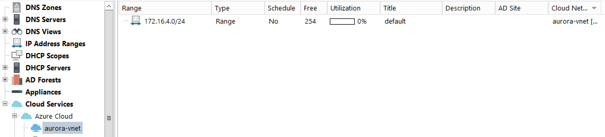
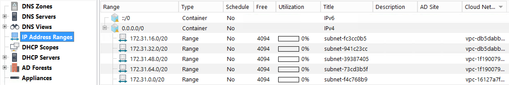

.. meta::
   :description: How to use cloud integration in Micetro by Men&Mice
   :keywords: cloud integration, cloud network

.. _using-cloud:

Using Cloud Integration
=======================

Viewing a cloud service instance
--------------------------------

Highlighting a cloud service in the object browser will show the cloud networks residing in that cloud service.

Name
  The name of the cloud network

Cloud
  The name of the Cloud service

Region
  The region where the cloud network is located at.

  .. note::
    This field is referred to as Location in Azure.

Address blocks
  The address blocks in the specific cloud network.

.. image:: ../../images/viewing-cloud-service.png
  :width: 80%
  :align: center

Using a cloud service
---------------------

Cloud DNS
^^^^^^^^^

Using and managing a cloud DNS server is very similar as managing and using a local DNS server. Adding zones and records to a zone is transparent for the user.

Cloud IPAM
^^^^^^^^^^

Cloud Networks
""""""""""""""

The cloud networks can either be viewed in the Object Browser, under the respective cloud service, or in the IP Address Ranges.

In the Object browser, clicking on a specific cloud network will display the subnet residing in that cloud network.

In IP Address ranges, a column named :guilabel:`Cloud Networks` shows the name of the respective cloud network among the other existing subnets.

Custom properties for Cloud services
""""""""""""""""""""""""""""""""""""

Custom properties can be specified for cloud services and cloud networks as for other objects.
