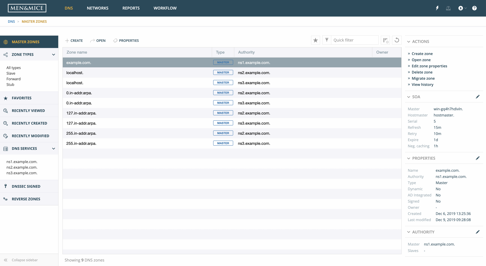
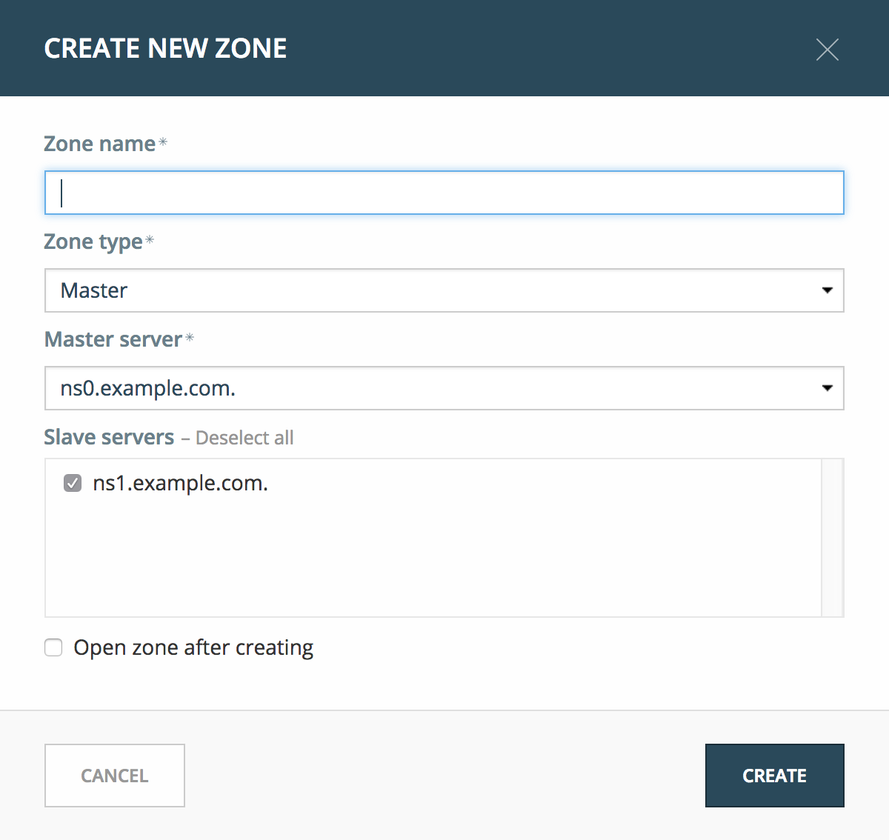
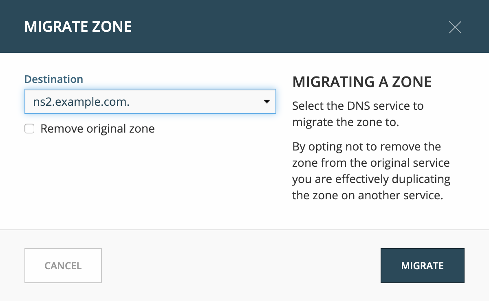
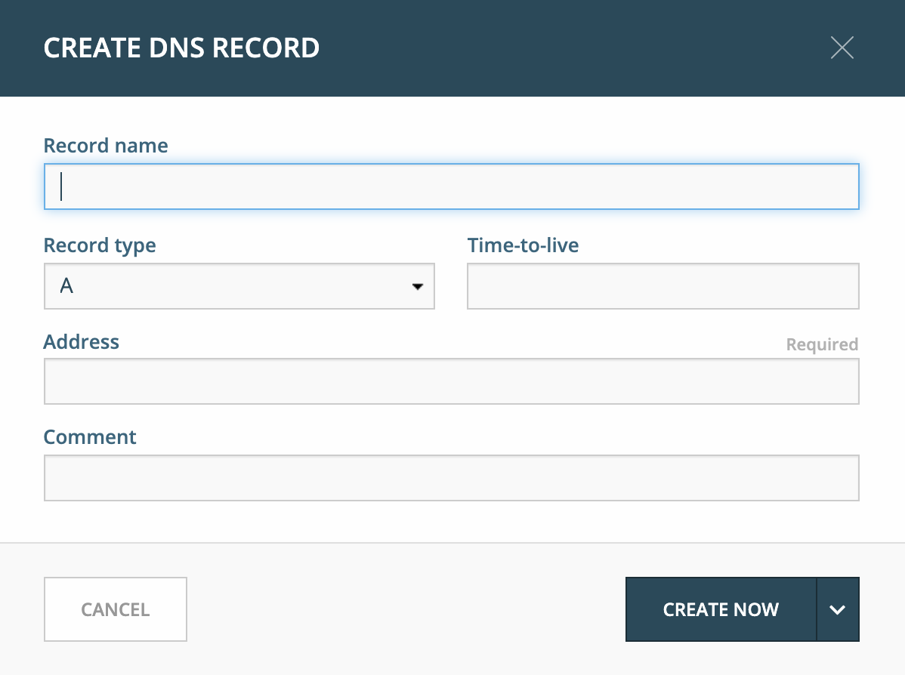
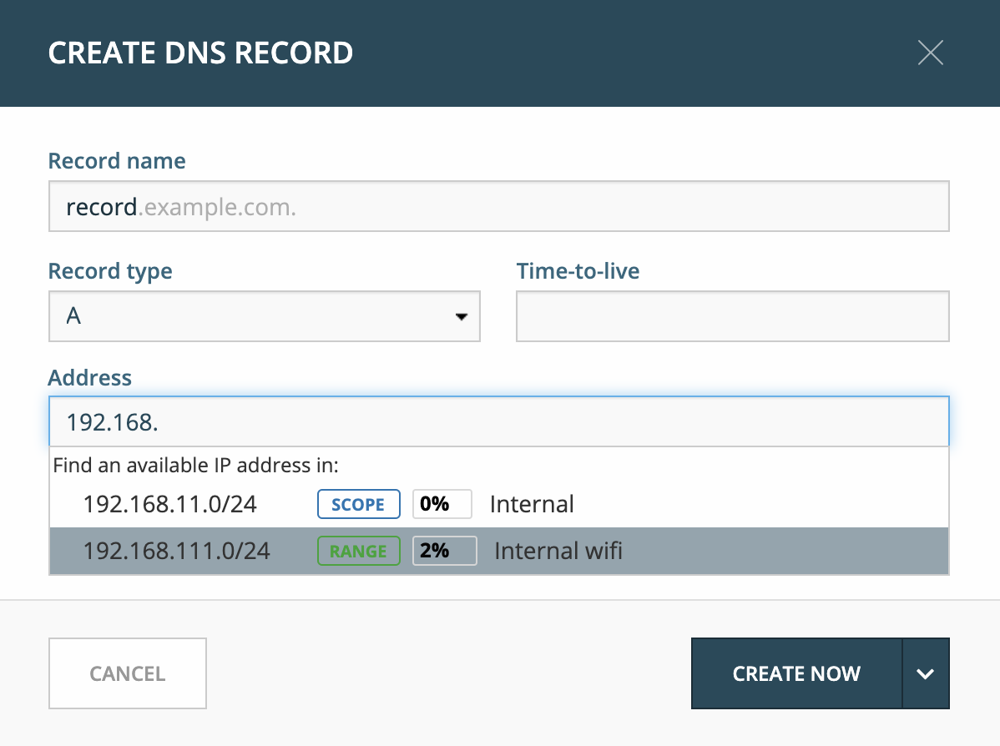
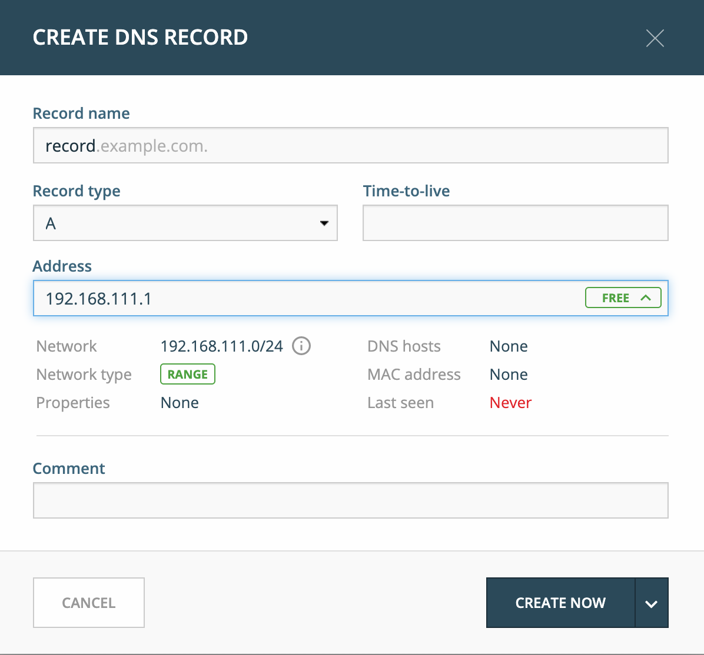
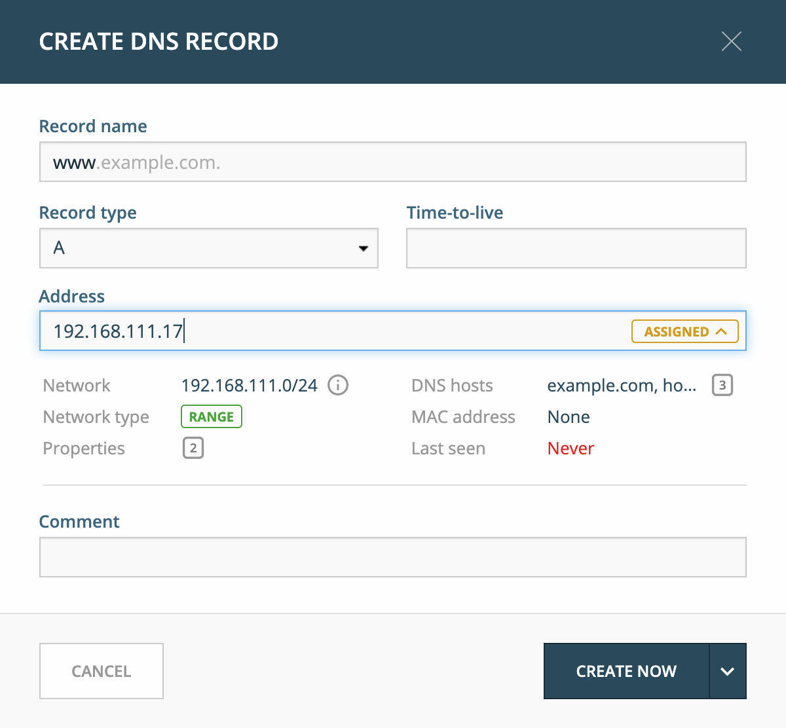
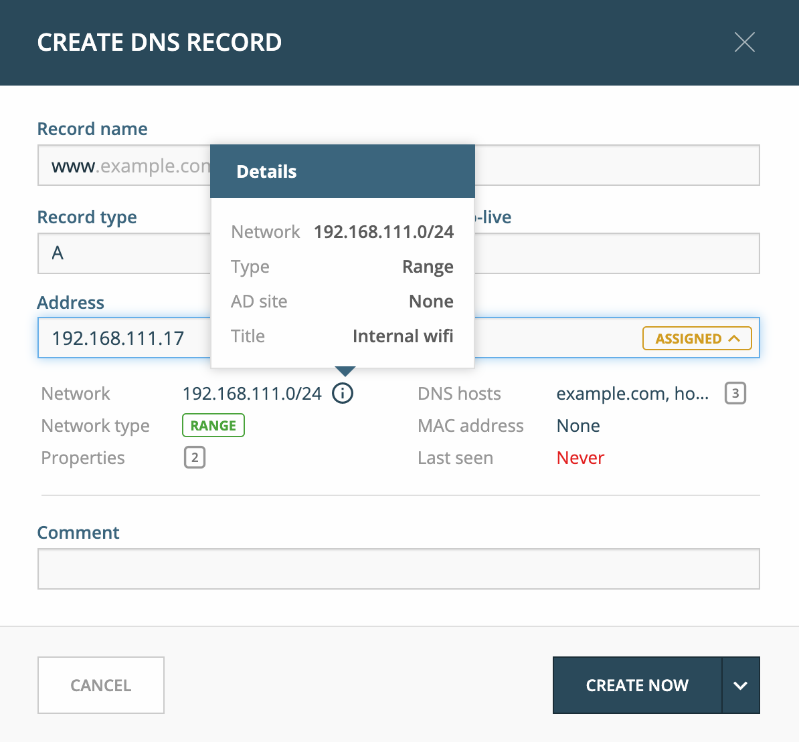
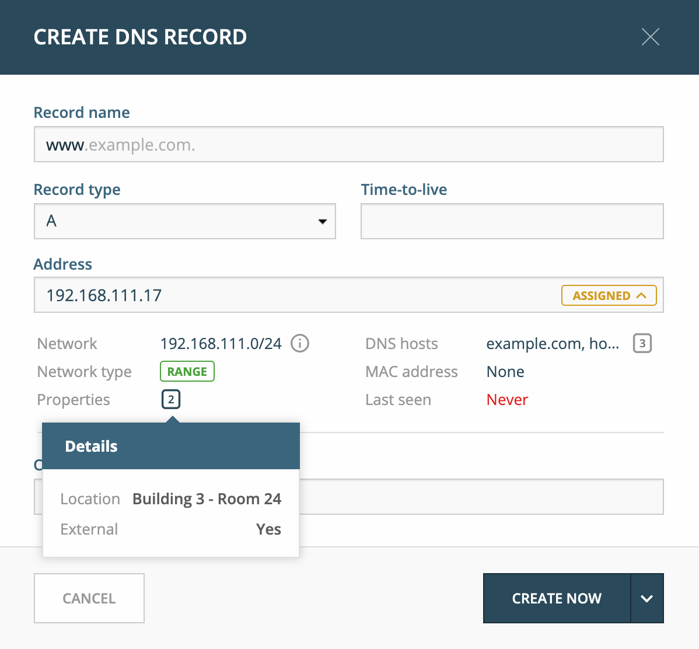

.. _webapp-dns:

DNS management
==============

DNS Zones
---------

Here is an overview of the main functionality for managing DNS zones.

By default, the list shows only master DNS zones, but to see other types of DNS zones, the filtering sidebar offers options to select different types.

Viewing the DNS zone list
^^^^^^^^^^^^^^^^^^^^^^^^^

After entering the DNS section of the Web Application, users are presented with a list of all DNS zones in the system that they have access to view.

Opening a DNS zone
^^^^^^^^^^^^^^^^^^

Opening a DNS zone can either by done by

* selecting the zone in the zone list and clicking on the :guilabel:`Open` button in the task bar above the zone list; or

* double clicking on the zone.

Creating a DNS zone
^^^^^^^^^^^^^^^^^^^

Creating a new DNS zone can be done by clicking on the :guilabel:`Create` button above the DNS zone list.

The following dialog presents the options for the operation:

.. csv-table::
  :header: "Item", "Description"
  :widths: 15, 85

  "Zone name", "The name of the DNS zone to be created as a fully qualified domain name (FQDN)"
  "Zone type", "Can either one of the following: **Master**, **Slave**, **Stub**, **Forward**"
  "Master server", "Specifies the server which will act as the master server for the DNS zone"
  "Slave servers", "Specify which server(s) should act as slave servers for the DNS zone"
  "Open zone after creating", "If checked, the DNS zone will be opened right after it has been created"
  "Save comment", "Allows users to write a comments to save for audit trail purposes."

Editing zone Properties
^^^^^^^^^^^^^^^^^^^^^^^

Any custom properties that have been defined for DNS zones can be added and edited here.

Deleting a zone
^^^^^^^^^^^^^^^

Select the zone to be deleted and click on the :guilabel:`Delete zone` action in the action part of the Inspector on the right hand side.

Migrating a DNS zone
^^^^^^^^^^^^^^^^^^^^

A DNS zone can be migrated between DNS servers.

1. Select the DNS zone in the list and run the :guilabel:`Migrate zone` action.

2. Specify the destination server. This is the server for which the DNS zone will be migrated to.

3. After migrating, you are presented with a dialog which confirms a successful zone migration.

DNS Records
-----------

After having opened a DNS zone, it is possible to:

* Add DNS records

* Edit DNS records

* Delete DNS records

* Disable DNS records

The :guilabel:`Inspector` for DNS records allows the following actions and details for each selected DNS record in the DNS zone list.

.. csv-table::
  :header: "Item", "Description"
  :widths: 15, 85

  "Actions", "Lists all available actions for the selected record"
  "Properties", "Lists the properties for the selected DNS record"
  "Related DNS Data", "Lists all related DNS records for the selected DNS record. Related DNS records all DNS records that are somehow associated with the specified record."
  "Related IP address", "List the related IP address in case of an A or AAAA DNS record."

Creating a new DNS record
^^^^^^^^^^^^^^^^^^^^^^^^^

To create a new DNS record, either click on the :guilabel:`Create` button in the main task bar or click on the :guilabel:`Create new DNS record` in the actions section of the Inspector.

The following dialog presents the options for the operation:

Available record types are:

* A / AAAA

* MX

* TXT

* NS

* SOA

* SRV

* HINFO

* CNAME

* TLSA

* CAA

* CERT

* WKS

* RP

* AFSDB

* LOC

* SSHFP

* SPF

* DNSKEY (read only)

* NSEC (read only)

* NSEC3 (read only)

* NSEC3PARAM (read only)

* RRSIG (read only)

* DS

* DLV (read only)

New DNS records can be added by filling out the required data and additionally custom fields if there are any.

For A records, there is useful autocomplete behavior that can help finding a free IP address in a network.

Typing in the first digits of a network will allow you to see a list of networks to choose from.

Selecting the first item from the list will fill in the **Address** field with the next free IP address from that network. Additionally, insights for the specified IP address will be shown.

After typing in an IP address or selecting from the list, an indicator will be given on the state of the IP address, whether it is *Free*, *Reserved*, *Claimed* or *Assigned*.

IP Address Insights
"""""""""""""""""""

The IP address insights feature aims to give details on the IP address and related objects. Hovering over the "i" icon will list further information or show a list of objects.

Typing in the full IP address in the the **Address** field will indicate the state of the IP address. Additionally, the IP insights are shown, which are details on the IP address itself and related objects.

Hovering over info icon for Network will show more details on the network.

Hovering over the icon for the Properties will show a list of all defined properties for the specified IP address.

Hovering over the icon for the DNS hosts will show a list of all defined DNS hosts for the specified IP address.

.. image:: ../../images/blackstar-create-dns-record-ip-hosts.png
  :width: 75%
  :align: center

.. csv-table::
  :widths: 15, 85

  "Network", "The network containing the specified IP address"
  "Network type", "Either an IP address range or a DHCP scope"
  "Properties", "Various properties including custom properties, if defined."
  "DHCP client",
  "DNS hosts", "Lists all DNS hosts that are set for the specified IP address"
  "MAC address", "The MAC address of the discovered device"
  "Last seen", "The date for which the IP address was last seen"

Time to live (TTL)
""""""""""""""""""

Throughout the system, the TTL value can either be specified in seconds or using the shorthand notation, such as

1s:
  1 second

1m
  1 minute

1h
  1 hour

1d
  1 day

1w
  1 week

Editing a DNS record
^^^^^^^^^^^^^^^^^^^^

1. Select the DNS record in the DNS record list

2. Either click :guilabel:`Edit` in the main task bar, or click on :guilabel:`Edit DNS record` in the Inspector actions.

3. A dialog is displayed which allows you to modify the DNS record

4. Click :guilabel:`Save` to persist the changes.

Deleting a DNS record
^^^^^^^^^^^^^^^^^^^^^

1. Select the DNS record in the DNS record list

2. Click on :guilabel:`Delete` in the main task bar or click on :guilabel:`Delete DNS record` in the Inspector actions.

3. Users will be prompted before the record(s) are deleted

Disabling a DNS record
^^^^^^^^^^^^^^^^^^^^^^

1. Select the DNS record in the DNS record list

2. Click on :guilabel:`Disable DNS record` in the Inspector actions.

3. Users will be prompted before the record(s) are disabled
