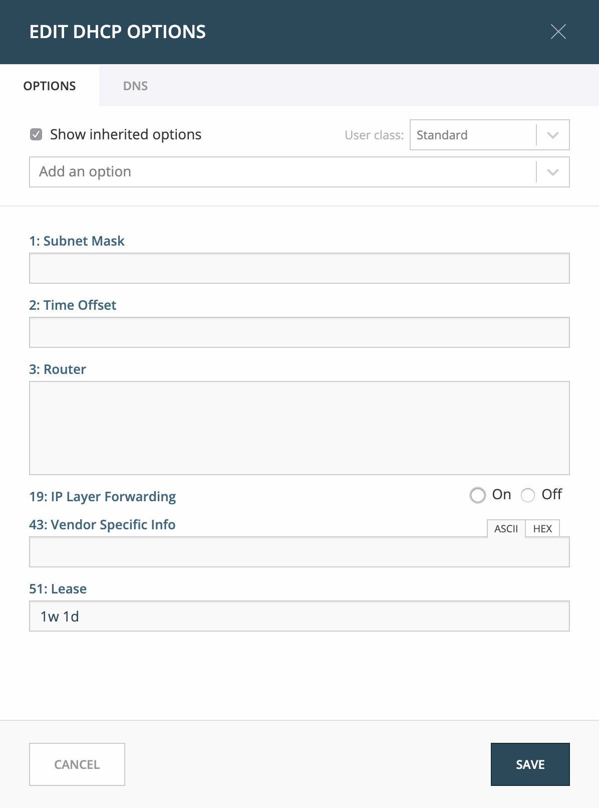
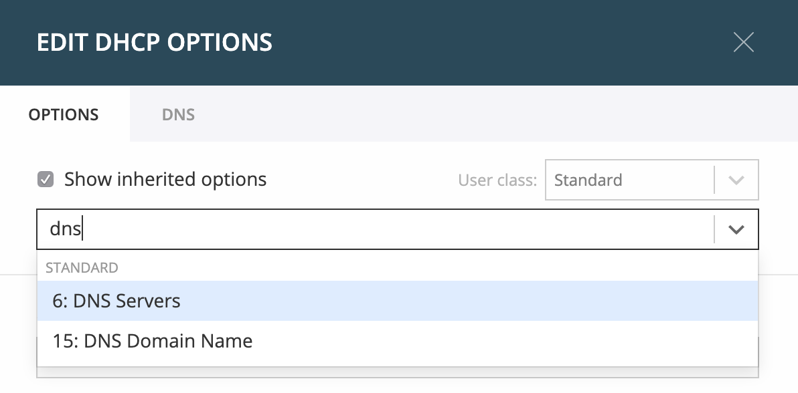

.. _webapp-edit-dhcp:

Edit DHCP Options
=================

View the configured DHCP options for a DHCP scope
-------------------------------------------------

1. Select the DHCP scope in the network list

2. Click on the "Edit DHCP options" task

3. A dialog is displayed. Note that in order to see the options that have inherited values, the "Show inherited options" checkbox needs to be checked.

Add a new DHCP option
---------------------

1. Start typing into the "Add an option" field. Either type in the name of the option or the option number.

2. A list of available options will be displayed as you type.

3. Select the option you want to add.

4. The option is now shown in the list and you can add values to the option.

Removing a DHCP option
----------------------

Hovering over an option will display a trashcan icon to the right of the option.

Clicking on the trashcan will remove the option.

HEX and ASCII representation
----------------------------

Some DHCP options, such as DHCP option 43 (Vendor specific info) require the value to be in HEX format. In this case the UI offers the value to be viewed both as HEX and ASCII by selecting each option in tabs above the field, as seen in the figure below.

.. image:: ../../images/blackstar-edit-dhcp-ascii-hex.png
  :width: 70%
  :align: center
