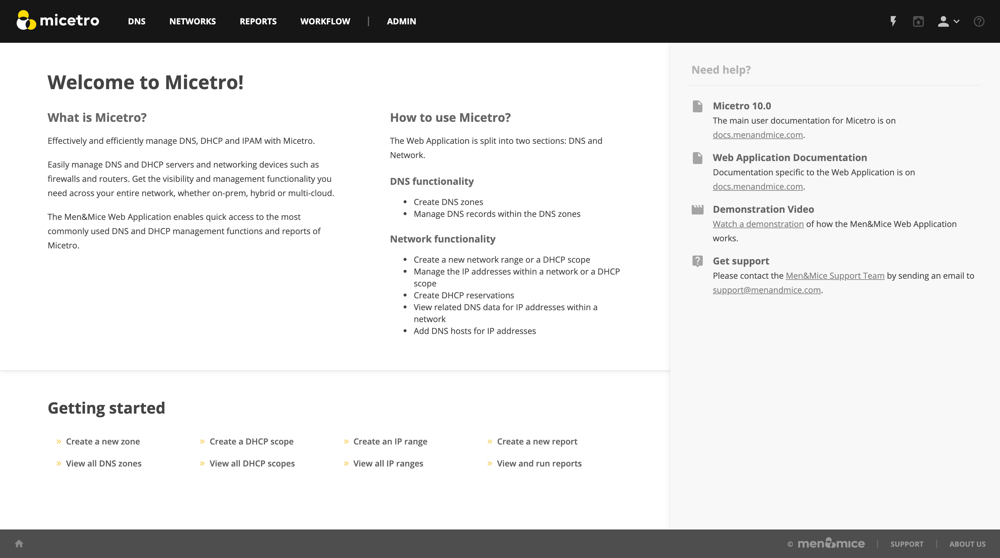
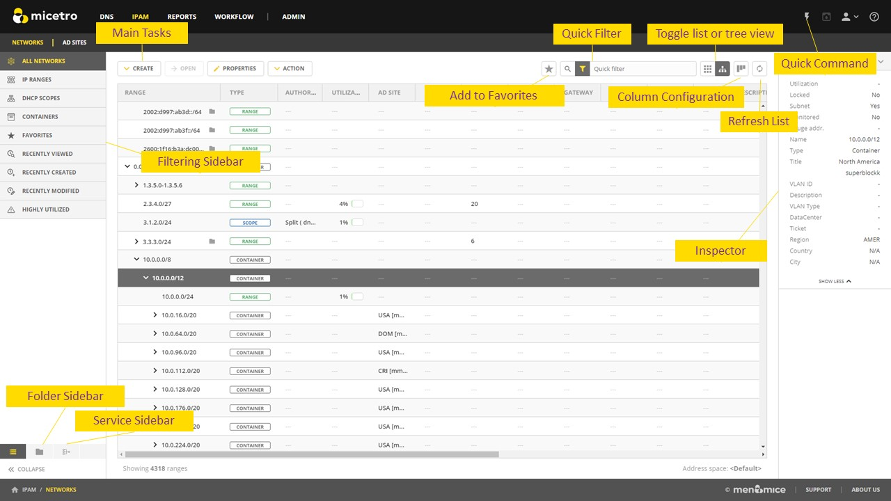
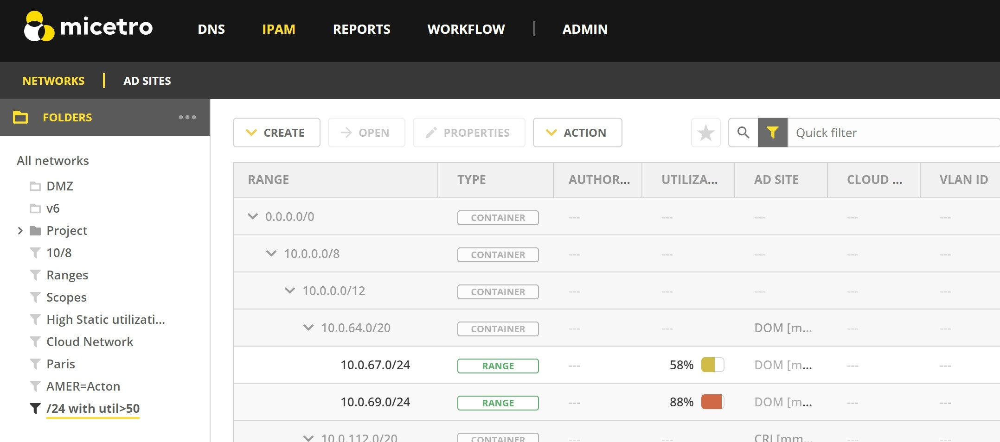
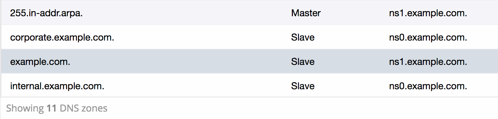
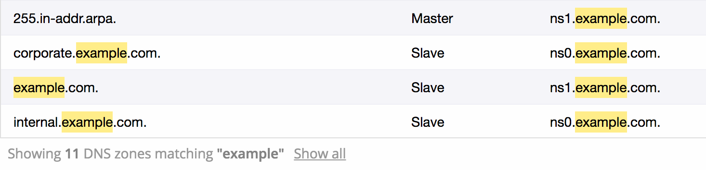
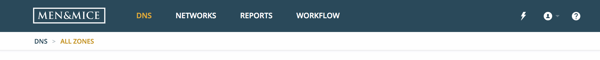
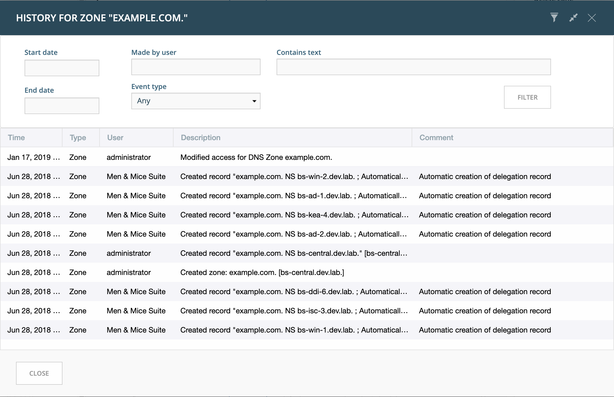

.. meta::
   :description: General information about the Micetro by Men&Mice Web Application
   :keywords: Micetro by Men&Mice

.. _webapp-general:

General
=======

The front page
--------------

The front page of the Web Application gives an overview of the available operations.

.. note::
  A persistent help section, (see :ref:`webapp-help`) is available in all views.

Working with the list view
--------------------------

Introduction
^^^^^^^^^^^^

The web application is centered around the grid listing objects in the system. (For example: DNS zones, DNS records, IP address ranges, DHCP scopes, IP addresses, etc.)

Operations highlighted in the image:

.. csv-table::
  :widths: 25, 75

  "Refresh list",	"Refreshes the list containing a list of zones, ranges, records or IP addresses"
  "Column configuration",	"Specifies which columns are visible in the list."
  "Quickfilter", "The quickfilter functionality is described in :ref:`webapp-quickfilter`."
  "Toggle list or tree view",	"Toggles the 'Networks' list between list and tree views"
  "Refresh list", "Refreshes the contents of the list"
  "Add to favorites", "Adds the selected item in the list to favorites. The corresponding favorites filter in the sidebar shows all favorited items."
  "Main tasks", "The main tasks in each section. All available tasks are shown at the top of the Inspector"
  "Inspector", "Shows various information for each selected item in the list. See :ref:`webapp-inspector`."
  "Filtering sidebar", "Shows a list of possible filters to use for the list. See :ref:`webapp-filtering`."
  "Quick command", "Allows for quickly finding and performing actions. See :ref:`webapp-quick-command`."

Folders
^^^^^^^

Folders can be used as containers of objects such as DNS zones and networks.

.. note::
  Currently the Web Application does not support managing folders (creating, editing, deleting), which needs to be done through the Management Console. See :ref:`object-folders` for further information.

The available folders, along with the folder hierarchy can be viewed in the filtering sidebar. Clicking on a folder will display the contents of the specific folder.

Selecting an item in the list and running the "Set folder" task from the Actions, will display a dialog where the item can be moved from one folder to another or removed from a folder.

Selecting multiple items
^^^^^^^^^^^^^^^^^^^^^^^^

Selecting multiple items in the list can be done by:

* On Windows: holding down the CTRL or SHIFT button and selecting rows with the mouse

* On OS X: holding down the CMD button and selecting rows with the mouse

Results
^^^^^^^

In the list's footer, the number of results is shown:

If a filter is applied, the filter string is highlighted:

Top menu
--------

The top menu allows to switch between the four main sections of the Web Application (DNS, IPAM, Reports, and Admin). Additionally, the Quick commands, User menu, and Help is accessible.

Navigating
^^^^^^^^^^

The navigation bar at the top of the grid interface

* indicates where you are

* allows you to navigate between subsections

You can also quickly check your current location by glancing at the breadcrumbs at the bottom of the interface.

.. _webapp-object-change-history:

History
-------

The history for the following objects is made available as a task (in the inspector actions) as well as a Quick Command.

* DNS zones

* DNS records

* IP address ranges

* DHCP scopes

* Workflow requests

The history dialog can be used to view past changes. By clicking on the filter icon in the header for the history dialog, additional options are made available for filtering the history.

Save comments
-------------

For audit trail purposes, saving comments is required after making changes in the system.

After making a change, the following dialog is displayed where users can write a comment that will be included in the history for that object.

.. _webapp-time-and-date:

Date and time handling
----------------------

In certain places like scheduling a change in Workflow and scheduling a report generation in Reporting, the date and times must be in the same time zone as the Men&Mice Central uses.

.. image:: ../../images/blackstar-schedule.png
  :width: 60%
  :align: center
