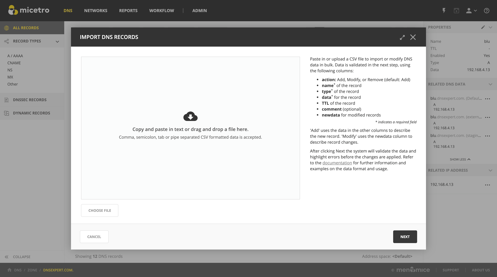

.. meta::
   :description: How to import DNS records in the Micetro by Men&Mice Web Application
   :keywords: DNS records, DNS import

.. _webapp-import-dns-records:

Import DNS Records
==================

DNS Records can be imported in the Micetro Web Application.

Prerequisites
-------------

The user importing must have access to edit records in the zones used in the import.

See :ref:`access-control` for further information on access controls.

Import task
-----------

The action to import DNS Records is available from the :menuselection:`Actions` menu in the DNS zones list, that allows importing records to different zones at the same time.

:menuselection:`Actions --> Import DNS Records` is also available from within a specific zone, which allows importing records to that zone only.

DNS bulk import format
^^^^^^^^^^^^^^^^^^^^^^

.. note::
  When choosing files, only plaintext CSV/TSV/TXT files are accepted. Excel spreadsheets need to be exported to one of these formats prior to importing.

Header line
"""""""""""

The first line of the data must be the header line, containing the name of the fields in the corresponding columns of the lines after it. Some of the fields refer to built-in system fields, while the rest of the fields are matching the custom properties that are defined for the object type in question.

.. tip::
  It's only necessary to include the fields that need to be imported/updated, except for properties that are defined as mandatory, or required to be able to identify the object to import.

The field names in the header line are not case sensitive. For example, "title" will be correlated to the custom property "Title".

Built-in fields
"""""""""""""""

action
  (Default: **Add**) Add, Modify, or Remove.

  .. tip::
    The following aliases can be also used:

    * Insert/Create = Add

    * Update/Change = Modify

    * Delete/Del = Remove

name
  (required) Hostname of the record.

zone
  The zone containing the record.

authority
  If multi-primary, the authority of the zone.

view
  If multi-primary, the view containing the zone.

forest
  If multi-primary, the forest of the zone.

type
  (required) The type (A, CNAME, MX, etc.) of the record.

data
  (required) The data (IP for A/AAAA, the target A/AAAA record for CNAME, etc.) for the record.

TTL
  The Time-to-Live value of the record. Time value defaults to seconds, but hour (i.e. 1H), day (i.e. 2D), week (i.e. 3W), or month (i.e. 4M), or year (i.e. 5Y) can be used.

comment
  Optional save comment.

newdata
  If modifying an existing record, the new data to replace the old value.

Examples
^^^^^^^^

Add records
"""""""""""

Import A record 'viola' to the zone 'illyria.coast':

::

  name,type,data
  viola.illyria.coast.,A,16.0.2.2

Import A record 'viola' to 'illyria' providing a view name:

::

  name,type,data,view
  viola.illyria.,A,16.0.2.2,first-folio

Import A record 'viola' to 'illyria.palace' to the authority of 'orsino':

::

  name,type,data,authority
  viola.illyria.palace.,A,16.0.2.2,orsino

Import A record 'cesario' to 'olivia.palace', when zone and authority are specified:

::

  name,type,data,authority,zone
  cesario.olivia.palace.,A,16.0.2.2,illyria,orsino.palace

Modify records
""""""""""""""

Modify IP address for the A record 'viola':

::

  action,name,type,data,newdata
  modify,viola.illyria.coast.,A,16.0.2.2, 20.21.9.6

Modify IP address for the A record 'viola' but leave the TTL as it was:

::

  action,name,type,data,newdata,ttl
  modify,viola.illyria.coast.,A,16.0.2.2, 20.21.9.6,

Modify IP address *and* TTL for the A record 'viola':

::

  action,name,type,data,newdata,ttl
  modify,viola.illyria.coast.,A,16.0.2.2, 20.21.9.6, 2H

Remove records
""""""""""""""

Remove A record 'malvolio':

::

  action,name,type,data
  remove,malvolio.olivia.palace.,A,16.0.2.2
