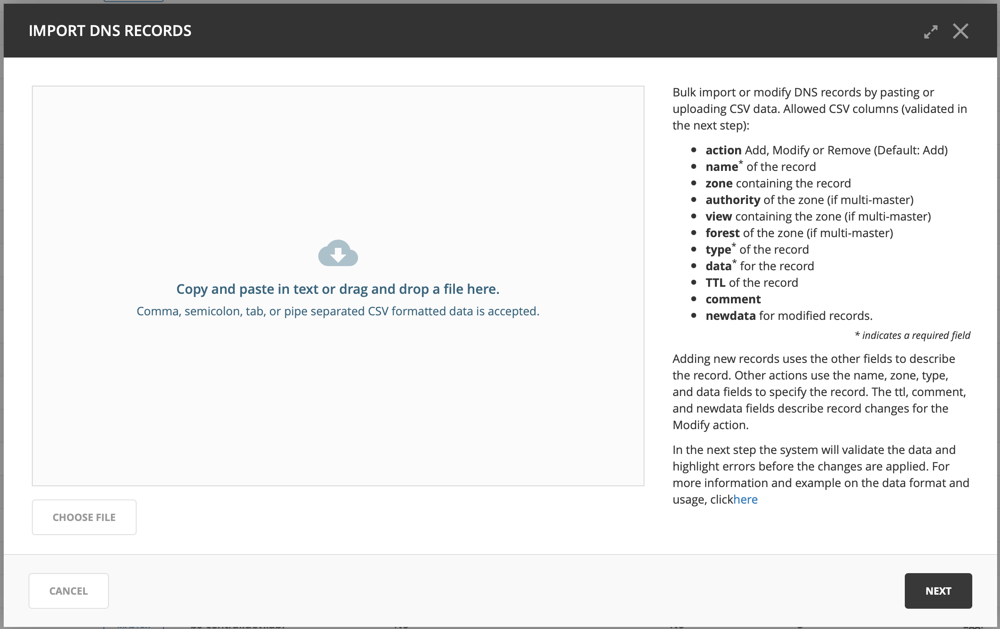

.. _webapp-import-dns-records:

Import DNS Records
==================

Overview
--------

DNS Records can be imported in the Micetro Web Application. The action to import DNS Records is available from the Actions menu in the DNS zones list, that allows importing records to different zones at the same time.

The Import DNS Records action is also available from within a specific zone, which allows importing records to that zone only.

Prerequisites
-------------

The user importing must have the following permissions:

* Access to DNS Module

* Access to the Web Interface

* Access to Advanced Zone view in web interface

* Access to "Import Data" web task

In addition, the user doing the import needs to have access to edit records in the zones used in the import.

See :ref:`global-access` for further information on access controls.
