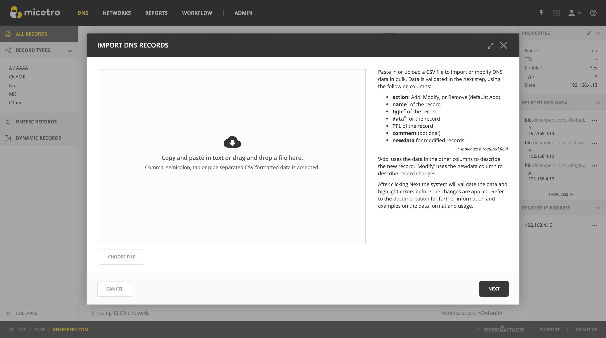

.. meta::
   :description: How to import DNS records in the Micetro Web Interface
   :keywords: DNS records, DNS import

.. _webapp-import-dns-records:

Importing DNS Records
=====================
Micetro enables you to import DNS records so you can manage them in the Web Application. This can be useful if you need to add DNS records in bulk.

.. note::
  You must have the necessary permissions to edit records in the zones that are used in the importation. For more information about permissions, refer to :ref:`access-control`.

**To import DNS records**:

1. Use the :menuselection:`Action` menu to select :guilabel:`Import DNS records`, which allows you to import records into multiple zones simultaneously. If you only want to import records into a specific zone, double-click that zone to open it and then use the :menuselection:`Action` menu to select :guilabel:`Import DNS records`.

2. In the **Import DNS Records** dialog box, paste in text or drag and drop a a plaintext CSV file into the provided field to import or modify DNS data in bulk. 

Refer to **DNS Bulk Import Format** below for instructions on formatting the DNS data file for import.

DNS Bulk Import Format
^^^^^^^^^^^^^^^^^^^^^^
Include the following information formatted as described here in the DNS data file you will use to import DNS records to Micetro.

.. note::
  Only plaintext CSV/TSV/TXT files are accepted for file selection. Excel spreadsheets must be converted to one of these formats before importing.

Header Line
"""""""""""

The first line of the data must be the header line, containing the names of the fields in the following columns. Some fields refer to built-in system fields, while others match the custom properties defined for the object type in question.

.. tip::
  Include only the fields that need to be imported/updated, except for mandatory properties or those needed to identify the object for import.

Field names in the header line are not case-sensitive. For example, "title" corresponds to the custom property "Title".

Built-in Fields
"""""""""""""""
Built-in system fields include the following:

* **action** (default: **Add**): Add, Modify, or Remove.

  .. tip::
    The following aliases can also be used:

    * Insert/Create = Add

    * Update/Change = Modify

    * Delete/Del = Remove

* **name** (required): The hostname of the record.

* **zone**: The zone containing the record.

* **authority**: For multi-primary, the zone's authority.

* **view**: For multi-primary, the view containing the zone.

* **forest**: For multi-primary, the forest of the zone.

* **type** (required): The record's type (A, CNAME, MX, etc.).

* **data** (required): The record's data (IP for A/AAAA, the target A/AAAA record for CNAME, etc.).

* **TTL**: The record's time-to-live (TTL) value. Defaults to seconds, but can also be hours (1H), days (2D), weeks (3W), months (4M), or years (5Y).

* **comment**: An optional save comment.

* **newdata**: For modifying an existing record, the new data to replace the old value.

Examples
^^^^^^^^
Here are a few examples of how to import, modify, and delete DNS records through the bulk import function:

Add Records
"""""""""""

Import A record 'viola' to the zone 'illyria.coast':

::

  name,type,data
  viola.illyria.coast.,A,16.0.2.2

Import A record 'viola' to 'illyria' providing a view name:

::

  name,type,data,view
  viola.illyria.,A,16.0.2.2,first-folio

Import A record 'viola' to 'illyria.palace' to the authority of 'orsino':

::

  name,type,data,authority
  viola.illyria.palace.,A,16.0.2.2,orsino

Import A record 'cesario' to 'olivia.palace', when zone and authority are specified:

::

  name,type,data,authority,zone
  cesario.olivia.palace.,A,16.0.2.2,illyria,orsino.palace

Modify Records
""""""""""""""

Modify IP address for the A record 'viola':

::

  action,name,type,data,newdata
  modify,viola.illyria.coast.,A,16.0.2.2, 20.21.9.6

Modify IP address for the A record 'viola' but leave the TTL as it was:

::

  action,name,type,data,newdata,ttl
  modify,viola.illyria.coast.,A,16.0.2.2, 20.21.9.6,

Modify IP address *and* TTL for the A record 'viola':

::

  action,name,type,data,newdata,ttl
  modify,viola.illyria.coast.,A,16.0.2.2, 20.21.9.6, 2H

Remove Records
""""""""""""""

Remove A record 'malvolio':

::

  action,name,type,data
  remove,malvolio.olivia.palace.,A,16.0.2.2
