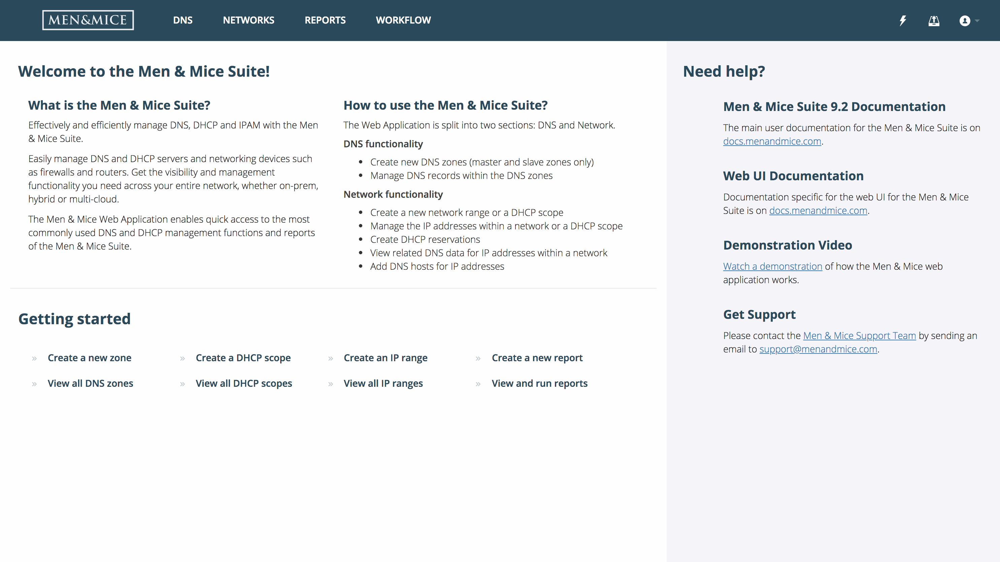

.. _webapp-introduction:

Introduction
============

The Web Application is split into three main sections:

:ref:`webapp-dns`

:ref:`webapp-network-management`

:ref:`webapp-reporting`

From the DNS section it is possible to:

* Create new DNS zones (previously limited to master and slave zones in the first version)

* Manage DNS records within the DNS zones

From the Network section it is possible to:

* Create a new network range or a DHCP scope

* Manage the the IP addresses within a network or a DHCP scope

* Create DHCP reservations

* View related DNS data for IP addresses within a network

* Add DNS hosts for IP addresses

In the Reporting section it is possible to:

* Create and save new reporting definitions

* Schedule reports to be run at specific times

.. note::
  The Internet Explorer browser is no longer supported as of version 9.3.0.

