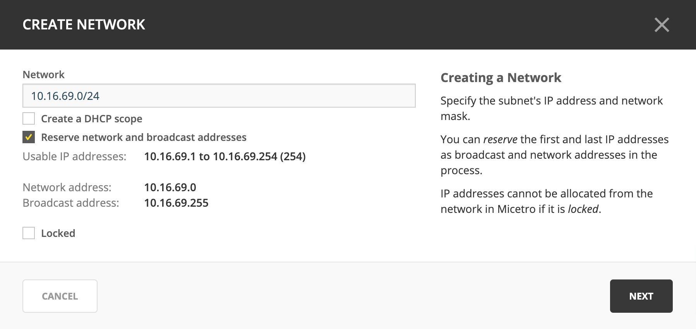
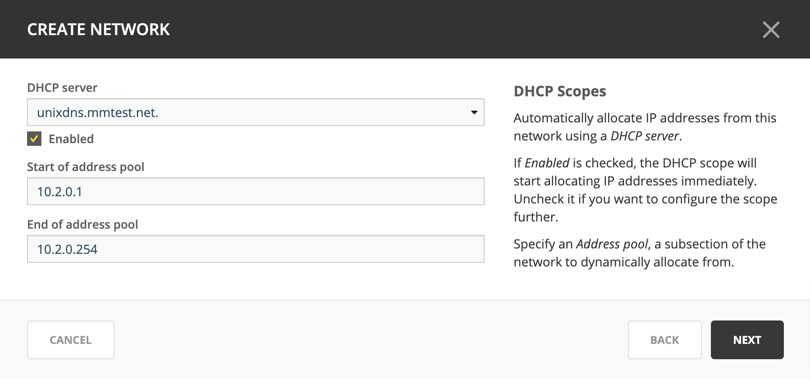
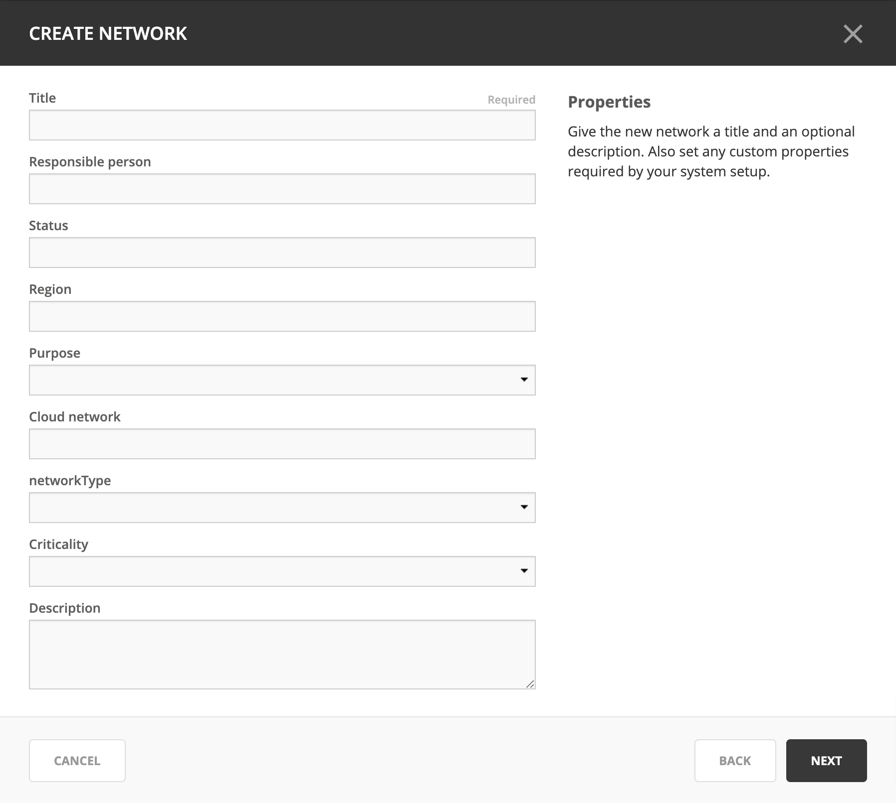
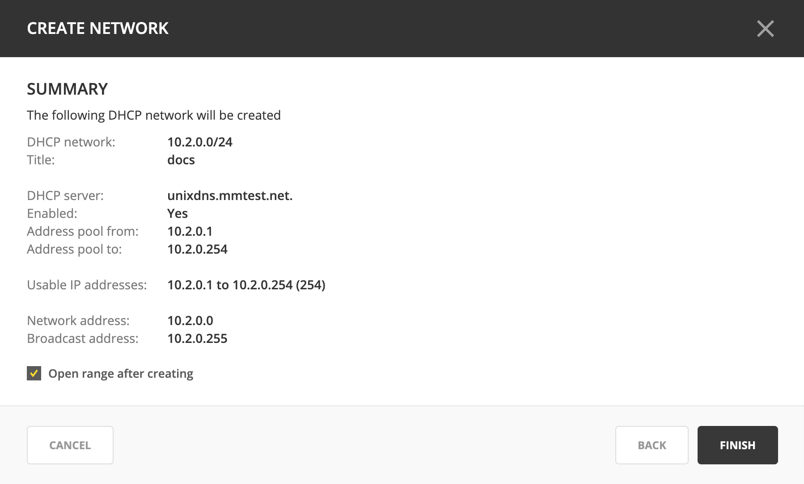
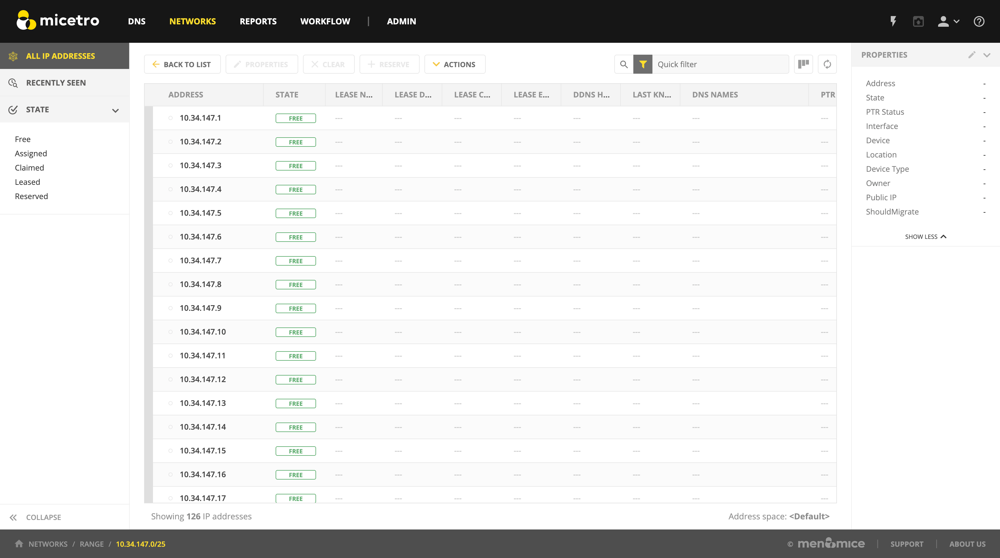
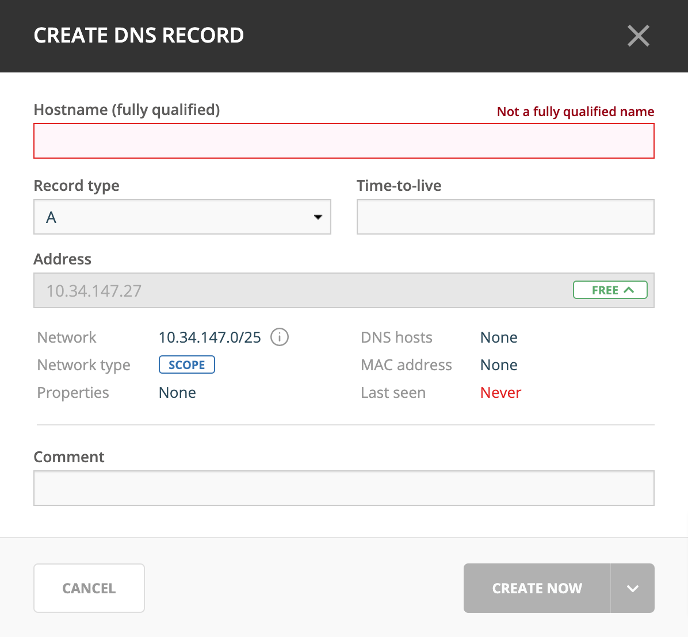
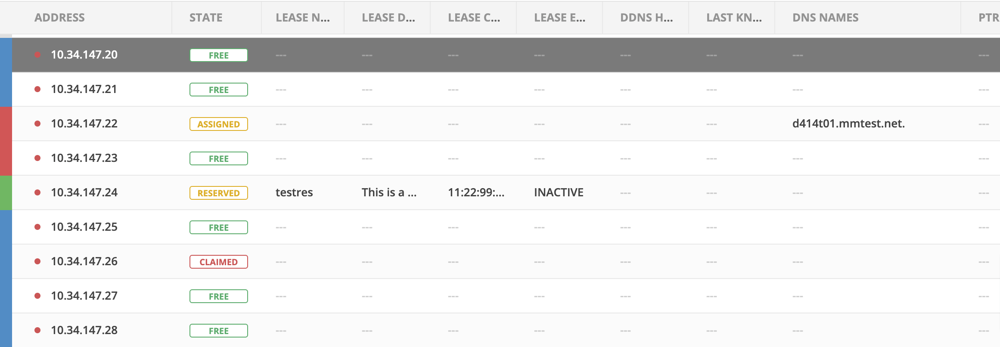

.. meta::
   :description: Network management in the Men&Mice Web Application  
   :keywords: network, management, web app  

.. _webapp-network-management:

Network management
==================

Networks
--------

.. image:: ../../images/Networks-Micetro.png
  :width: 90%
  :align: center

Viewing the network list
^^^^^^^^^^^^^^^^^^^^^^^^

In the :guilabel:`Networks` section of the Web Application, users are presented with a list of all networks in the system that they have access to view.

The networks lists shows all IP address ranges and scopes in the system (depending on what is selected in the :ref:`webapp-filtering`). The visible columns can be configured by clicking on the "Configure columns" icon above the list.

The utilization of ranges and DHCP scopes is shown in a column called **Utilization** showing each network's utilization.

.. _webapp-create-network:

Creating a network
^^^^^^^^^^^^^^^^^^

Step 1
""""""

Click on the :guilabel:`Create` button above the list, or click on :menuselection:`Actions --> Create new network` on the top or in the Inspector.

A wizard dialog appears to guide users through the process.

1. Fill in the network along with the subnet mask.

2. When creating a DHCP network, the check box :guilabel:`Create a DHCP network` should be checked. (See below for details.)

3. Specify if network and broadcast addresses should be reserved.

4. Click :guilabel:`Next`.

Step 2 (optional)
"""""""""""""""""

If the :guilabel:`Create a DHCP network` box was checked in Step 1, the following dialog is presented:

Step 3
""""""

1. Fill in the **Title** and **Description**.

2. Fill in to any custom fields to be defined in the system.

3. Click :guilabel:`Next`.

Step 4
""""""

Users are presented with summary information about the network before it is created.

1. To open the range after it has been created, check the :guilabel:`Open range after creating` box.

2. Optionally, add a save comment for audit trail purposes.

3. Click :guilabel:`Finish`.

The new IP address range or DHCP scope will be created.

Additional actions
^^^^^^^^^^^^^^^^^^

After selecting a network in the list, the available actions are shown in the Inspector on the right.

.. csv-table::
  :header: "Action", "Description"
  :widths: 15, 85

  "Create network", "See :ref:`webapp-create-network`."
  "Open network", "Opens up the network and lists all IP addresses."
  "Edit network properties", "Displays a dialog where the properties of the network can be configured."
  "Edit DHCP options", "*Only for DHCP scopes.* See :ref:`webapp-edit-dhcp`. Displays a dialog where DHCP scope options can be added and edited."
  "Delete network", "Allows the network to be deleted from the system."
  "Enable / disable scope", "*Only for DHCP scopes.* A disabled DHCP scope will be indicated in the list in the Authority column, such as 'Disabled on <Server name>'. *Scopes on Cisco DHCP servers can not be disabled.*"
  "Set folder", "Allows for moving the object to a different folder, adding the object to a folder or removing from a folder."
  "Find next free IP address", "Opens the network and selects the next free IP address."
  "Set discovery schedule",	"Enable and set discovery schedule for a network."
  "Convert to container", "Allows for converting a DHCP scope or IP address range to a container."
  "Convert to DHCP scope", "Only for IP address ranges."
  "Convert to network", "Only for DHCP scopes."
  "Set subnet monitoring", "Allows for enabling and configuring subnet monitoring."
  "View history", "Opens a dialog which shows the history for the selected network."
  "Import", "Opens an import wizard where networks can be imported. See :ref:`webapp-import-ipam-data`."

Enabling / Disabling DHCP scopes
^^^^^^^^^^^^^^^^^^^^^^^^^^^^^^^^

To disable a DHCP scope, select the scope in the list and use :menuselection:`Actions --> Disable scope`.

To enable a DHCP scope, select the scope in the list and use :menuseleciton:`Actions --> Enable scope`.

Edit DHCP options for a scope
^^^^^^^^^^^^^^^^^^^^^^^^^^^^^

See :ref:`webapp-edit-dhcp`.

DHCP information
^^^^^^^^^^^^^^^^

After selecting a DHCP scope in the list, information on DHCP pools can be viewed in the inspector on the right.

The name of the authoritative DHCP servers are shown along with pools and exclusions defined in the scope.

In the case of split and failover DHCP scopes, both authoritative servers are shown and the respective pools and exclusions.

Changing between address spaces
^^^^^^^^^^^^^^^^^^^^^^^^^^^^^^^

If there are more than one address space defined, it is possible to change between address spaces by going to :menuselection:`User settings --> Address space` and select a different address space to activate.

.. image:: ../../images/Networks-change-space-Micetro.png
  :width: 75%
  :align: center

IP Addresses
------------

Viewing a network
^^^^^^^^^^^^^^^^^

To open a network, double click on a network or select the network and click on :guilabel:`Open`.

An example of a network which is an IP address range can be seen below.

.. note::
  Each IP address in a network can have different states. It depends on whether it is an IP address network or a DHCP scope.

.. image:: ../../images/view-Networks-Micetro.png
  :width: 90%
  :align: center

Column descriptions
^^^^^^^^^^^^^^^^^^^

IP Address Ranges
"""""""""""""""""

+-------------------+------------------------------------------------------------------------------------------+
| Column            | Description                                                                              |
+===================+==========================================================================================+
| Address           |	An IP address within the IP address range                                                |
+-------------------+------------------------------------------------------------------------------------------+
| State             | For IP address ranges, the possible states for IP addresses are:                         |
|                   |                                                                                          |
|                   | * Free                                                                                   |
|                   | * Assigned                                                                               |
|                   | * Claimed                                                                                |
+-------------------+------------------------------------------------------------------------------------------+
| Last known        | The last known MAC address associated with the IP address.                               |
| MAC Address       | (Obtained through discovery.)                                                            |
+-------------------+------------------------------------------------------------------------------------------+
| DNS names	        | A list of DNS hostnames associated with the IP address                                   |
+-------------------+------------------------------------------------------------------------------------------+
| PTR status        | Shows the status of the Address (A) record and Pointer (PTR) record mappings.            |
|                   | This column can have three values:                                                       |
|                   |                                                                                          |
|                   | **Empty**. there are no DNS records for the host. It is also empty if a                  |
|                   | PTR record exists where the domain in the data section of the PTR record                 |
|                   | is not managed by the system.                                                            |
|                   |                                                                                          |
|                   | **OK**. there is a match between the A and the corresponding PTR record(s).              |
|                   |                                                                                          |
|                   | **Verify**. there is no match between the A and the PTR records for the host. The most   |
|                   | common reasons are:                                                                      |
|                   |                                                                                          |
|                   |    * There is an A record but the PTR record is missing.                                 |
|                   |    * There is a PTR record but the A record is missing.                                  |
|                   |    * The data section in the PTR record does not correspond to the name of the A record. |
+-------------------+------------------------------------------------------------------------------------------+
| Last seen         |	The date and time which the IP address was last seen during discovery.                   |
+-------------------+------------------------------------------------------------------------------------------+
| Device            |	If the IP address is associated with a device, the name of the device is shown.          |
+-------------------+------------------------------------------------------------------------------------------+

DHCP Scopes
"""""""""""

.. note::
  The table below shows only additional columns shown for DHCP scopes. Shared columns are described in the table above.

+----------------------+---------------------------------------------------------------------------------------+
| Column               | Description                                                                           |
+======================+=======================================================================================+
| Pool color indicator | * Blue : IP address is in a DHCP pool                                                 |
|                      | * Green : IP address has a DHCP reservation                                           |
|                      | * Red : IP address is in an DHCP exclusion range                                      |
|                      | * Grey : IP address is in static part of DHCP scope                                   |
+----------------------+---------------------------------------------------------------------------------------+
| State                | For DHCP scopes, the possible states for IP addresses are                             |
|                      |                                                                                       |
|                      | * Free                                                                                |
|                      | * Assigned                                                                            |
|                      | * Claimed                                                                             |
|                      | * Leases                                                                              |
|                      | * Reserved                                                                            |
+----------------------+---------------------------------------------------------------------------------------+
| Lease name           | The name of the DHCP lease                                                            |
+----------------------+---------------------------------------------------------------------------------------+
| Lease description    | The description of the DHCP lease                                                     |
+----------------------+---------------------------------------------------------------------------------------+
| Lease client         | The client identifier of the DHCP lease                                               |
| identifier           |                                                                                       |
+----------------------+---------------------------------------------------------------------------------------+
| Lease expires        | The expiration time of the DHCP lease                                                 |
+----------------------+---------------------------------------------------------------------------------------+
| DDNS hostname        | The DDNS hostname associated with the DHCP lease                                      |
+----------------------+---------------------------------------------------------------------------------------+

An example of a network which is a DHCP scope:

Creating a DHCP reservation
^^^^^^^^^^^^^^^^^^^^^^^^^^^

Inside a DHCP scope, select a specific IP address in the list, and then click on the "Reserve" button above the list.

Adding a DNS host
^^^^^^^^^^^^^^^^^

To add a DNS host for a specific IP address within a IP address range or a scope:

1. Select the IP address in the list

2. In the Related DNS data section of the Inspector, click on the :guilabel:`+` button

3. A dialog will be displayed which allows for adding the record

4. Specify a record name.

5. Specify a zone name. (Typing in the zone name field will start generating a list of potential zone names with autocomplete.)

6. Fill in other information.

7. Click :guilabel:`Create` to create the new record.

Additional actions
^^^^^^^^^^^^^^^^^^

After selecting an IP address in the list, the available actions are shown in the Inspector on the right.

.. csv-table::
  :header: "Action", "Description"
  :widths: 15, 85

  "Edit IP address properties", "Displays a dialog where the properties of the IP address can be configured."
  "Find next free IP address", "Selects the next free IP address."
  "Create new DNS record", "Displays a dialog where DNS records associated with the IP address can be created."
  "Claim IP address", "Claims the IP address."
  "Ping IP address", "Pings the IP address. See :ref:`webapp-ping`."
  "View history", "Opens a dialog which shows the history for the selected IP address."
  "Import IP", "Opens an import wizard where networks can be imported."

.. _webapp-ping:

Pinging an IP address
^^^^^^^^^^^^^^^^^^^^^

An IP address or multiple IP addresses in the list can be pinged by: select them and then click on the :guilabel:`Ping IP address` task in the Inspector.

An indicator is shown during the ping. Afterwards a green or red indicator on the left of the IP address indicates a successful (green) or unsuccessful (red) ping.

