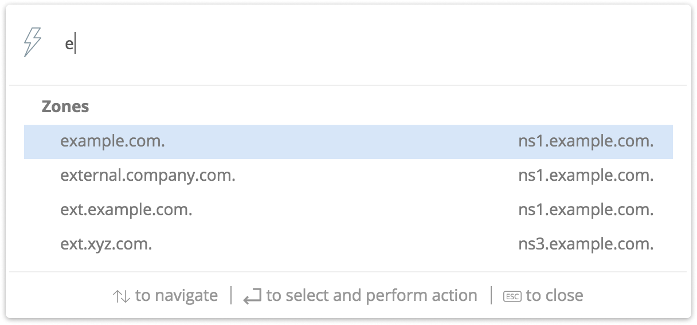
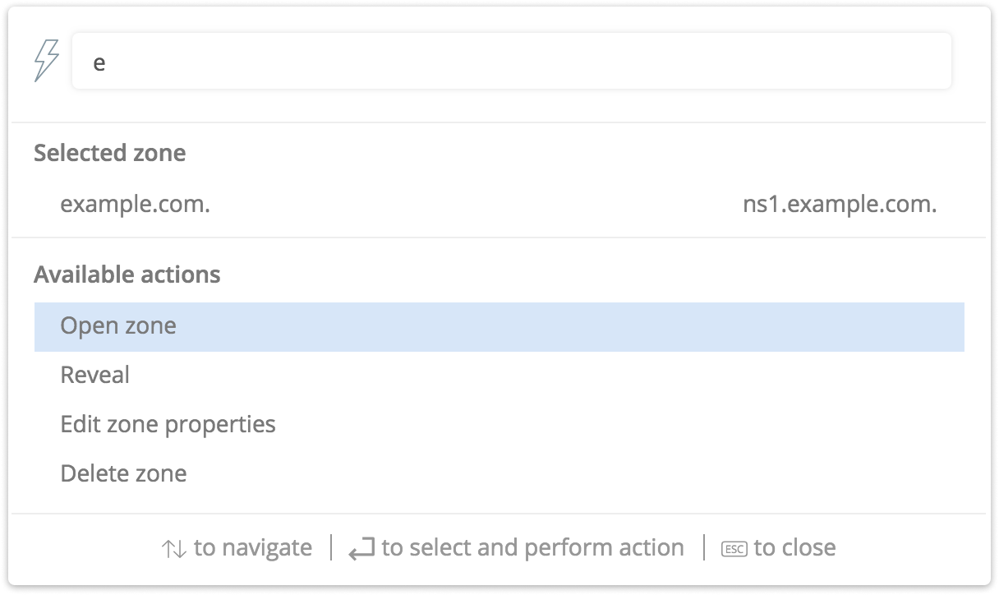

.. meta::
   :description: The Quick command feature in the Micetro by Men&Mice Web Application
   :keywords: Micetro, Men&Mice

.. _webapp-quick-command:

Quick command
=============

Introduction
------------

Quick Command is a feature to speed up common operations in the Web Application. It allows users to quickly find and perform actions on specific objects in the system, using a single, persistent dialog box.

The autocomplete functionality in the interface allows typing in either names or the addresses and dynamically presents the user options to choose from.

After selecting an object such as a DNS zone or a DNS record, the user can choose from a list of actions, for example Open, Edit, Delete, Reveal.

Using Quick Command
-------------------

The quick commands can be accessed by clicking either the lightning icon in the top menu or by using a keyboard shortcut: **Ctrl** + **Space**.

Step 1
^^^^^^

Start typing in one of the following

* A network

* A DNS zone name

* A DNS record name

* An IP address

A list of potential results will be displayed:

Step 2
^^^^^^

Select the object to work with.

Step 3
^^^^^^

Select the action to perform on the object.

Available actions
"""""""""""""""""

The available actions for each object are:

+--------------+-------------------------+
| Object       | Actions                 |
+==============+=========================+
| DNS zones    | * Open DNS zone         |
|              | * Reveal                |
|              | * Edit zone properties  |
|              | * Delete zone           |
+--------------+-------------------------+
| DNS records  | * Add DNS record        |
|              | * Edit DNS record       |
|              | * Reveal                |
|              | * Delete DNS record     |
|              | * Disable DNS record    |
+--------------+-------------------------+
| Network      | Open                    |
|              | Reveal                  |
|              | Edit network properties |
|              | Delete network          |
+--------------+-------------------------+
| IP addresses | * Reveal                |
|              | * IP address properties |
|              | * Claim IP address      |
|              | * Ping IP address       |
+--------------+-------------------------+

Examples
--------

Add a DNS record to an existing DNS zone
^^^^^^^^^^^^^^^^^^^^^^^^^^^^^^^^^^^^^^^^

Adding the www2.example.com DNS record to the example.com DNS zone.

Step 1
""""""

Bring up 'Quick command' and write www2.ex

Step 2
""""""

Select the www.2.example.com from the list

Step 3
""""""

Fill in the details for the record in the add record dialog and click "Save"

The DNS record has now been added.

Find an existing DNS zone
^^^^^^^^^^^^^^^^^^^^^^^^^

Finding the zone corp.company.com and opening it.

Step 1
""""""

Bring up 'Quick Command' and write corp.com.

Step 2
""""""

Select corp.company.com zone from the list

Step 3
""""""

Select the action "Open zone"
