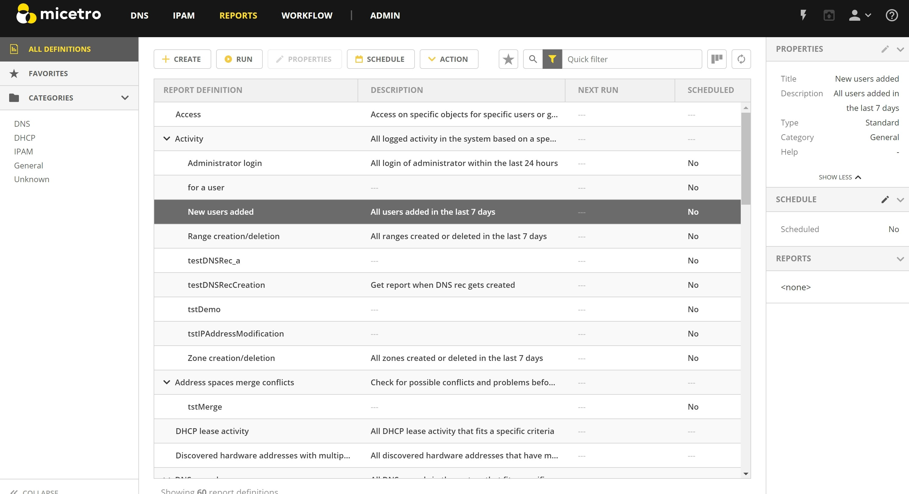
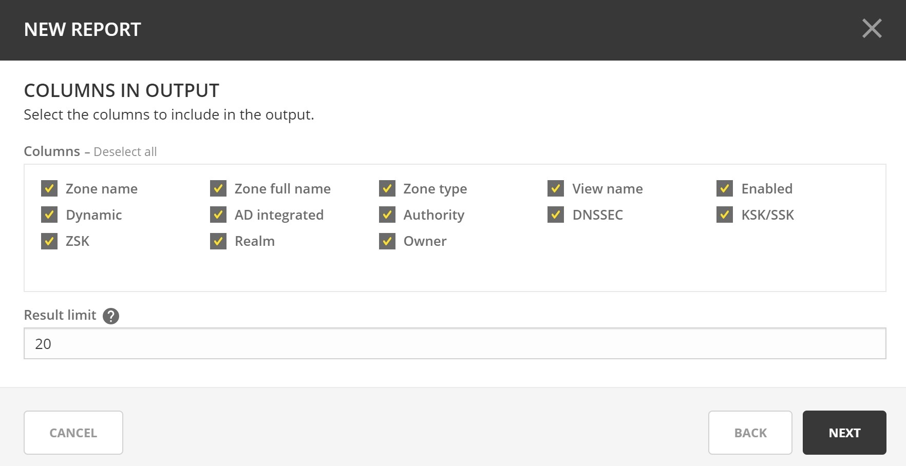
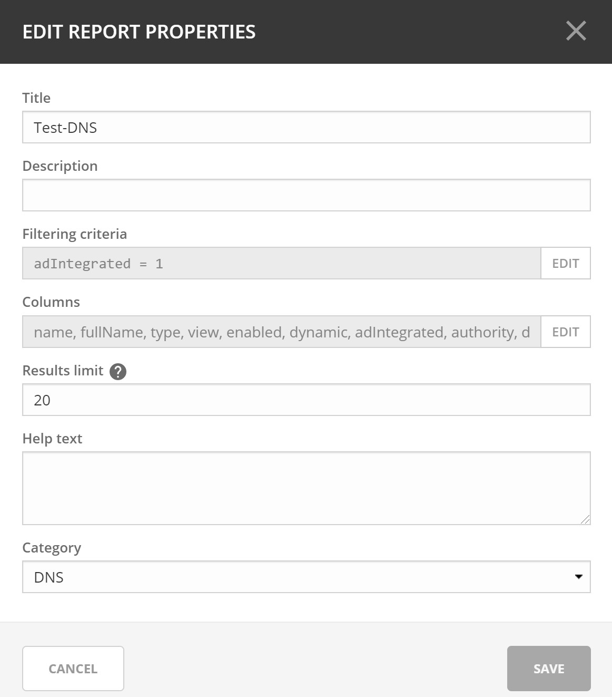
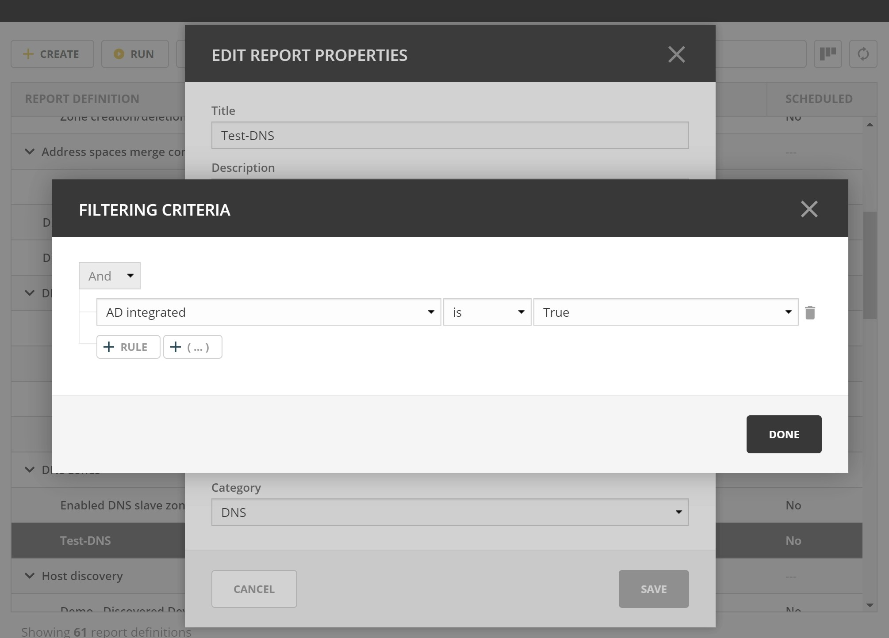
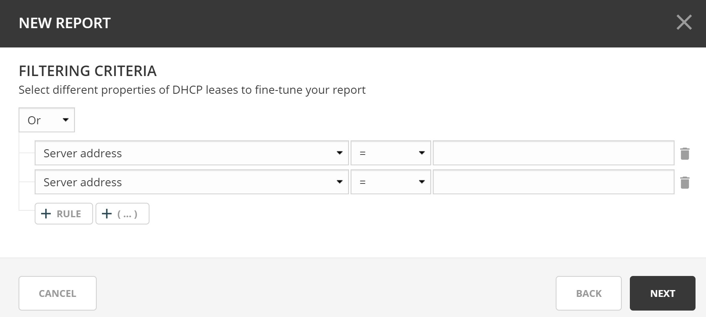

.. meta::
   :description: Reports management in the Men&Mice Web Application 
   :keywords: micetro

.. _webapp-reporting:

Reports Management
==================

Introduction
------------

Micetro manages vast amounts of DNS, DHCP, and IPAM data. The first version of reporting in the Web Application was introduced in version 9.1. To enhance the functionality in version 9.2, a new Reporting module has been created.

Building reports is easy and can be tailor-made by correlating related data in a few steps, and scheduling the results to be generated daily, weekly or on a custom schedule. There are built-in report definitions that can be used as a reference to build reports. Using custom fields in Micetro further enhances reports by correlating custom fields with the built-in ones. The system then allows you to create reporting definitions that can be run either one time only, or scheduled to run later or at regular intervals.

The reports can be viewed within the Web Application, or downloaded in various formats for further analysis.

When the Reports section is opened in the Web Application, you are presented with a list of report definitions. Like every other part of the Web Application, this list can be filtered and searched.

Reporting module
----------------

You can:

* create and save new report definitions

* schedule reports to be generated

* run reports

* download reports in various formats

Main actions
------------

The main actions are shown in the action list above the list of report definitions.

.. csv-table::
  :widths: 20, 80

  "Create",	"Creates a new report. For more information, see Creating a new report."
  "Run", "For more information, see Run now."
  "Properties", "For more information, see Edit report definition properties"
  "Schedule", "For more information, see Schedule regular report generation"
  "Delete", "For more information, see Delete a report definition"

The "Create" action can be run without selecting a report, but all the other actions require you to first select a report from the list.

Additional actions for reports are described in :ref:`report-actions`.

Viewing the report definition list
----------------------------------

A report definition is a recipe for the actual report. It contains the filter criteria used to build the report, along with scheduling information and other properties.

The list of report definitions is shown when first entering the Reports section.

For help with finding and organizing the reports, use the filtering sidebar on the left-hand side of the list.

.. csv-table::
  :widths: 15, 85

  "All reports", "Shows all report definitions."
  "Favorites", "Shows report definitions that have been added to favorites. See :ref:`favorite-report`."
  "Category", "Shows all report definitions that belong to a specific category."

Creating a new report
---------------------

A new report definition can be created by clicking on the Create button above the report list, or by selecting the Create new report in the action list in the Inspector.

With the wizard, you can:

* change the report definition's source,

* edit its filter,

* select the columns to be included in the output,

* and then run the report.

Additionally, it is possible to schedule a report to be generated at specific times or intervals.

After running the report, you are presented with a preview of the results and has the option of saving a copy of the report in a number of different formats. See :ref:`report-results`.

A description of each report source is described in :ref:`report-sources`.

Step 1: Select source
^^^^^^^^^^^^^^^^^^^^^

Select one of the existing reports or a data source as the basis of the new report definition.

.. image:: ../../images/new-report.png
  :width: 70%
  :align: center

Step 2: Edit filtering criteria
^^^^^^^^^^^^^^^^^^^^^^^^^^^^^^^

In the second step, you have the option of editing the filtering criteria. You might want to make some adjustments to the fields in the filter of the selected report definition, for example extending a time span or selecting a different username. It is also possible to change the filter completely and create a new report definition.

.. image:: ../../images/report-criteria.jpg
  :width: 70%
  :align: center

Conditions and parenthesis
""""""""""""""""""""""""""

.. csv-table::
  :header: "Operator", "Description"
  :widths: 10, 90

  "And", "All the conditions have to be met"
  "Or", "Sufficient that any of the conditions are met"

It is possible to add parenthesis to create sub-conditions with a different operator. The report definition shown in the screenshot above can be read as follows:

.. highlights::

	"Last seen must be less than one month ago, lost must be true and either claimed or usage must be true".

This translates into: "*Show me hosts that have not answered during discovery in the last month that are either claimed or in use.*"

Comparison operator
"""""""""""""""""""

Depending on the type of field you are presented with different comparison operators.

.. csv-table::
  :header: "String", "Number, timespan, date", "Boolean, pick-list, object"
  :widths: 20, 10, 20

  "equals", "=", "is"
  "doesn't equal", "!=", "is not"
  "contains", "<",
  "doesn't contain", ">",
  "starts with", "<=",
  "doesn't start with", ">=",
  "ends with",,
  "doesn't end with",,
  "matches regex",,
  "doesn't match regex",,

Step 3: Select columns
^^^^^^^^^^^^^^^^^^^^^^

It is possible to select which columns are to be included in the report result.

.. note::
  All available columns are selected by default.

Step 4: Save or run report definition
^^^^^^^^^^^^^^^^^^^^^^^^^^^^^^^^^^^^^

By selecting "Run once", the report definition will not be saved, and you will be presented with a dialog that shows the report results.

Click **Finish** to run the report and get the results.

By selecting "Open scheduling dialog after saving" you can schedule periodic executions of the report.

Step 5: Schedule
^^^^^^^^^^^^^^^^

.. image:: ../../images/report-save-run.png
  :width: 70%
  :align: center

In this step, report generation can be scheduled to run periodically. The frequency and the interval can be specified, and a start date can be set.

For more information, see :ref:`schedule-report-generation`.

Step 6: Run the report definition
^^^^^^^^^^^^^^^^^^^^^^^^^^^^^^^^^

After the report has been created, it can be generated at any time by selecting the report definition in the list and clicking on the the "Run report" task. (See :ref:`report-results`.)

.. _report-results:

Viewing the report results
--------------------------

Viewing the list of reports
^^^^^^^^^^^^^^^^^^^^^^^^^^^

To view a list of all reports that have been generated for a particular reporting definition, double click on the reporting definition in the list.

This lists all reports along with the how much data is in the report (row count) and how long it took to generate the report (duration).

Double clicking on a report in this list allows you to preview a report.

Previewing and downloading a report
^^^^^^^^^^^^^^^^^^^^^^^^^^^^^^^^^^^

Previewing the report results can be done in various ways:

* Generating the report instead of saving it after going through the create report wizard.

* Selecting a report definition in the list and clicking on the "Run report" task.

* Preview a report result from a scheduled run:

    1. Select a report definition in the list.

    2. Find the "Reports" inspector item.

    3. Find a scheduled run of a report and click on the timestamp or the ellipsis and selecting "Preview" from the menu.

.. note::
  The preview only shows up to the first 150 rows in the report. For the full report it needs to be downloaded.

.. image:: ../../images/report-preview.png
  :width: 80%
  :align: center

In all cases, you will be presented with a preview of the report in a separate dialog. (As shown above.)

The results can then be downloaded by clicking the download button. The dropdown menu offers a number of file formats to select from (ie. CSV, XML, JSON or SYLK).

.. tip::
  Sylk and CSV are handy for importing the data into a spreadsheet application for further processing.

Actions for reports
-------------------

In the actions part of the Inspector, the available actions for each selected reports are shown.

.. note::
  In the case of the reporting module not being enabled, the unavailable actions are greyed out.

Run now
^^^^^^^

Select a report definition in the list and click on the Run now action.

A dialog is displayed showing a preview of the report results. (See :ref:`report-results`.)

.. _schedule-report-generation:

Schedule regular report generation
^^^^^^^^^^^^^^^^^^^^^^^^^^^^^^^^^^

In this dialog a report can be scheduled to be generated at specific intervals. Additionally, it is also possible to specify a path to a script that will be run after the report is generated and also can scavenging be scheduled.

1. Select a report definition in the list and click on the Schedule action.

2. The following dialog is shown where scheduling and scavenging can be configured.

.. image:: ../../images/report-schedule.jpg
  :width: 70%
  :align: center

Settings for schedule.
""""""""""""""""""""""

.. csv-table::
  :widths: 30, 70

  "Enabled", "When selected, scheduling is enabled for this report"
  "Frequency", "Specifies the frequency in which the report is scheduled to run."
  "Every", "Specifies the interval in which the report is scheduled to run."
  "Starts on", "Specifies the starting date for the report to be run on."

By selecting for example '2' and 'Weeks', a new report is generated at the selected start on date/time and then at every 2 weeks afterward.

.. note::
  All dates and times are according to the time zone setting on the Men&Mice Central server.

Settings for Scavenging
"""""""""""""""""""""""

.. csv-table::
  :widths: 40, 60

  "Maximum number of reports to keep", "Specifies how many reports will be retained in the system. This helps with making sure that disk space does not run out in case many large reports are generated in a small time interval."
  "Maximum number of days to keep results", "Specifies for how many days the reoprts will be retained in the system. This helps with making sure that disk space does not run out in case many large reports are generated in a small time interval."

Duplicate an existing report definition
^^^^^^^^^^^^^^^^^^^^^^^^^^^^^^^^^^^^^^^

Use this option to create a new report definition based upon an existing one.

1. Select a report definition in the list and click on the Duplicate action.

2. The create new report wizard will be shown, and you will be allowed to edit the filtering criteria for the new report. (As described in Step 2 in Creating a new report.)

Delete a report definition
^^^^^^^^^^^^^^^^^^^^^^^^^^

1. Select a user defined report definition in the list and click on the Delete action.

2. A dialog is presented prompting you if you want to delete the report definition.

Edit report definition properties
^^^^^^^^^^^^^^^^^^^^^^^^^^^^^^^^^

Both the report definition properties, the filtering criteria for the report and the data columns for the report results can be edited.

.. note::
  Only user created report definitions can be edited.

1. Select a report definition in the list and click on the Edit report properties action.

2. A dialog is presented which allows for specifying the properties for the report, along with editing the filtering criteria.

3. Clicking on "Edit" for the filtering criteria brings up the following dialog:

Scavenge reports
^^^^^^^^^^^^^^^^

Report results take up disk space on the Men&Mice Central server. The system allows for specifying the maximum number of reports (or the maximum number of days to keep each result) for each report definition. Oldest results are deleted when the limit is reached.

1. Select a report definition in the list and click on the Scavenge reports action.

2. A dialog is presented which allows for specifying the properties for scavenging reports.

.. _favorite-report:

Adding a report definition to favorites
^^^^^^^^^^^^^^^^^^^^^^^^^^^^^^^^^^^^^^^

1. Select a report in the list and click on the Delete action.

2. Click on the star button to the left of the Quick filter field:

.. image:: ../../images/blackstar-favorite.png
  :width: 40%
  :align: center

.. _report-sources:

Report sources
--------------

There are 24 reports definitions in the list under Reports (not counting user defined reports).

12 base report definition sources: sources that either allow you to query one particular object type in the system (e.g. Activity); or sources that give access to a particular data relation in the system (e.g. Host discovery).

12 derivatives of the base report sources showing the specification possibilities they offer. (Zone creation/deletion building upon Activity and IP reconciliation building upon Host discovery.)

+-----------------------------------------------------------------------+-----------------------------------------------------------------------+
| Report types                                                          | Built-in reports                                                      |
+=======================================================================+=======================================================================+
| Activity                                                              | Administrator login                                                   |
|                                                                       | New users added                                                       |
|                                                                       | Range creation/deletion                                               |
|                                                                       | Zone creation/deletion                                                |
+-----------------------------------------------------------------------+-----------------------------------------------------------------------+
| Access [1]_                                                           |                                                                       |
+-----------------------------------------------------------------------+-----------------------------------------------------------------------+
| Address space merge conflicts [1]_                                    |                                                                       |
+-----------------------------------------------------------------------+-----------------------------------------------------------------------+
| DHCP lease activity                                                   |                                                                       |
+-----------------------------------------------------------------------+-----------------------------------------------------------------------+
| Discovered hardware addresses with multiple addresses [1]_            |                                                                       |
+-----------------------------------------------------------------------+-----------------------------------------------------------------------+
| DNS records                                                           | Address records                                                       |
|                                                                       | Multi-labeled hosts                                                   |
+-----------------------------------------------------------------------+-----------------------------------------------------------------------+
| DNS zones                                                             | Enabled DNS zones of type secondary                                       |
+-----------------------------------------------------------------------+-----------------------------------------------------------------------+
| Host discovery [1]_                                                   | IP reconciliation                                                     |
|                                                                       | Discovered devices                                                    |
+-----------------------------------------------------------------------+-----------------------------------------------------------------------+
| IP ranges                                                             |                                                                       |
+-----------------------------------------------------------------------+-----------------------------------------------------------------------+
| IP addresses                                                          |                                                                       |
+-----------------------------------------------------------------------+-----------------------------------------------------------------------+
| Lease hardware address with multiple IP addresses [1]_                |                                                                       |
+-----------------------------------------------------------------------+-----------------------------------------------------------------------+
| Men&Mice Suite messages                                               |                                                                       |
+-----------------------------------------------------------------------+-----------------------------------------------------------------------+
| SOA records                                                           | SOA records with abnormal minimum TTL value                           |
|                                                                       | SOA records with abnormal refresh value                               |
+-----------------------------------------------------------------------+-----------------------------------------------------------------------+

.. [1] Specialized report source.

Filter field types
------------------

.. csv-table::
  :widths: 40, 60

  "String, number", "Free text input."
  "Date and time", "Date time string or current time delta shorthand units, e.g. -2w, +1d."
  "Timespan", "Timespan shorthand units, e.g. 24h, 2d, 30m"
  "Object, boolean, options", "A dropdown is presented with the available options."

Timespan formats
^^^^^^^^^^^^^^^^

.. code-block::

  <num><time unit>
  <time unit> ::= s (seconds), m (minutes), h (hours), d (days), w (weeks), M (months), y (years)

Date time formats
^^^^^^^^^^^^^^^^^

General date time format consist of date and/or time (separated by a space).

.. code-block::

  <datetime> ::= <date> <time>
  <time> ::= HH:MM[:SS[:TTT]][ AM|PM]
  <date> ::= [yy]yy-mm-dd
           | dd.mm.yy[yy]
           | mm/dd/yy[yy]

Timestamps formatted according to RFC3339.

.. code-block::

  YYYY-MM-DDTHH:MM:SS[time-secfrac][time-offset]

Current time deltas, i.e. a date time relative from now, can also be used.

.. code-block::

  -|+ <num><time unit>
  <time unit> ::= s (seconds), m (minutes), h (hours), d (days), w (weeks), M (months), y (years)

To include more than one value for a particular field the field has to be added again to the filter with an "OR" condition. (For example: the Address records, where the record type field has to be either A or AAAA.)

