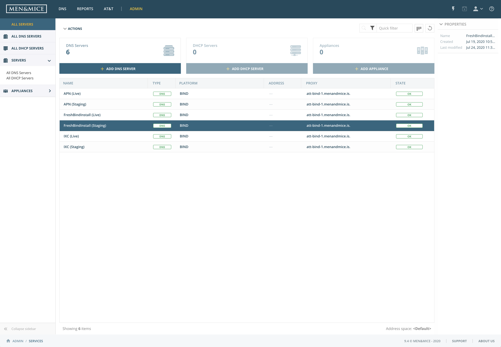

.. _webapp-server-management:

Server management
=================

Managing DNS and DHCP servers in the system is done by navigating to :guilabel:`Admin`.
A list of all servers configured in the system is shown by default.
In the left sidebar it is possible to choose from viewing DNS servers, DHCP servers or Appliances (if configured in the system).

.. note::
  The final version of the server management feature has not been released officially and will go through improvements before the final release.

In the right hand sidebar, the properties of a selected server is shown. Any custom fields defined will also be displayed there.

Server Management actions
-------------------------

Any actions that can be performed on a selected server can either be accessed in the :guilabel:`Actions` above the list or by hovering over a menu at the right hand side of the list.

.. csv-table::
  :header: "Action", "Description"
  :widths: 15, 85

  "Add DNS server", "Adds a DNS server to the system."
  "Add DHCP server", "Adds a DHCP server to the system."
  "Add appliance", "Adds an Appliance to the system."
  "Edit DNS server", "Allows to edit the server name and server properties."
  "Attach server", "Attaches a previously detached server."
  "Detach server", "Detaches or disables the server. The server can be attached again for it to be part of the server synchronization again."
  "Advanced server options", "Allows to view and edit advanced (BIND) server options for the selected server."
  "View history", "Allows to view history for the selected server."
  "Remove server", "Removes the selected server from the system."
