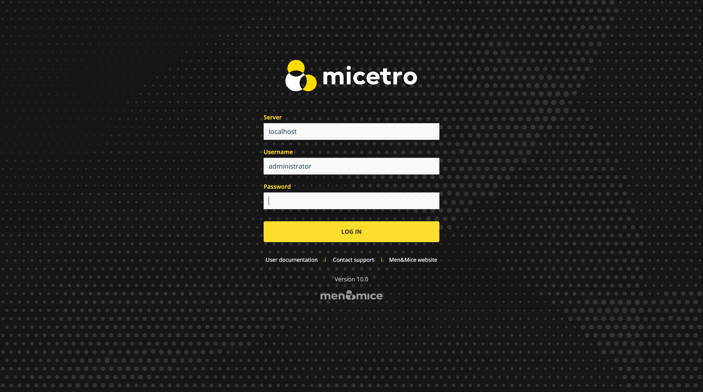

.. _webapp-user-guide:

Using the Web Application
=========================

Installing the Web Application
------------------------------

Installing the Web Application for Micetro is straightforward: just follow the instructions in the :ref:`install-webapp` in the Implementation Guide.

.. note::
  The web application cannot be installed on the same server as the old web interface. It needs to be on a separate virtual host.

Logging in
----------

Server
  The hostname or IP address of the server running Men&Mice Central

Username
  The username you want to log in as

Password
  The password for the specified user

Log in with Single Sign-on
  You can use existing SSO to log in. Note that the checkbox is only visible when the web server supports SSO.  For more information see :ref:`webapp-sso`.

  .. note::
    If you're logged in through an SSO service, the *Change password* operation is disabled in the :menuselection:`User menu`.

Using the Men&Mice Web Application
----------------------------------

The Web Application is split into three main sections: :ref:`webapp-dns`, :ref:`webapp-network-management`, and :ref:`webapp-reporting`.

For information on elements common to all sections, see :ref:`webapp-general`.

.. _webapp-help:

Getting help or support
-----------------------

Important information about how to get help and access the documentation can be found in the right sidebar on the front page of the Web Application.

The help sidebar can also be accessed by clicking on the :guilabel:`?` icon in the top menu in all sections.
