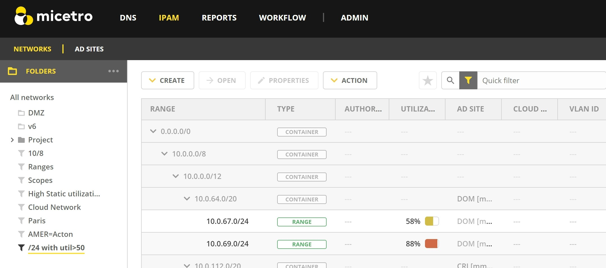
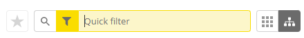
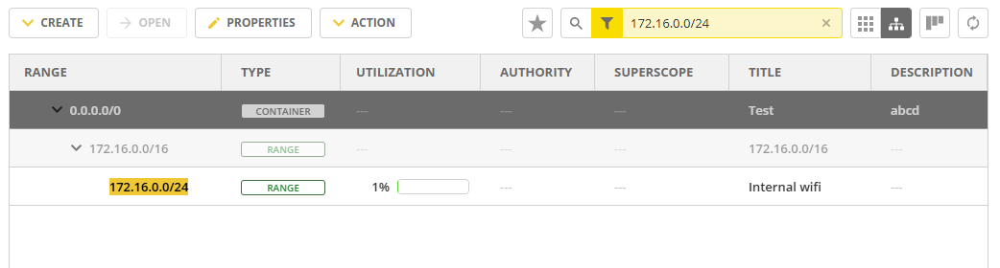

.. meta::
   :description: A guide to using the Micetro Web Application 
   :keywords: web application, user guide, Micetro 

.. _webapp-user-guide:

Using Micetro
==============

The web application is split into five main pages:

* :ref:`dns`: Create, delete, and edit DNS zones. You can also manage DNS records within the DNS zones.
* :ref:`ipam`: Perform various actions related to network and DHCP management, such as creating a new network range or DHCP scope, managing IP addresses within a network or DHCP scope, and creating DHCP reservations. You can also view related DNS data for IP addresses within a network and add DNS hosts for IP addresses.
* :ref:`webapp-reporting`: Run and view reports on various objects. To create and save new reporting definitions, as well as schedule reports to run at specific times, you need to have the Advanced Reporting module, which is activated by a separate license key.
* :ref:`webapp-workflows` requires a separate license key. On this page, you can submit change requests to create, modify, or delete DNS records.
* :ref:`Admin <admin-micetro>` is the workspace for system administrators. As an administrator, you can complete the various tasks to manage Micetro, such as managing user access and services.

Working in the data grid
-------------------------
Micetro is centered around the data grid, which lists objects in the system, such as DNS zones, DNS records, IP address ranges, DHCP scopes, and IP addresses. 

From the data grid, you can manage DNS zones and records, networks and DHCP scopes, and more, using the tools that comprise Micetro.

  .. image:: ../../images/webUI-annotated-new.png
    :width: 100%

.. csv-table:: Web Application UI elements
  :widths: 25, 75
  :header: Item, Description

  "Add to favorites", "Adds the selected item to the favorites list. The corresponding Favorites filter in the sidebar shows all favorited items."
  "Column configuration", "Specifies which columns are displayed in the data grid."
  "Folder sidebar", "Filters the sidebar to show only created folders."
  "Flat or tree toggle", "Toggles the data grid between list and tree view."
  "Inspector", "Displays various information about the item selected in the data grid. Refer to :ref:`webapp-inspector`."
  "Quick command", "Allows you to quickly find and perform actions. Refer to :ref:`webapp-quick-command`."
  "Quick filter", "Filters the results displayed in the data grid when you select an item in the sidebar. Refer to :ref:`quickfilter`."
  "Refresh data grid", "Refreshes the contents of the data grid."
  "Services sidebar", "Filters the sidebar to show only services, e.g., DHCP services or DNS services."
  "Sidebar", "Displays a list of possible filters to apply to the data grid. Refer to :ref:`webapp-filtering`."
  "Task bar", "Provides the main tasks on each page, e.g., Create, Open, Action."

.. _webapp-inspector:

Viewing object details in the Inspector
---------------------------------------
The Inspector, located to the right of the data grid on each page, serves as an info box for the selected objects, such as DNS zones. In some cases, it's possible to edit the information in the Inspector, such as DNS zone authority or the Start of Authority (SOA) record for each zone. For more information, refer to :ref:`zone-contents`.

The **Properties** section of the Inspector displays all properties for the selected object. These include all custom properties that have been defined for a specific object type.

.. note::
  For IP addresses, the Inspector also displays the vendor for the specific MAC address, when available.

.. _webapp-filtering:

Filtering with the sidebar
--------------------------
The left sidebar provides a set of predefined filters on each page, which you can use to quickly find the zones or networks.

The sidebar is open by default, but you can collapse it to an icon-only mode. If a list of clickable items is needed, the sidebar automatically unfolds.

Selecting an item in the left sidebar applies the filter to the data grid. You can narrow down the results further using the quick filter. For more information, refer to :ref:`quickfilter`.

.. tip::
   When you select a filter in the left sidebar, and then the :guilabel:`Create` action on the task bar, the object type will be automatically selected based on the active filter.

Folders
^^^^^^^
You can use folders as containers of objects such as DNS zones and networks.

Select the folder |folder| in the bottom left corner of the sidebar to view the available folders, along with the folder hierarchy. Select a folder to view its contents.

|

To add or remove an object to a folder, select the object in the data grid and then use the :guilabel:`Action` menu to select :guilabel:`Add to folder`. In the **Add to Folder** dialog, you can add the object to a folder, move it between folders, or remove it from a folder.

.. _quickfilter:

Filtering with the quick filter
-------------------------------
The quick filter can be accessed on all pages that display a list of items like, for example, the DNS zone data grid on the **DNS** page. The quick filter enables you to filter the results displayed after selecting an object in the sidebar. Alternatively, you can use the quick filter to specify columns and the values for which to filter each column.

|

.. note::
  **Quick search**: Toggle the quick filter to quick search by selecting the magnifying glass |quicksearch|. Quick search will highlight objects in the data grid that match the search, but the data grid will still display all entries.

The quick filter can be used as a free text search by simply entering some string into the field. The value is compared to all rows in the data grid with columns containing the given string.

You can also enter the name of the column, a conditional operator, and the queried string.

.. code-block::

  type=secondary
  name=^example
  name=$arpa.

Conditional operators
^^^^^^^^^^^^^^^^^^^^^^
Use the following conditional operators when filtering with the quick filter:

.. csv-table:: Conditional operators
  :header: "Operator", "", "Opposite operator", ""
  :widths: 10, 40, 10, 40

  "=, ==", "is equal to", "!=", "is not equal to"
  ">, >=", "greater than, greater than or equal to", "<, <=", "less than, less than or equal to"
  "=@", "contains", "!@", "does not contain"
  "=^", "starts with", "!^", "does not start with"
  "=$", "ends with", "!$", "does not end with"
  "=~", "matches regular expression", "!~", "does not match regular expression"
  "in(...)", "is equal to one of the values in the given list", "not in(...)", "does not match any of the values in the given list"

Two or more conditions can be combined using *and*, *or*, and parentheses *()*.

.. note::
  Date and time values, as well as MAC addresses, need to be enclosed in quotation marks ("") when using the quick filter.

On the **IPAM** page, you can find the network containing a specific IP address by entering the full IP address into the quick filter.

|

.. _webapp-quick-command:

Searching with the quick command
--------------------------------
The quick command speeds up common operations in Micetro and helps you find and perform actions on specific objects in the system.

Access quick command by selecting either the lightning icon |quickcommand| in the top right corner of the screen or by using the keyboard shortcut **Ctrl** + **Space**.

|

1. Start entering one of the following in the quick command search bar:

   * A network

   * A DNS zone name

   * A DNS record name

   * An IP address

   A list of potential results will be displayed:

    .. image:: ../../images/quickcommand-search-results.png
      :width: 70%

2. Select the object you want to work with.

3. Select the action to perform on the object.

   .. image:: ../../images/quickcommand-actions.png
     :width: 70%

.. _webapp-help:

Getting help or support
-----------------------
Information about how to get help and/or access the documentation is available in the right sidebar on Micetro's front page.

You can also access the help sidebar from anywhere in Micetro by clicking the |help| icon on the navigation menu.

