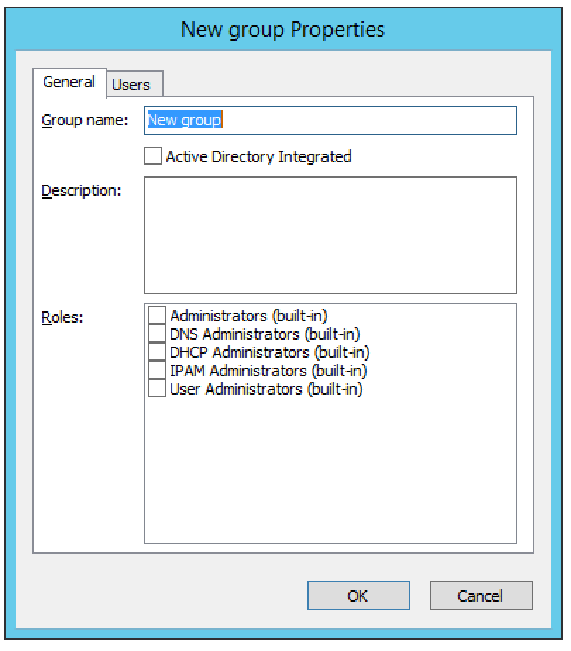

.. _webapp-user-management:

User Management
***************

User Management involves both creating groups as well as creating :ref:`users` to associate with :ref:`groups`. For more information refer to :ref:`access-control`.

.. image:: ../../images/admin-user-management.png
  :width: 80%
  :align: center

.. _users:

Users
=====

Each user defined in Micetro can be a part of one or more groups. Before creating a user, it is recommended to define different groups so you can assign users directly to the desired group as you create their accounts.

.. note::
  "administrator" is the user already configured for the application. In order to manage users, you have to be logged in as a user who has user management privileges.

Adding User Accounts
--------------------

Through this function, you add new users who can then be assigned to groups.

1þ From the menu bar, select Tools, Users and Groups. The User and group management dialog box displays. The default administrator account displays here, as well as any other users you have already added.

2. On the Users tab, click the Add button. The New user properties dialog box displays.

  User Name
    Type the name that you want to as assign to this person.

  .. warning::
    Once you have created the user name, it is not possible to change it.

  Full Name and Description.
    (Optional) Type the user's first and last name and a description of their duties (i.e., job title, department, etc.), respectively.

  Authentication.
    Click the drop-down list and specify whether the user's login will be authenticated by Micetro or by an external authentication service (such as existing Active Directory account on the network).

  Password/Confirm Password.
    If the Authentication method selected is Men&Mice Internal, you need to provide a password for the user in the Password field. Passwords must be at least four characters in length and no longer than 20 characters. Passwords can contain any combination of letters and numbers, but cannot include spaces or special characters. In the Confirm Password field, re-enter the password exactly as you did in the Password field above.

  In the Groups area, select the user group(s) to which you want to assign this user.
    Each user can be assigned to none or to multiple groups. There are five default groups defined in Men&Mice Suite:

      * **Administrators**. Full access to everything.
      * **DNS Administrators**. Full access to all DNS related objects, such as zones, DNS servers, etc.
      * **DHCP Administrators**. Full access to DHCP related objects, including DHCP scopes, DHCP servers, etc.
      * **IPAM Administrators**. Full access to IPAM related objects, including IPAM ranges, etc.
      * **Users Administrators**. Full access to User and Group objects.

  .. note::
    If you have not created your groups, you can always come back and edit the user accounts anytime and change the group assignments.

3. When all selections/entries are made, click OK. The new user is added to the Users list.

Editing User Accounts
---------------------

1. From the menu bar, select Tools, Users and Groups. The User and group management dialog box displays.

2. To select a single user, click on the user's name. To select multiple users, press/hold the Ctrl key and then click on each user name.

3. Click the Edit button. The User properties tabdisplays.

4. Make the desired changes to the user's information.

5. Click OK to save the changes.

Removing User Accounts
----------------------

1. From the menu bar, select Tools, Users and Groups. The User and group management dialog box displays.

2. To remove a single user, click on the user's name. To remove multiple users, press/hold the Ctrl key and then click on each user name.

3. Click the Remove button. A dialog box prompts you to confirm your decision.

4. To remove the user, click the Yes button. The user is removed.

Viewing User Activity
---------------------

Selecting this menu item displays a window that shows a list of all users including the user name, authentication type, login status, and last login time. Only users with user administrative privileges can see this menu item.

1. From the menu bar, select Query, User Activity. The User Activity tab displays.

.. image:: ../../images/admin-user-activity.png
  :width: 90%
  :align: center

2. Use the Quick Filter, if desired, to refine the list.

.. _groups:

Groups
======

Through this function, you create and manage groups. Groups allow you to manage multiple individual users who have the same access and/or permissions across the system.

Adding a New Group
------------------

1. From the menu bar, select Tools, Users and Groups. The User and group management dialog box displays.

2. Click the Groups tab. The default groups are displayed here, as well as any other groups you have already created.

3. From the Groups tab, click the Add button. The New group properties dialog box displays.

4. In the Group name field, enter a name for the group you are creating.

5. (Optional) In the Description field, provide some information that describes the function of this group.

6. Active Directory Integrated. Check this box to define this group as an Active Directory Integrated group. When checked this group name will be matched against groups defined in Active Directory. For more information how on this works refer to External Authentication.

7. When all selections/entries are made, click OK. The new group now displays in the User and Group Management dialog box.

Editing a Group
---------------

Through this function, you can edit the group name and/or description, and indicate whether this group is Active Directory integrated.

1. From the menu bar, select Tools, Users and Groups. The User and group management dialog box displays.

2. Click the Groups tab.

3. Highlight the group to which you want to make changes.

4. Click the Edit button. The Users properties dialog box displays.

5. Make the desired changes.

6. When all selections/entries are made, click OK.

Deleting a Group
----------------

Through this function, you delete a group.

1. From the menu bar, select Tools, Users and Groups. The User and group management dialog box displays.

2. Click the Groups tab.

3. Highlight the group you want to delete.

4. Click the Remove button.

5. When the confirmation message displays, click Yes.

Access control
==============

See :ref:`access-control`.
