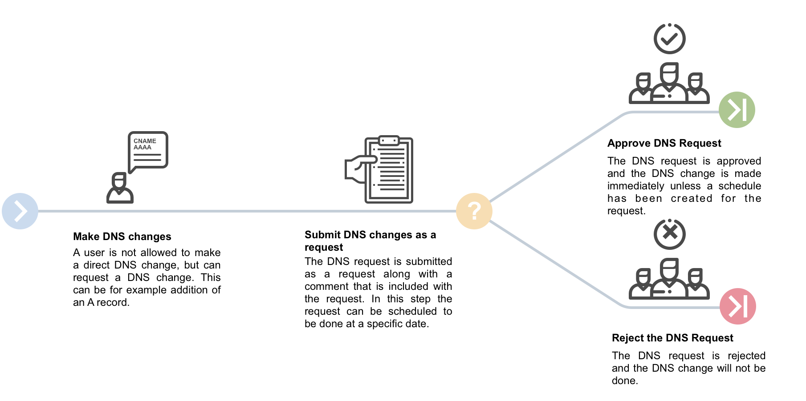
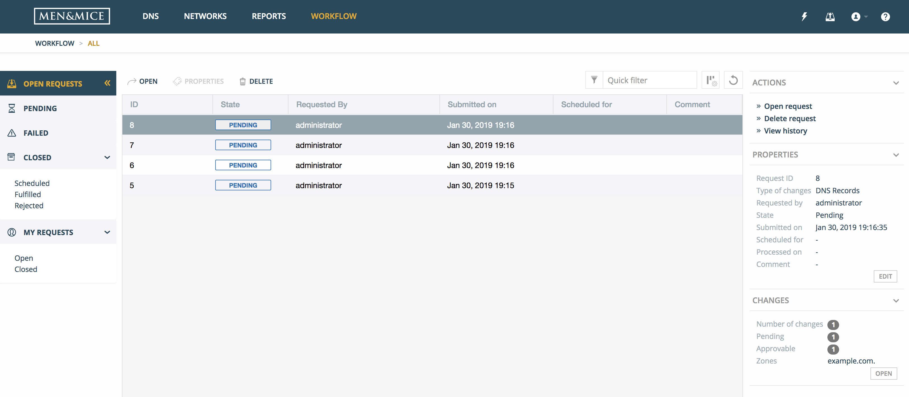
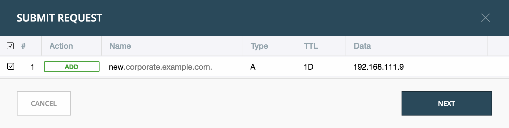
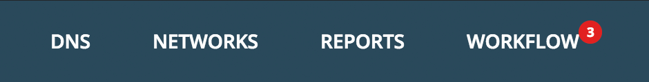
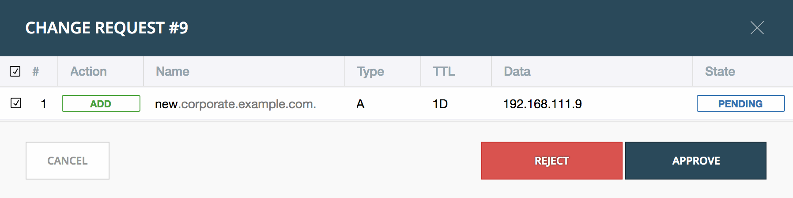

.. meta:: 
   :description: An introduction to the Workflow module that allows the user to submit 'change requests' for creating, modifying or deleting DNS records
   :keywords: Workflow, Management
   
.. _webapp-workflows:

Workflow Management
===================

Introduction
------------

This current version of the Workflow module is focused on DNS changes, so a company can have better control over what changes are done in their DNS infrastructure by approving or rejecting changes. It also helps preventing unintentional changes resulting from human error.

Organizations can give users access within the organization and the ability to request DNS changes, in some or all of the DNS zones available in the organization.

The Workflow module allows the user to submit 'change requests' for creating, modifying or deleting DNS records:

1. The user makes a change in DNS. This can be adding a new DNS record or modifying or deleting an existing DNS record. Instead of saving the changes or creating the DNS record immediately, users with limited access have an option of creating a request to approve the change.

2. The request is created and can, be submitted for approval by users with necessary access.

3. User with permission of approving DNS requests can view a list of requests.

4. The request can be either approved or rejected. If the request is approved, the DNS change is made and the DNS zone is updated automatically with the new data, either immediately or at a time specified in the request. If the DNS request is rejected, the request is deleted and the DNS request history will indicate a reason for the rejection.

Getting started
---------------

In order to use the DNS requests in the Web application, the Workflow module needs to be purchased and enabled. The license key is added through the License Management dialog (see Administration Functions) in the Men&Mice Management Console.

In order to use the Workflow module, there are two new workflow specific roles in User Management, "Requesters" and "Approvers" needed to be set. Users have to be added to the "Requesters" role to be able to submit requests. Administrative users have to be added to the "Approvers" role to be able to see requests made by others and approve them.

In addition, Approvers are only able to approve requests that involve DNS Zones in which they have access to edit records.

Requesters also need basic read-only access to the DNS Zones (and the containing DNS server) to be able to request changes, as well as the IP address ranges (to find available IP addresses).

Overview of DNS Requests in the system
--------------------------------------

When the Workflow module license key has been added and enabled, a new top menu item is visible.

Open Requests shows an overview of the change requests in the system. (An icon is shown in the top menu to the right to indicate how many pending changes are in the queue. Clicking on the icon displays a dialog for submitting those changes as a request.)

Filtering sidebar
-----------------

The filtering sidebar has the following options for open DNS requests:

.. csv-table::
  :widths: 20, 80

  "Pending", "Lists all DNS requests that are pending approval or rejection"
  "Failed", "Lists all DNS requests that encountered an error while being applied to the DNS servers"
  "Closed", "Lists all requests that are closed and have been either **Scheduled**, **Fulfilled**, or **Rejected**"
  "My requests", "Lists all requests for the current logged in users that are either **Open** or **Closed**."

Actions
-------

The following actions can be performed for a selected request in the list.

.. csv-table::
  :widths: 20, 80

  "Open request", "Opens the request in a dialog where changes in it can be viewed and either approved or rejected"
  "Edit request properties", "Opens up a dialog where the properties for the request can be edited, if custom properties for Change Requests have been defined"
  "Delete request", "Allows for cancelling the selected request"
  "View history", "Allows for viewing the history of the selected request"

Inspector
---------

The following items are listed in the Inspector's Properties section for a selected request in the list.

.. csv-table::
  :widths: 20, 80

  "Request ID", "The ID of the selected request"
  "Type of changes", "Currently only DNS Records"
  "Requested by", "Username of user that submitted the selected request"
  "State", "The current state of the request. Either Pending, Approved (i.e. awaiting scheduling), Rejected, Failed or Applied"
  "Submitted on", "Date the request was submitted"
  "Schedule for", "Date the request should be fulfilled on"
  "Processed on", "Date the request was fully approved and applied"
  "Comment", "An optional comment the user provided when submitting the request"

Creating a DNS request
----------------------

In order to create a DNS request, one of the following can be done:

* Create a DNS record

* Edit a DNS record

* Delete a DNS record

Additional options are available when creating, editing or removing a DNS record.

.. note::
  Access restrictions will affect which users have these options available.

Authorized users and approvers can also submit change requests, even if they have full access, in order to make scheduled changes.

.. csv-table::
  :widths: 10, 90

  "Add to request", "Adds the changes to a DNS request. Number in badge on request queue icon in top right corner will increase accordingly"
  "Save now / Delete now", "DNS changes are applied immediately to DNS server(s)"

.. note::
  After a DNS request for a DNS change has been created, the corresponding IP address will be set in to a pending state and will not be available, for example when requesting the next Free IP address in the subnet.

Submitting a change request
---------------------------

Step 1: Open the pending request.
"""""""""""""""""""""""""""""""""

Open the pending request by clicking on the request queue icon in the top menu.

The following dialog is displayed, where the user can review the DNS changes to submit or remove a DNS change from the queue.

Step 2: Scheduling
""""""""""""""""""

If the user want to make a scheduled change (i.e. the records are applied to the DNS server at a specific date and time) they need to check "Schedule request" and provide the date and time.

Additionally, if custom properties have been defined for Change Requests, the user will be asked to enter those here, along with the optional Comment.

.. note::
  All dates and times are according to the time zone setting on the Men&Mice Central server.

.. image:: ../../images/blackstar-workflows-schedule-request.png
  :width: 70%
  :align: center

Step 3: Submit the request
""""""""""""""""""""""""""

Clicking on Submit will submit the request which is followed by an indication of a successful submission, along with the ID (request number) for the request.

Approving or rejecting a change request
---------------------------------------

Pending requests are indicated in the top menu.

Clicking on the Workflow item in the top menu displays the Workflow page with an overview of all requests that the user has access to view.

Double clicking on a pending request opens up the approval dialog:

The approval dialog shows the request to be approved or rejected, as well the following details:

.. csv-table::
  :widths: 10, 90

  "Action", "Indicates what action is being performed: Add, Modify or Remove"
  "Name", "The fully qualified DNS record name"
  "Type", "The DNS record type"
  "TTL", "The Time To Live of the DNS record"
  "Data", "The data being added. Hovering over the field shows the previous value, if being modified"
  "State", "The state of the change request"

After clicking on the Approve button, the request is approved, and the data propagated accordingly.

If the user clicks on the Reject button, they are prompted for a comment and then the request and all changes within the request is rejected.
