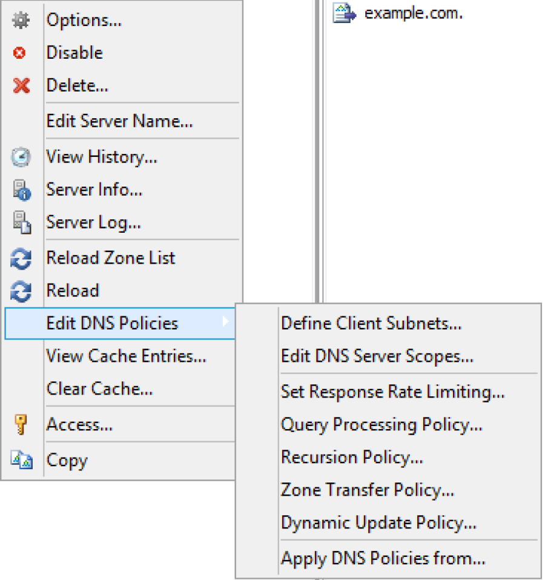
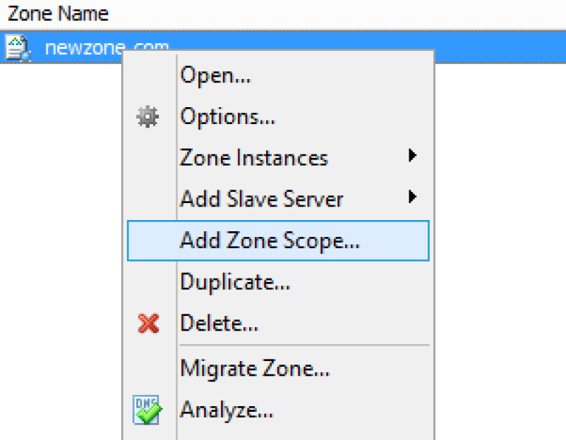
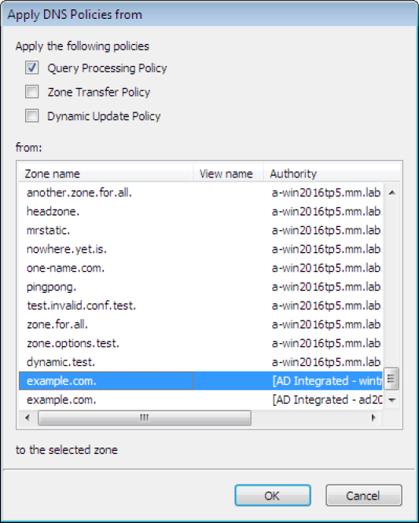

.. _windows-dns-policies:

DNS policies (Windows)
======================

DNS Policies and DNS Scopes
---------------------------

DNS policies are processing rules that control DNS operations on the DNS server. Creating a DNS policy enables user control over the details of these DNS operations: query processing, zone transfer, recursion and dynamic update. A DNS policy is always specific to one DNS operation and apply either on the server level or the zone level. This control of DNS operations can, for example, be used to implement the following scenarios:

* High availability of DNS services

* Traffic management

* Split-brain DNS

* Filtering

* Forensics

* Redirection based on date/time

Specific types of policies are:

Zone transfer policies
  Controls how zone transfers are processed, either for the DNS server or a specific DNS zone.

Recursion policies
  Control how recursive DNS queries are processed by the DNS server.

Query resolution policies
  Controls how queries are processed for the DNS server or a specific zone.

Dynamic update
  Controls how dynamic updates are processed

Rate limiting exception list
  Controls how rate limiting is configured

DNS policies are used in conjunction with zone scopes and server scopes which are a new concept introduced in Windows Server 2016. A zone scope represents a specific version of an existing zone while a server scope is a collection of DNS server settings that is associated with a unique name.

Edit DNS Policies
-----------------

Editing or adding DNS policies on Windows Server 2016 is done by

1. Right click on the server in the sidebar as shown in the figure.

2. Select :guilabel:`Edit DNS Policies`.

3. A menu is displayed that offers to do add or edit various types of policies and configure related properties.

Define Client Subnets
---------------------

This allows the user to specify those subnets that will be used by the DNS policies to identify where a DNS client is located.

1. Select the :guilabel:`Define Client Subnets` in the submenu of :guilabel:`Edit DNS Policies`.

2. Click the :guilabel:`Add` button to add a new client subnet.

3. Specify the name of the subnet and a list of subnets in CIDR notation, that will be used in the exclusion rules.

Add DNS Zone scopes
-------------------

To add a new zone scope:

1. Right click on a DNS zone.

2. Select :guilabel:`Add zone Scope` after right clicking the zone.

3. A new dialog appears where you can enter the name of the new zone zone.

4. Click the :guilabel:`Add` button to add the new zone scope.

The newly added zone scope is now shown in the zone list. The name of each zone scope is shown in a separate column.

Edit DNS Server Scopes
----------------------

This allows the user to add or remove server scopes as well as specifying options for each scope.

1. Select the :guilabel:`Edit DNS Server Scopes` in the submenu of the :guilabel:`Edit DNS Server policies`.

2. Click the :guilabel:`Add` button to add a new server scope. A new dialog is displayed that allows the user to specify a name of the new server scope.

3. Click the :guilabel:`OK` button to add the new server scope.

4. For an existing server scope, select the corresponding server scope and then click the :guilabel:`Remove` button to remove the server scope.

5. To edit the options for a server scope, highlight the corresponding server scope and click the :guilabel:`Options` button. A new dialog window is displayed that allows the user to specify forwarders and select if recursion should be allowed. To disable the use of forwarders for the server scope leave the forwarders list empty.

.. note::
  The forwarders list for the default server scope can still be edited in the Server Options

Set Response Rate Limiting
--------------------------

The Response Rate Limiting feature of the Microsoft 2016 DNS server can be used to control the rate in which the server responds to similar requests it will send to clients on the same subnet.

Configuring rate limiting
^^^^^^^^^^^^^^^^^^^^^^^^^

1. Select the 'Set Response Rate Limiting' in the submenu of the 'Edit DNS Server policies'

2. To enable response rate limiting, make sure the checkbox in 'Enable reponse rate limiting is checked.

For an overview of the configuration and the related fields, see below.

Enable Response Rate Limiting
  To enable the Response Rate Limiting

Log only
  RRL calculations are performed, but potential actions are logged as if RRL is enabled.

Responses / second
  Maximum number of times the servers sends a client the same response within a one second interval.

Errors / seconds
  Maximum number of times the servers sends an error response to a client within a one second interval.

Detection window
  Specifies the period (in seconds) over which rates are measured and averaged for RRL.

IPv4 prefix length
  Specifies the IPv4 prefix length, which indicates the size of the subnet in which the incoming queries are grouped.

IPv6 prefix length
  Specifies the IPv6 prefix length, which indicates the size of the IPv6 subnet in which the incoming queries are grouped

Leak rate
  Specifies the rate at which the server responds to dropped queries

Truncate rate
  Specifies the rate at which the server responds with truncated responses

Max responses / window
  Specifies the maximum number of responses that the server sends to a subnet-domain address in a RRL time window.

Exception list
  Allows for creating policies that control RRL exceptions.

Adding an exception
^^^^^^^^^^^^^^^^^^^

In the Response Rate Limiting window, click on the :guilabel:`Add` button.

DNS Policies
------------

To add a DNS policy:

1. Select the type of DNS policy in the submenu of the :guilabel:`Edit DNS Server policies`.

2. Click the :guilabel:`Add` button to add the new policy

3. A new dialog window is displayed. It is a generic window for adding a DNS policy. Refer to :ref:`adding-dns-policies` for more details.

.. _adding-dns-policies:

Adding DNS policies
^^^^^^^^^^^^^^^^^^^

1. Each DNS policy must have a name that conforms to the rules of filenames. The name should be chosen to be unique for the zone or among DNS policies on the server level.

  .. note::
    In case the name of the DNS policy does conflict with a DNS policy of a different type it is automatically renamed.

2. A DNS policy can be created enabled or disabled. Policies that are disabled are ignored by the server except for statistics and logging.

3. Each query that matches the policy can result in three actions:

  Allow:
    The query is processed and answered from the server or zone scope referred to.

  Deny:
    The DNS server refuses the query.

  Ignore:
    The DNS server drops the query without informing the client.

  .. note::
    Server level policies other than recursion policies can only have "Deny" and "Ignore" as the action. Recursion policies and all zone level policies can have "Allow", "Deny" and "Ignore" as the action. For the "Allow" action one or more DNS scope must be selected, for a recursion policy these must be sever scopes and for any policy on a DNS zone these must be DNS scopes created on the zone.

4. If the action is 'Allow' select the 'Edit' button. This opens a dialog where you can select the target DNS scopes used for matched queries and the weight for load balancing.

5. Condition decides the condition for matching the Criteria list. Selecting 'And' indicates that all of the criteria should match for the policy to apply and 'Or' indicates that one or more of the criteria is sufficient for the policy to apply.

6. Criteria is a list of rules that the incoming DNS query is compared to. If the query matches the rules the server takes action in accordance. For more details refer to Add DNS policy criteria section.

Adding DNS policy target scope
^^^^^^^^^^^^^^^^^^^^^^^^^^^^^^

When the action for a DNS Policy is 'Allow' one or more target DNS scopes must be chosen. Each DNS scope has a name and a weight for load balancing.

1. To add an DNS scope to the list press :guilabel:`Add` button.

2. In the Add Target Scope dialog you can select a scope which you want to be used to answer queries that match the DNS policy criteria list. DNS scopes for the DNS server or the zone will be listed, to create a new DNS scope, refer to Add server scope and Add zone scope, respectively.

  Target scope:
    The DNS scope used to answer the query.

    .. note::
      The DNS server will always have default scope, the name of the default scope is '.', DNS zones also have a default scope with the same name as the zone. In some cases the empty string can be used to referred to the default scope.

  Weight:
    Is an integer value used for load balancing.

    .. note::
        DNS policies can be used to for DNS based load balancing. For zones this can be achieved by adding the DNS records that you want to load balance (typically A/AAAA records) to different DNS scopes and then creating a Query Processing policy that will match the incoming queries and has 'Allowed' as the action, then add the DNS scopes as the target scopes for the DNS policy.

        The queries will be answered from the the target scopes in a round-robin fashion based on the weight. If the target scopes are 'example.com' with weight 4 and 'offload' with weight '2', then the first 4 queries that match this policy will be answered from the 'example.com' scope and the next 2 from the 'offload' scope. Similar load balancing can also be achieved with other types of DNS policies.

Adding DNS policy criteria
^^^^^^^^^^^^^^^^^^^^^^^^^^

Each DNS policy has a list of criteria that with the policy condition define how the DNS policy is matched. Depending on the policy type different criteria are allowed.

The DNS policy criteria and their descriptions are:

.. csv-table::
  :header: "Type", "Dsecription"
  :widths: 20, 80

  "Client Subnet",	"A list of subnet names as they are defined on the server. See Define client subnets for details."
  "Transport Protocol", "A list of transport protocols used by the incoming query. The possible transport protocols are UDP and TCP."
  "Network Protocol", "A list of network protocol used by the query. The possible network protocols are IPv4 and IPv6."
  "Server interface",	"A list of the IP address that the DNS server is listening on."
  "Domain Name", "A list of domain names with strict wildcards allowed. For example '\*.example.com'"
  "Query Type", "A list of DNS record types. For example A, NS, SRV, CNAME"
  "Time of Day", "A list of time periods in a 24h format. For example 18:00-23:15. The time of day is rounded to the next 15 minutes by MS-DNS. Maybe we should put this in a note and absolutely avoid examples that will be rounded."

Operator:
  Supported values are 'is' or 'is not', where is not negates ALL the values supplied in the 'Values' input box.

Values:
  The list of values used to match the DNS policy criteria with each item in the list on a newline.

.. note::
  Two criteria of the same type are allowed only if they have a different operator but you can work around this limitation by using a list of values for each operator. If you want the criteria to match on two domain names you can select the type as 'Domain Name', the operator 'is' and enter the two domain name on different lines in the 'Values' field.

Apply DNS Policy from
---------------------

It is possible to copy DNS policies between DNS servers and DNS zones. One or more type of DNS policy list can be copied at a time to one or more DNS server or DNS zone. DNS policies can not be copied if they refer to any Client Subnet Lists, DNS scopes or server interfaces that do not exist the targets of the copy operation. The copy operation results in the DNS policy lists for the chosen types of DNS policy to be overwritten with the copied DNS policy lists.

.. note::
  DNS policies will be renamed if necessary when created or copied. You can avoid this by choosing unique names.

1. Right click on a DNS Server or DNS zone.

2. Select :guilabel:`Apply DNS Policy From...`` in the :guilabel:`Edit DNS Policy` submenu.

3. Select the DNS policy type to copy.

4. Select the DNS server or DNS zone to copy DNS policies from
